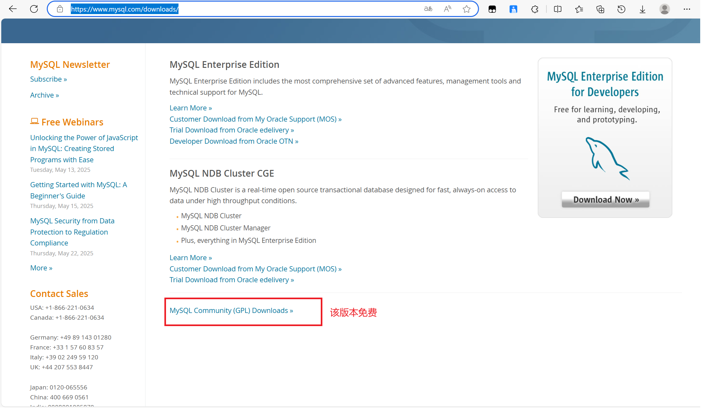
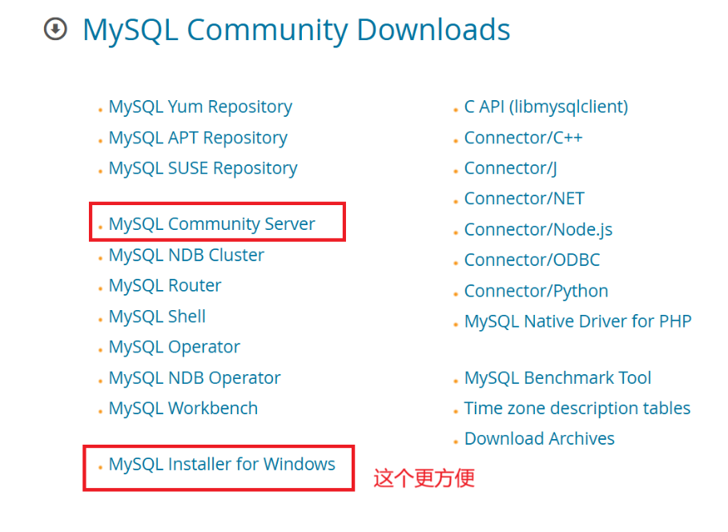
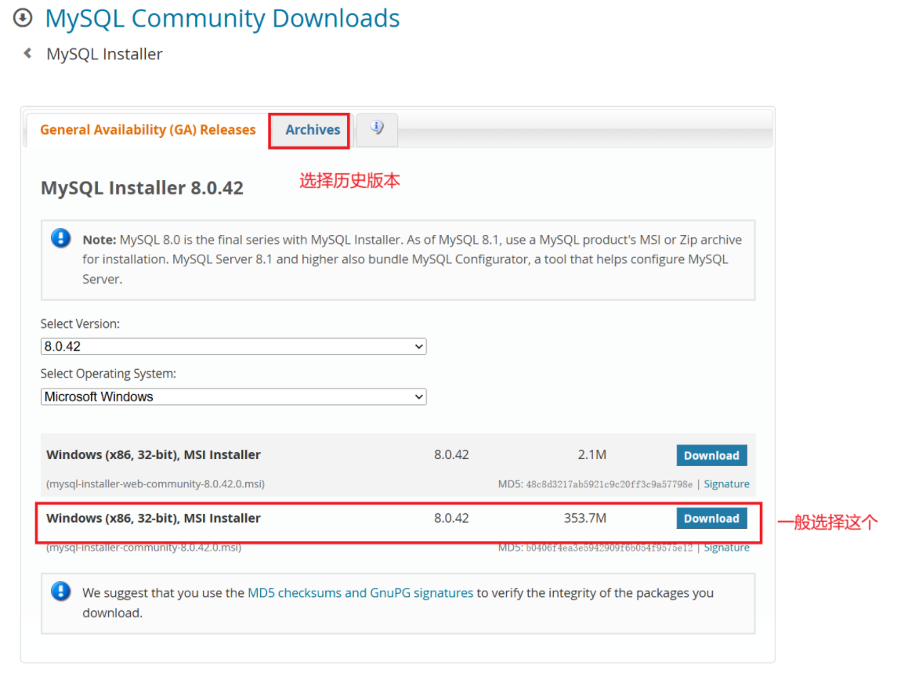

# MySQL的卸载与安装

[卸载](#卸载)

[下载](#卸载)

[安装](#安装)

---

# 卸载

- 控制面板--卸载 MySQL 程序
- 删除安装目录的 MySQL 项目 
	- 默认在 C:\Program Files 、C:\Program Files (x86)、C:\ProgramData 里面找。
- 删除 MySQL 相关注册表，通过 win + r 输入 regedit 进入
	- HKEY_LOCAL_MACHINE\SYSTEM\ControlSet001\Services\EventLog\Application\
	- HKEY_LOCAL_MACHINE\SYSTEM\ControlSet002\Services\EventLog\Application\
	- HKEY_LOCAL_MACHINE\SYSTEM\CurrentControlSet\Services\EventLog\Application\ 
	- HKEY_LOCAL_MACHINE\SYSTEM\CurrentControlSet\Services\
	 （在这里面找有没有MySQL之类的，有就删掉，没有就别管）
- 确认服务中没有 MySQL 后重启电脑（直接搜索服务，或者 win + r 输入 services.msc 进入）

# 下载

- 进入[官网](https://www.mysql.com/)
- 点击 [downloads](https://www.mysql.com/downloads/)
- 选择社区版，之后步骤如下： 
	
	
	

# 安装

- 运行下载来的 .msi 文件（如mysql-installer-community-8.0.20.0）。
- 之后根据需求安装即可，不确定的话就选 Developer Default。
- 需要自定义路径先选 Custom，再选 Developer Default再返回到 Custom 即可，Developer Default 的内容也就到了Custom。
