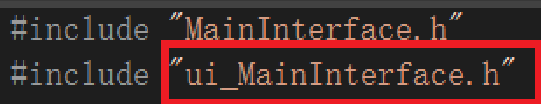

# VS使用CMake构建QT项目遇到的问题

[头文件引用错误](#头文件引用错误)

--- 

## 头文件引用错误

因为在 QT Designer 中保存后，习惯性的引用了 MainInterface.ui

但实际上该文件它本身是 XML 格式的元数据，并非直接可执行的编程语言代码，直接引用 MainInterface.ui 做头文件会发生报错。

### 解决方法

在 CMakeLists.txt 中调用 `set()` 命令，将 CMake 内置变量 `CMAKE_AUTOUIC` 的值设为 `ON`，激活 UIC 的构建时自动化流程，即 `set(CMAKE_AUTOUIC ON)`。

这样就会自动生成 ui_MainInterface.h, 通常在 `out\build\x64-Debug\Demo_autogen\include` 目录中。 

有了它，就直接改而引用 ui_MainInterface.h 文件。 

注意：ui_MainInterface.h 的生成可能需要一定，如果发现仍然报错稍稍等待即可。

