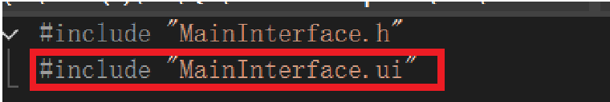
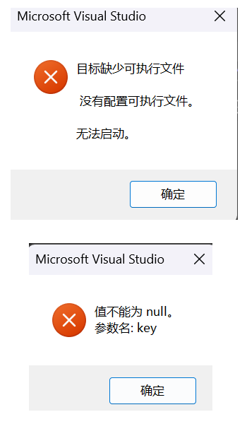

# VS使用CMake构建QT项目遇到的问题

[头文件引用错误](#头文件引用错误)

[目标缺少可执行文件](#目标缺少可执行文件)

[语法错误常量中有换行符缺少……](#语法错误常量中有换行符缺少……)

--- 

## 头文件引用错误

因为在 QT Designer 中保存后，习惯性的引用了 MainInterface.ui

但实际上该文件它本身是 XML 格式的元数据，并非直接可执行的编程语言代码，直接引用 MainInterface.ui 做头文件会发生报错。

### 解决方法

在 CMakeLists.txt 中调用 `set()` 命令，将 CMake 内置变量 `CMAKE_AUTOUIC` 的值设为 `ON`，激活 UIC 的构建时自动化流程，即 `set(CMAKE_AUTOUIC ON)`。

这样就会自动生成 ui_MainInterface.h, 通常在 `out\build\x64-Debug\Demo_autogen\include` 目录中。 

之后改而引用 ui_MainInterface.h 文件即可。 

注意：ui_MainInterface.h 的生成可能需要一定时间，如果发现仍然报错稍稍等待即可。

## 目标缺少可执行文件

报错如下：

### 可能的引发原因

新建了 Sources 和 Headers 目录，分类放置.cpp .h文件。

此时 .cpp .h 文件和CMakeLists.txt已经不在同级目录了。之后又手动删除了out文件，导致原ui_MainInterface.h文件也被删除。

此时cmake在构建时找不到文件，导致报错。

### 解决办法

将构建目录添加到头文件搜索路径中。

如：`target_include_directories(${PROJECT_NAME} PRIVATE ${CMAKE_CURRENT_SOURCE_DIR})`

注意该操作的插入位置应该在 `add_executable` 之后。

## 语法错误常量中有换行符缺少……

### 可能的原因

vs对文件编码的兼容性较差。

中文字符 "游戏结束" 的 UTF-8 字节序列可能被解码为多个 GB2312 字符。

如果某个字节被解析为换行符（\n）或非法字符，编译器会抛出 C2001: 常量中有换行符。

若字符串因编码错误未正确闭合，后续代码的括号会被误认为属于字符串，导致 C2143: 缺少“)”

### 解决方案

文件保存为 UTF-8 编码格式即可解决。
