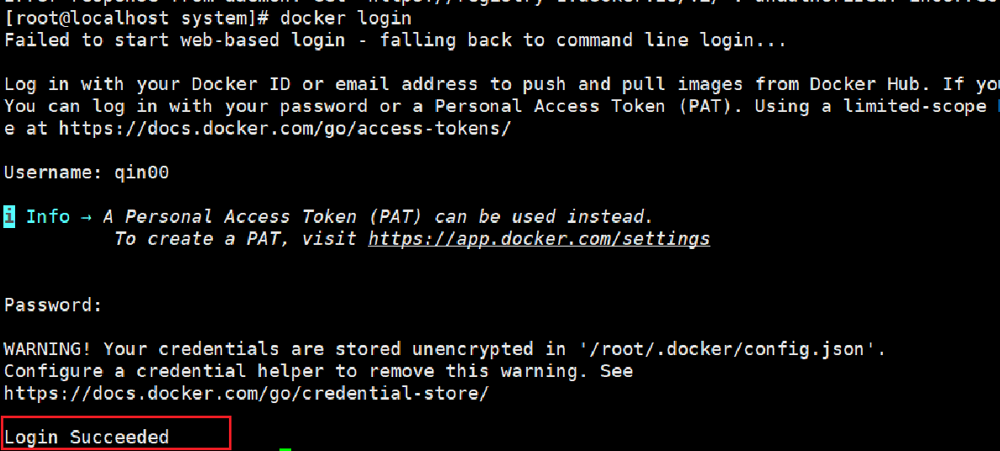

# 使用Docker遇到的问题

[Docker_login_search超时及被拒绝连接的问题](#Docker_login_search超时及被拒绝连接的问题)

--- 

## Docker_login_search超时及被拒绝连接的问题

### Docker不能拉取pull

由于国内网络访问限制，docker 无法 pull。

这里解决办法很简单，直接使用镜像即可，操作如下：

在 /etc/docker/ 目录下打开 daemon.json （没有就创建）文件。

像这样添加镜像源：

```
{
    "log-driver": "json-file",
    "log-opts": {
        "max-size": "20m",
        "max-file": "3"
    },
    "registry-mirrors": [
      "https://docker.1ms.run",
      "https://docker.xuanyuan.me",
      "https://docker.wanpeng.life",
      "https://docker.imgdb.de",
      "https://dockerproxy.cn",
      "https://dockerproxy.com",
      "https://dockerpull.cn",
      "https://docker.1panel.live"
    ]
}

```

再重启 docker 即可正常 pull。

### 无法login_search

有了镜像源，虽然可以正常进行大部分操作，但仍然有部分命令无法使用。

问题如下（以下图片中的问题都是重新演示出来的，与原报错有所出入，但大致意思无二）：


在search和login时都会报错：connect: connection refused。

即使使用代理也没有效果。

### 原因

Docker 的网络设置和代理配置与主机不一致，导致 Docker search 镜像时无法走自己设置的翻墙代理。

既然反正要使用代理，那 daemon.json 文件就不需要了，也更方便测试问题，这里可以把 daemon.json 重命名为其他名称，如果有需要再命名回来。

### 处理方法

为 Docker 守护进程配置代理，使用 `find / -name "docker.service"` 命令找到我们即将配置的文件所在目录（如：/usr/lib/systemd/system/docker.service）。

- 在 docker.service 文件中找到 Service，在其下添加如下配置：

    ```
    Environment="http_proxy=http://127.0.0.1:7890"
    Environment="https_proxy=http://127.0.0.1:7890"
    ```

    

    配置好之后要重新加载配置文件, 使用命令 `systemctl daemon-reload` 即可。

- 注意

    上面的端口号7890视情况定，如果是clash代理工具则一般是7890没有错。

    更建议使用主机ip如：192.xxx.xxx.xxx，当然127.0.0.1大部分情况也不会出错。

如果网络代理处使用127.0.0.1而配置时使用主机ip，会导致 Docker 守护进程运行在独立网络命名空间，由于配置中直接使用的主机ip，又无法直接访问宿主机的 127.0.0.1。

- 这里需要对代理工具进行配置（以clash为例）：
    
    

    允许局域网连接：在 Clash 设置中开启 Allow LAN

之后就可以正常使用docker了。


