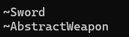

# 抽象类中虚析构的作用

[没有虚析构函数时的风险](#没有虚析构函数时的风险)

[虚析构函数的作用](#虚析构函数的作用)

[必须使用虚析构的场景](#必须使用虚析构的场景)

---

## 没有虚析构函数时的风险

假设基类析构函数非虚，且存在派生类：

```C++
class AbstractWeapon {
public:
    ~AbstractWeapon() { std::cout << "~AbstractWeapon" << std::endl; } // 非虚析构
    virtual void attack() = 0;
};

class Sword : public AbstractWeapon {
public:
    ~Sword() { std::cout << "~Sword" << std::endl; } // 派生类析构函数
    void attack() override { /* ... */ }

private:
    int* data = new int[100]; // 堆内存
};

int main() {
    AbstractWeapon* weapon = new Sword();
    delete weapon; // 仅调用基类析构函数，导致资源泄漏
}
```
输出为：


这里使用的就是非析构函数，观察输出不难发现，`Sword`的析构函数未被调用，当其内部持有资源（如内存、文件句柄），将发生泄漏。

## 虚析构函数的作用

现在将基类析构函数声明为虚函数：

```C++
class Weapon {
public:
	virtual string getWeapon() = 0;
	virtual ~Weapon() = default;
};

class AbstractWeapon {
public:
    //~AbstractWeapon() { std::cout << "~AbstractWeapon" << std::endl; } // 非虚析构
    virtual ~AbstractWeapon() { std::cout << "~AbstractWeapon" << std::endl; }
    virtual void attack() = 0;
};

class Sword : public AbstractWeapon {
public:
    ~Sword() { std::cout << "~Sword" << std::endl; } // 派生类析构函数
    void attack() override { /* ... */ }

private:
    int* data = new int[100]; // 堆内存
};

int main() {
    AbstractWeapon* weapon = new Sword();
    delete weapon; 
}
```

此时输出为：



这里可以发现，`Sword`的析构函数被正常调用，析构顺序从派生类向基类反向执行（栈展开），资源完全释放。

## 必须使用虚析构的场景

当同时满足以下条件时，基类必须定义虚析构函数：
- 存在继承关系：基类被其他类继承。
- 多态删除：通过基类指针或引用删除派生类对象。

总结：虚析构函数是管理多态对象资源释放的关键机制。若类可能被继承并通过基类指针删除，必须声明虚析构函数。这是 C++ 中资源管理的基石之一。