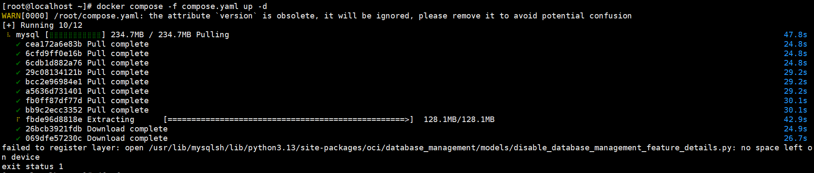
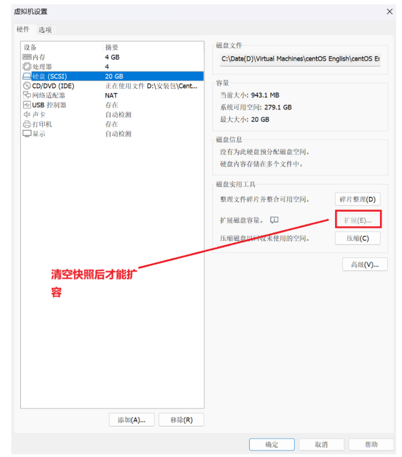
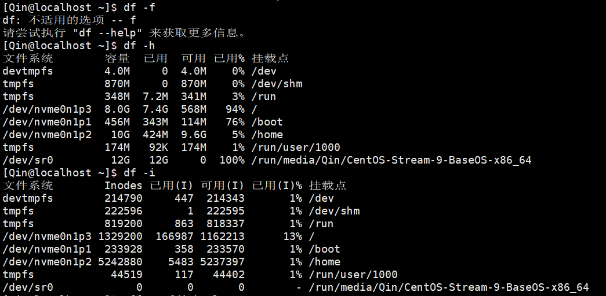
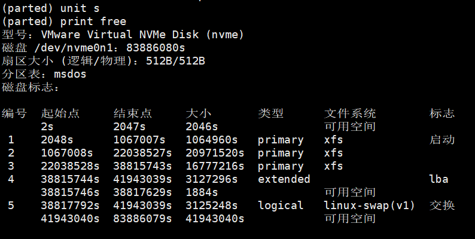
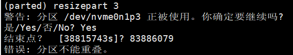
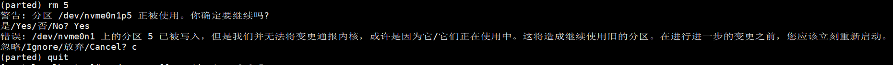
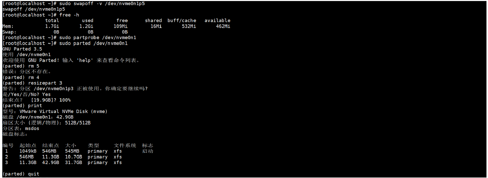
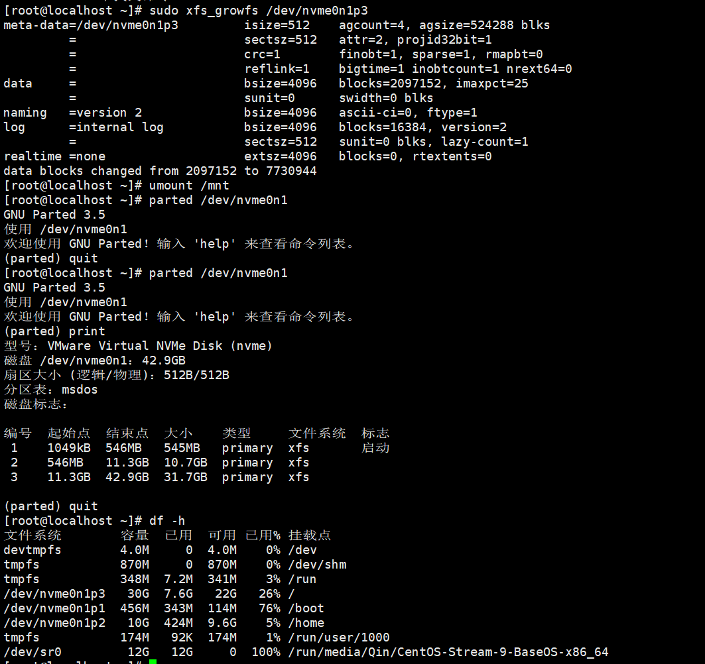

# 虚拟机空间扩容

[报错信息](#报错信息)

---

## 报错信息

- 空间不足导致Docker操作报错

	

## 解决路程

- 直接给虚拟机扩容

	

- 查看磁盘空间使用情况 查看 inode 使用情况(如果inode用尽，即使空间足够，也会出现类似错误，这时候需要删除多余的小文件。)

	

- 调整分区大小：将扩展第三个分区（nvme0n1p3）至磁盘末尾的可用空间

	```growpart /dev/nvme0n1 3```

	报错如下：
	
	`NOCHANGE: partition 3 is size 16777216. it cannot be grown`

	报错原因：growpart 无法直接扩展分区，因为新增的 20G 未分配空间位于分区 3 之后，且需要调整分区表布局

### 使用parted调整分区

```sudo parted /dev/nvme0n1```

- 在parted交互界面：
	
	```
	(parted) resizepart 3
	End? [旧值]? 100%
	(parted) quit
	```

- 新的报错：分区不能重叠。

	问题出在 分区3（/dev/nvme0n1p3）后面存在其他分区或未分配空间的间隙，导致直接输入 100% 会触发“重叠”错误。

	可以通过 `fdisk -l` 原始分区结构。

	在parted交互界面执行以下操作查看并定位问题

	```
	(parted) unit s          # 切换到扇区单位
	(parted) print free      # 查看当前分区和空闲空间
	```

	

	还是出现报错

	

	报错原因：分区3后面紧跟着分区4，那么调整分区3的大小到100%会覆盖到分区4的起始位置，导致错误。

- 处理办法：删除后续分区

	在parted交互界面执行以下操作：

	```
	(parted) rm 5       # 先删除逻辑分区5（swap）
	(parted) rm 4       # 再删除扩展分区4
	```

	

- 错误原因及处理办法：

	出现这个错误是因为系统中的swap分区（/dev/nvme0n1p5）正在被内核使用。需要先 ​关闭swap，再删除分区。

	```
	# 未退出 parted 要先输入 quit 退出 parted

	# 关闭swap分区
	sudo swapoff -v /dev/nvme0n1p5  # 关闭swap
	free -h                          # 确认swap已禁用（应显示0B）

	# 强制内核更新分区表（无需重启）
	sudo partprobe /dev/nvme0n1

	# 重新进入parted删除分区
	sudo parted /dev/nvme0n1
	(parted) rm 5    # 此时不会再报错
	(parted) rm 4    # 删除扩展分区4
	(parted) resizepart 3 100%  # 扩展分区3到磁盘末尾
	(parted) print   # 验证分区3已扩展
	(parted) quit

	# 执行到这里可以用 df -h 查看相关信息，此时空间应该已经扩充完毕

	# 更新文件系统（XFS）
	sudo mount /dev/nvme0n1p3 /mnt  # 挂载分区（假设挂载到/mnt）
	sudo xfs_growfs /dev/nvme0n1p3   # 在线扩容XFS
	sudo umount /mnt
	```

	

	

