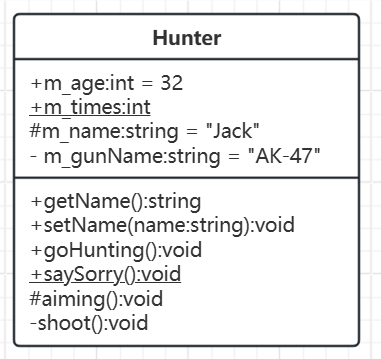

# UML类图

[语法](#语法)

[类的UML画法](#类的UML画法)

[类与类之间的关系](#类与类之间的关系)

&emsp;&emsp;[继承关系](#继承关系)

&emsp;&emsp;[关联关系](#关联关系)

&emsp;&emsp;&emsp;&emsp;[单向关联关系](#单向关联关系)

&emsp;&emsp;&emsp;&emsp;[双向关联关系](#双向关联关系)

&emsp;&emsp;&emsp;&emsp;[自关联关系](#自关联关系)

&emsp;&emsp;[聚合关系](#聚合关系)

&emsp;&emsp;[组合关系](#组合关系)

&emsp;&emsp;[依赖关系](#依赖关系)

&emsp;&emsp;[关联关系对比聚合组合及依赖关系之间的区别](#关联关系对比聚合组合及依赖关系之间的区别)

---

## 语法

|类名|
|:---|
|[可见性]变量名[:类型][=初始值][{属性字符串}]|
|[可见性]函数名[(参数表)][:返回类型][{属性字符串}]|

`注意:[]中的内容可有可无`

## 类的UML画法

设计模式中的 UML 类图是描述模式结构和类之间关系的重要工具。以下是绘制设计模式类图的步骤和要点:

比如，现在定义了猎人类：
```C++
class Hunter
{
public:
    int m_age = 32;
    static int m_times;
    string getName()
    {
        return m_name;
    }

    void setName(string name)
    {
        m_name = name;
    }

    void goHunting()
    {
        aiming();
        shoot();
    }
    static void saySorry()
    {
        string count = to_string(m_times);
        cout << "Say sorry to every animal " + count + " times!" << endl;
    }

protected:
    string m_name = "Jack";
    void aiming()
    {
        cout << "使用" + m_gunName + "瞄准猎物..." << endl;
    }

private:
    string m_gunName = "AK-47";
    void shoot()
    {
        cout << "使用" + m_gunName + "射击猎物..." << endl;
    }
};
int Hunter::m_times = 3;
```

这个类对应的类图应该是这样的：



在UML类图中：

对于成员可见性：
- 用 + 表示 public
- 用 # 表示 protected
- 用 - 表示 private

对于静态成员变量或者静态成员函数函数：
- 用下划线表示，如上图 <span style="text-decoration:underline">+m_times:int</span>

注意：在使用UML画类图的时候，如果我们定义的类是一个抽象类，类名需要使用斜体显示。虚函数的表示方跟随类名，也就是使用斜体，如果是纯虚函数则需要在最后给函数指定=0。

## 类与类之间的关系

### 继承关系

概念：继承也叫作泛化，继承的概念与C++概念一致。

UML连线：在UML中，泛化关系用带<span style="color:brown">空心三角形</span>的实线来表示。

样例如下：
```C++
class Bird
{
public:
    string getName()
    {
        return m_name;
    }

    void setName(string name)
    {
        m_name = name;
    }

    virtual void fly() {}
    virtual void eat() {}
protected:
    string m_sex;
    string m_name;
};

class Cuckoo : public Bird
{
public:
    void fly() override
    {
        cout << "我拍打翅膀飞行..." << endl;
    }

    void eat() override
    {
        cout << "我喜欢吃肉肉的小虫子..." << endl;
    }
};

class Eagle : public Bird
{
public:
    void fly() override
    {
        cout << "我展翅翱翔..." << endl;
    }

    void eat() override
    {
        cout << "我喜欢吃小动物..." << endl;
    }
};
```
使用UML表示上述关系如下：


### 关联关系

关联（Assocition）关系是类与类之间最常见的一种关系，它是一种结构化的关系，表示一个对象与另一个对象之间有联系。

#### 单向关联关系

概念：单向关联指的是关联只有一个方向。

UML连线：使用的连接线是带<span style="color:brown">单向箭头</span>的实线。

样例如下：比如下面样例中每个孩子（Child）都拥有一个父亲（Parent）。

```C++
class Parent
{
};

class Child
{
private:
    Parent m_father;
};
```
用UML表示如下：


在这个例子中 Parent 类 作为了Child 类的成员变量，因此箭头端应该指向Parent 类，另一端连接 Child 类。

#### 双向关联关系

概念：双向关联关系是面向对象设计中两个类之间相互持有对方引用的关系类型。

UML连线：一般使用<span style="color:brown">没有箭头</span>的实线，有些UML绘图软件使用的是带<span style="color:brown">双向箭头</span>的实线来表示双向关联关系。

样例如下：比如每个孩子（Child）都拥有一个父亲（Parent），每个父亲（Parent）都拥有一个孩子（Child）。

```C++
class Parent
{
private:
    Child* m_son;
};

class Child
{
private:
    Parent* m_father;
};
```

用UML表示如下：


#### 自关联关系

概念：自关联指的就是当前类中包含一个自身类型的对象成员。

UML连线：一般使用<span style="color:brown">带箭头</span>的实线来描述自关联关系。

样例如下：
```C++
class Node 
{
private:
    void* m_data;
    Node* m_prev;
    Node* m_next;
};
```

用UML表示如下：


### 聚合关系

概念：聚合关系表示整体与部分的关系。在聚合关系中，成员对象是整体的一部分，但是成员对象可以脱离整体对象独立存在。

UML连线：聚合关系用带<span style="color:brown">空心菱形</span>的直线表示。

样例如下：
```C++
class Plant
{
    // 植物
};

class Animal
{
    // 动物
};

class Water
{
    // 水
};

class Sunshine
{
    // 阳光
};

class Forest
{
public:
    Forest(Plant p, Animal a, Water w, Sunshine s) : 
        m_plant(p),m_animal(a),m_water(w),m_sun(s)
    {
    }
private:
    Plant m_plant;
    Animal m_animal;
    Water m_water;
    Sunshine m_sun;
};
```

该案例中，植物、动物、水和阳光都是森林的一部分，但也可以脱离整体对象独立存在。

对应的UML类图为：


代码实现聚合关系，成员对象通常以构造方法、Setter方法的方式注入到整体对象之中，因为成员对象可以脱离整体对象独立存在。

### 组合关系

概念：组合关系也表示的是一种整体和部分的关系，但是在组合关系中整体对象可以控制成员对象的生命周期，一旦整体对象不存在，成员对象也不存在，整体对象和成员对象之间具有同生共死的关系。

UML连线：在UML中组合关系用带<span style="color:brown">实心菱形</span>的直线表示。

样例如下：
```C++
class Root
{
};

class Trunk
{
};

class Branch
{
};

class Leaf
{
};

class Tree
{
public:
    Tree()
    {
        m_root = new Root;
        m_trunk = new Trunk;
        m_branch = new Branch;
        m_leaf = new Leaf;
    }
    ~Tree()
    {
        delete m_root;
        delete m_trunk;
        delete m_branch;
        delete m_leaf;
    }
private:
    Root* m_root;
    Trunk* m_trunk;
    Branch* m_branch;
    Leaf* m_leaf;
};
```

对应的UML类图为：


注意：代码实现组合关系，通常在整体类的构造方法中直接实例化成员类，因为组合关系的整体和部分是共生关系，整体的实例对象被析构的时候它的子对象也会一并被析构。如果通过外部注入，即使整体不存在了，部分还是存在的，这样的话就变成聚合关系了。

### 依赖关系

概念：依赖关系是面向对象设计中一种临时性的关系，表示一个类（客户端）在某个特定场景下需要使用另一个类（被依赖者），但两者之间没有长期的结构化关联。依赖关系的核心特点是单向性和临时性，通常通过方法的参数、返回值或局部变量触发。

UML连线：依赖关系用<span style="color:brown">带箭头的虚线</span>表示，由依赖的一方指向被依赖的一方。

样例如下(树木（Tree）的生长，需要将空气（Air）、水（Water）、土壤（Soil）对象作为参数传递给 Tree 类的 grow（）方法。)：
```C++
class Water
{
};

class Air
{
};

class Soil
{
};

class Tree
{
public:
    void grow(Water w, Air a, Soil s) 
    {
        cout << "借助 w 中的水分, s 中的养分和 a 中的二氧化碳, 我就可以茁壮成长了";
    }
};
```

对应的UML类图为：


依赖关系通常通过三种方式来实现：
- 将一个类的对象作为另一个类中方法的参数。
- 在一个类的方法中将另一个类的对象作为其对象的局部变量。
- 在一个类的方法中调用另一个类的静态方法。

### 关联关系对比聚合组合及依赖关系之间的区别

**关联**
- 定义：表示两个类之间的基本连接关系，一个类知道另一个类的存在（可能有双向或单向）。
- 特点:
    - 没有整体与部分的语义。
    - 类之间是平等的，可以是简单的引用关系。
    - 生命周期不绑定，双方可以独立存在。

**聚合**
- 定义：一种特殊的关联关系，表示 整体与部分 的关系，但部分可以独立存在。
- 特点：部分的生命周期不依赖于整体（例如：汽车和轮胎，轮胎可以脱离汽车存在）。

<br />

- 与关联关系的关键区别：
    - 语义：聚合是整体与部分的关系，而关联是平等的关系。
    - 生命周期：聚合的部分可以独立存在，关联的双方可能没有直接的生命周期依赖。

**组合**
- 定义：一种强类型的聚合，表示整体与部分的关系，但部分的生命周期完全依赖于整体。
- 特点：部分不能脱离整体存在（例如：公司和部门，部门随公司销毁而销毁）。 

<br />

- 与关联关系的关键区别：
    - 生命周期：组合的部分必须与整体共存亡，而关联的双方是独立的。
    - 代码表现：组合通常在整体的构造函数中直接创建部分对象。

**依赖**
- 定义：一个类临时使用另一个类，但没有长期持有关系。
- 特点：
    - 通常通过方法参数、局部变量或返回值体现。
    - 关系短暂，不持有对方的引用。

<br />

- 与关联关系的关键区别：
    - 强度：依赖是临时、弱的关系，而关联是长期、稳定的关系。
    - 代码表现：依赖不持有对方的成员变量，仅在方法中使用。