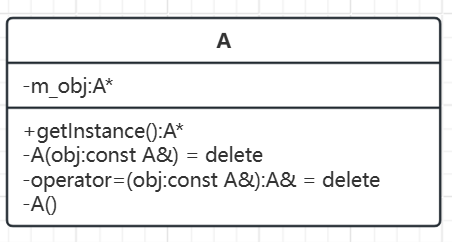

# 单例模式

[单例模式概述](#单例模式概述)

&emsp;&emsp;[概念](#概念)

&emsp;&emsp;[核心原则](#核心原则)

&emsp;&emsp;[示例代码](#示例代码)

&emsp;&emsp;[UML类图](#UML类图)

[单例模式的实现方式](#单例模式的实现方式)

&emsp;&emsp;[饿汉模式](#饿汉模式)

&emsp;&emsp;[懒汉模式](#懒汉模式)

&emsp;&emsp;&emsp;&emsp;[类的定义](#类的定义)

&emsp;&emsp;&emsp;&emsp;[线程安全问题](#线程安全问题)

---

## 单例模式概述

### 概念

在一个项目中，全局范围内，某个类的实例有且仅有一个，通过这个唯一实例向其他模块提供数据的全局访问，这种模式就叫单例模式。单例模式的典型应用就是任务队列。

### 核心原则

确保一个类只有一个实例，办法如下：
- 构造函数私有化，在类内部只调用一次。
	- 由于使用者在类外部不能使用构造函数，所以在类内部创建的这个唯一的对象必须是静态的，这样就可以通过类名来访问了，为了不破坏类的封装，我们都会把这个静态对象的访问权限设置为私有的。
	- 在类中只有它的静态成员函数才能访问其静态成员变量，所以可以给这个单例类提供一个静态函数用于得到这个静态的单例对象。
- 拷贝构造函数私有化或者禁用。
- 拷贝赋值操作符重载函数私有化或者禁用。

### 示例代码

```C++
// 定义一个单例模式的类
class A
{
public:
    // = delete 代表函数禁用, 也可以将其访问权限设置为私有
    A(const A& obj) = delete;
    A& operator=(const A& obj) = delete;
    static A* getInstance();
private:
    A() = default;
    static A* m_obj;
};
```


### UML类图



注意：即使在代码中`A(const A&) = delete;`和`operator=(const A&) = delete;`是声明为 public 的，它们仍然应该视作不可用的函数，我们通常在 UML 中将它们标记为 private，以更好地传达设计意图。

## 单例模式的实现方式

### 饿汉模式

概念：饿汉模式就是在类加载的时候立刻进行实例化。

类的定义如下:

```C++
// 饿汉模式
class TaskQueue
{
public:
    // = delete 代表函数禁用, 也可以将其访问权限设置为私有
    TaskQueue(const TaskQueue& obj) = delete;
    TaskQueue& operator=(const TaskQueue& obj) = delete;
    static TaskQueue* getInstance()
    {
        return m_taskQ;
    }
private:
    TaskQueue() = default;
    static TaskQueue* m_taskQ;
};

TaskQueue* TaskQueue::m_taskQ = new TaskQueue;

int main()
{
    TaskQueue* obj = TaskQueue::getInstance();
}
```

代码`TaskQueue* TaskQueue::m_taskQ = new TaskQueue;`，在定义这个单例类的时候，就把这个静态的单例对象创建出来了。当使用者通过`getInstance()`获取这个单例对象的时候，它已经被准备好了。

### 懒汉模式

概念：懒汉模式是在类加载的时候不去创建这个唯一的实例，而是在需要使用的时候再进行实例化。

#### 类的定义

```C++
// 懒汉模式
class TaskQueue
{
public:
    // = delete 代表函数禁用, 也可以将其访问权限设置为私有
    TaskQueue(const TaskQueue& obj) = delete;
    TaskQueue& operator=(const TaskQueue& obj) = delete;
    static TaskQueue* getInstance()
    {
        if(m_taskQ == nullptr)
        {
            m_taskQ = new TaskQueue;
        }
        return m_taskQ;
    }
private:
    TaskQueue() = default;
    static TaskQueue* m_taskQ;
};

TaskQueue* TaskQueue::m_taskQ = nullptr;
```

上述代码在单线程中没有问题，但如果是多线程的情况，多个线程同时调用了`getInstance()`函数，就会`new`出多个实例对象，不符合单例模式的定义。由此，引申出线程安全问题。

#### 线程安全问题

> **双重检查锁定**

使用互斥锁处理：

```C++
class TaskQueue
{
public:
    // = delete 代表函数禁用, 也可以将其访问权限设置为私有
    TaskQueue(const TaskQueue& obj) = delete;
    TaskQueue& operator=(const TaskQueue& obj) = delete;
    static TaskQueue* getInstance()
    {
        m_mutex.lock();
        if (m_taskQ == nullptr)
        {
            m_taskQ = new TaskQueue;
        }
        m_mutex.unlock();
        return m_taskQ;
    }
private:
    TaskQueue() = default;
    static TaskQueue* m_taskQ;
    static mutex m_mutex;
};
TaskQueue* TaskQueue::m_taskQ = nullptr;
mutex TaskQueue::m_mutex;
```

在
```C++
if (m_taskQ == nullptr)
{
    m_taskQ = new TaskQueue;
}
```
这个代码块被互斥锁锁住了，也就意味着不论有多少个线程，在同一时间只有一个线程能够执行该代码块，在重负载情况下，可能导致响应缓慢。

优化如下：

```C++
class TaskQueue
{
public:
    // = delete 代表函数禁用, 也可以将其访问权限设置为私有
    TaskQueue(const TaskQueue& obj) = delete;
    TaskQueue& operator=(const TaskQueue& obj) = delete;
    static TaskQueue* getInstance()
    {
        if (m_taskQ == nullptr)
        {
            m_mutex.lock();
            if (m_taskQ == nullptr)
            {
                m_taskQ = new TaskQueue;
            }
            m_mutex.unlock();
        }
        return m_taskQ;
    }
private:
    TaskQueue() = default;
    static TaskQueue* m_taskQ;
    static mutex m_mutex;
};
TaskQueue* TaskQueue::m_taskQ = nullptr;
mutex TaskQueue::m_mutex;
```

优化后的代码在被调用`getInstance()`时会判断`m_taskQ`是否等于`nullptr`，如果不等于`nullptr`，代表实例对象已经被创建了，直接跳过创建代码。

**双重检查锁定的问题**

```C++
    static TaskQueue* getInstance()
    {
        if (m_taskQ == nullptr)
        {
            m_mutex.lock();
            if (m_taskQ == nullptr)
            {
                m_taskQ = new TaskQueue;
            }
            m_mutex.unlock();
        }
        return m_taskQ;
    }
```

在该代码块中`m_taskQ = new TaskQueue;` 在执行过程中对应的机器指令可能会被重新排序。

正常过程如下：
- 第一步：分配内存用于保存 TaskQueue 对象。
- 第二步：在分配的内存中构造一个 TaskQueue 对象（初始化内存）。
- 第三步：使用 m_taskQ 指针指向分配的内存。

但是被重新排序以后执行顺序可能会变成这样：
- 第一步：分配内存用于保存 TaskQueue 对象。
- 第二步：使用 m_taskQ 指针指向分配的内存。
- 第三步：在分配的内存中构造一个 TaskQueue 对象（初始化内存）。

在多线程中这样就会导致一个问题：

假设现在进程A执行到了`m_taskQ = new TaskQueue;`，被重新排序后会先分配内存，使用 `m_taskQ` 指针指向分配的内存。也就是此时`m_taskQ`不等于`nullptr`但又没有被初始化。

如果在这时进程B执行到了`if (m_taskQ == nullptr)`，会直接返回一个一个没有被初始化`m_taskQ`。

针对上述问题，我们可以引入原子变量`atomic`实现一种更安全的懒汉模式的单例，代码如下：

```C++
class TaskQueue
{
public:
    // = delete 代表函数禁用, 也可以将其访问权限设置为私有
    TaskQueue(const TaskQueue& obj) = delete;
    TaskQueue& operator=(const TaskQueue& obj) = delete;
    static TaskQueue* getInstance()
    {
        TaskQueue* queue = m_taskQ.load();  
        if (queue == nullptr)
        {
            m_mutex.lock();  
            queue = m_taskQ.load();
            if (queue == nullptr)
            {
                queue = new TaskQueue;
                m_taskQ.store(queue);
            }
            m_mutex.unlock();
        }
        return queue;
    }
private:
    TaskQueue() = default;
    static atomic<TaskQueue*> m_taskQ;
    static mutex m_mutex;
};
atomic<TaskQueue*> TaskQueue::m_taskQ;
mutex TaskQueue::m_mutex;
```

原子操作的内存顺序：C++11 提供了多种内存顺序选项，如 `memory_order_relaxed`、`memory_order_consume`、`memory_order_acquire`、`memory_order_release` 和 `memory_order_seq_cst`。默认情况下，`std::atomic` 的 `load()` 和 `store()` 操作使用 `memory_order_seq_cst`，即顺序一致性。这意味着所有原子操作会按照程序中出现的顺序执行，不会被重排序，从而避免了上述问题。

不过使用原子变量的不足之处就是这种方法实现的懒汉模式的单例执行效率更低一些。由此，可以引申出静态局部变量。

**静态局部变量**

在C++11标准中有这项规定：如果指令逻辑进入一个未被初始化的声明变量，所有并发执行应当等待该变量完成初始化。

由此相较于双重检查锁定模式，使用静态局部局部对象更简单且不会出现线程安全问题。代码如下：

```C++
class TaskQueue
{
public:
    // = delete 代表函数禁用, 也可以将其访问权限设置为私有
    TaskQueue(const TaskQueue& obj) = delete;
    TaskQueue& operator=(const TaskQueue& obj) = delete;
    static TaskQueue* getInstance()
    {
        static TaskQueue taskQ;
        return &taskQ;
    }

private:
    TaskQueue() = default;
};
```