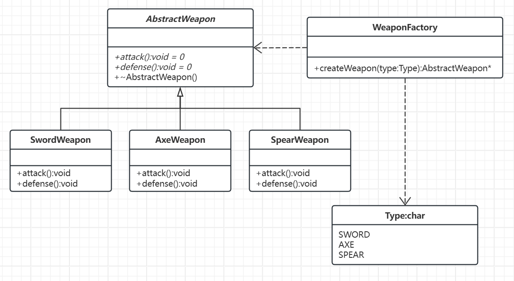

# 简单工厂模式

[核心思想](#核心思想)

[代码实现](#代码实现)

---

## 核心思想

- 解耦：将对象的创建和使用分离，客户端代码只需关注接口，无需关心具体实现类。
- 集中管理：将对象创建的判断逻辑集中在一个地方（工厂类），便于维护和扩展。

## 代码实现

假设我们需要使用的武器有剑、斧头、长枪，则可以定义以下代码：

```C++
// 剑
class SwordWeapon
{
public:
    void attack()
    {
        // 假设此处实现了攻击代码
    }
    void defense()
    {
        // 假设此处实现了防御代码
    }
};

// 斧头
class AxeWeapon
{
public:
    void attack()
    {
        // 假设此处实现了攻击代码
    }
    void defense()
    {
        // 假设此处实现了防御代码
    }
};

// 长枪
class SpearWeapon
{
public:
    void attack()
    {
        // 假设此处实现了攻击代码
    }
    void defense()
    {
        // 假设此处实现了防御代码
    }
};
```
不论是哪种武器，都具有攻击与防御俩种使用方式。

如果想要生产出这些武器，可以先创建一个工厂类，然后再给这个工厂类添加一个工厂函数，又因为我们要生成三种不同类型的武器，所以可以给工厂函数添加一个参数，用以控制当前要生产的是哪一类。

```C++
enum class Type:char{SWORD, AXE, SPEAR};
// 武器工厂类
class WeaponFactory
{
public:
    WeaponFactory() {}
    ~WeaponFactory() {}
    void* createWeapon(Type type)
    {
        void* ptr = nullptr;
        switch (type)
        {
        case Type::SWORD:
            ptr = new SwordWeapon;
            break;
        case Type::AXE:
            ptr = new AxeWeapon;
            break;
        case Type::SPEAR:
            ptr = new SpearWeapon;
            break;
        default:
            break;
        }
        return ptr;
    }
};
```

关于武器的类型，代码中用到了强类型枚举，实现了不同对象类型的兼容，并且将枚举元素设置为了`char`类型，节省了内存。

上述代码在得到函数`createSmile(Type type)`的返回值之后，还需要将其转换成实际的类型,后续处理较为复杂。

为解决该问题，我们可以使用多态，当然需要满足下面三个条件：
- 类和类之间有继承关系。
- 父类中有虚函数，并且在子类中需要重写这些虚函数。
- 使用父类指针或引用指向子类对象。

对应UML类图如下：



对应代码如下：
```C++
class AbstractWeapon
{
public:
    virtual void attack() = 0;
    virtual void defense() = 0;
    virtual ~AbstractWeapon() = default; // 虚析构确保正确释放资源
};

// 剑
class SwordWeapon : public AbstractWeapon
{
public:
    void attack()
    {
        // 假设此处实现了攻击代码
    }
    void defense()
    {
        // 假设此处实现了防御代码
    }
};

// 斧头
class AxeWeapon : public AbstractWeapon
{
public:
    void attack()
    {
        // 假设此处实现了攻击代码
    }
    void defense()
    {
        // 假设此处实现了防御代码
    }
};

// 长枪
class SpearWeapon : public AbstractWeapon
{
public:
    void attack()
    {
        // 假设此处实现了攻击代码
    }
    void defense()
    {
        // 假设此处实现了防御代码
    }
};

enum class Type:char{SWORD, AXE, SPEAR};
// 武器工厂类
class WeaponFactory
{
public:
    WeaponFactory() {}
    ~WeaponFactory() {}
    AbstractWeapon* createWeapon(Type type)
    {
        AbstractWeapon* ptr = nullptr;
        switch (type)
        {
        case Type::SWORD:
            ptr = new SwordWeapon;
            break;
        case Type::AXE:
            ptr = new AxeWeapon;
            break;
        case Type::SPEAR:
            ptr = new SpearWeapon;
            break;
        default:
            break;
        }
        return ptr;
    }
};
```
代码到此处，便实现了一个简单工厂模式。