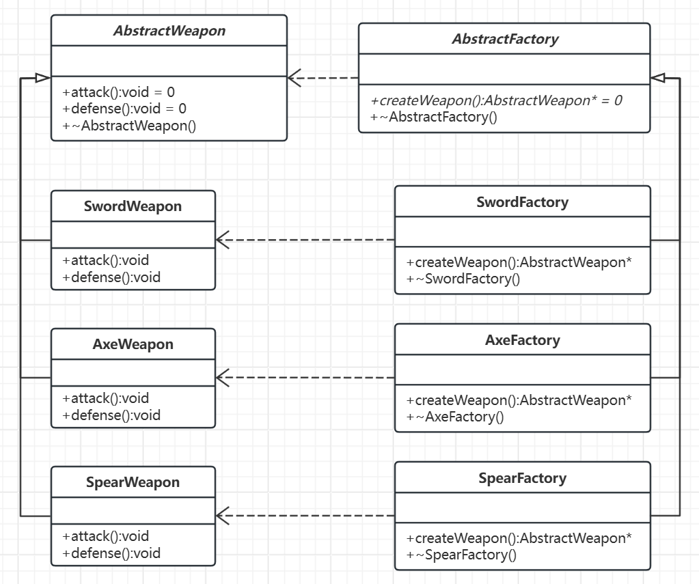

# 工厂模式

[简单工厂模式的弊端](#简单工厂模式的弊端)

[工厂模式概要](#工厂模式概要)

[工厂模式的代码实现](#工厂模式的代码实现)

---

## 简单工厂模式的弊端

先看简单工厂模式的代码：

```C++
enum class Type:char{SWORD, AXE, SPEAR};
// 武器工厂类
class WeaponFactory
{
public:
    WeaponFactory() {}
    ~WeaponFactory() {}
    AbstractWeapon* createWeapon(Type type)
    {
        AbstractWeapon* ptr = nullptr;
        switch (type)
        {
        case Type::SWORD:
            ptr = new SwordWeapon;
            break;
        case Type::AXE:
            ptr = new AxeWeapon;
            break;
        case Type::SPEAR:
            ptr = new SpearWeapon;
            break;
        default:
            break;
        }
        return ptr;
    }
};
```
在该代码中显然违反了开放-封闭原则，每当想要生成更多种类的武器时，就需要在`switch`中增加更多的`case`，违背了封闭原则。为解决该问题，引申出工厂模式。

## 工厂模式概要

面对简单工厂模式只有一个类导致的弊端，我们不妨改进一下:
- 使用一个基类，包含一个虚工厂函数，用于实现多态。
- 使用多个子类，重写父类的工厂函数。每个子工厂类负责生产一种武器。

由此得到UML类图如下：



代码如下：
```C++
// 抽象武器
class AbstractWeapon
{
public:
    virtual void attack() = 0;
    virtual void defense() = 0;
    virtual ~AbstractWeapon() = default; // 虚析构确保正确释放资源
};

// 剑
class SwordWeapon : public AbstractWeapon
{
public:
    void attack()
    {
        // 假设此处实现了攻击代码
    }
    void defense()
    {
        // 假设此处实现了防御代码
    }
};

// 斧头
class AxeWeapon : public AbstractWeapon
{
public:
    void attack()
    {
        // 假设此处实现了攻击代码
    }
    void defense()
    {
        // 假设此处实现了防御代码
    }
};

// 长枪
class SpearWeapon : public AbstractWeapon
{
public:
    void attack()
    {
        // 假设此处实现了攻击代码
    }
    void defense()
    {
        // 假设此处实现了防御代码
    }
};

// 抽象工厂
class AbstractFactory
{
public:
    virtual AbstractWeapon* createWeapon() = 0;
    virtual ~AbstractFactory() {}
};

// 制剑工厂
class SwordFactory : public AbstractFactory
{
public:
    AbstractWeapon* createWeapon() override
    {
        return new SwordWeapon;
    }
    ~SwordFactory()
    {
        // ……
    }
};

// 制斧工厂
class AxeFactory : public AbstractFactory
{
public:
    AbstractWeapon* createWeapon() override
    {
        return new AxeWeapon;
    }
    ~AxeFactory()
    {
        // ……
    }
};

// 制长枪工厂
class SpearFactory : public AbstractFactory
{
public:
    AbstractWeapon* createWeapon() override
    {
        return new SpearWeapon;
    }
    ~SpearFactory()
    {
        // ……
    }
};
```