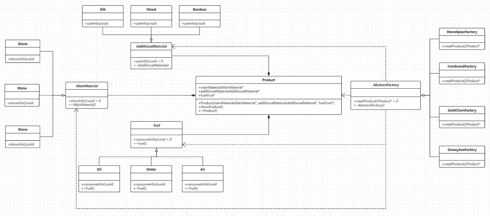

# 抽象工厂模式

[概要](#概要)

[抽象工厂模式的实现](#抽象工厂模式的实现)

---

## 概要

抽象工厂模式旨在提供一种方式来创建相关或依赖对象家族，而无需指定具体类。它通过定义高层接口来封装一组独立产品的创建过程，确保这些产品在设计上保持兼容性。

与工厂模式的区别:
- 工厂模式：针对单一产品，通过子类决定实例化哪个类。
- 抽象工厂：针对多个产品，创建整个产品家族，强调对象间的兼容性。

## 抽象工厂模式的实现

假如我们有一个工厂需要生成多种产品，并且未来可能需要生成新的产品，不同的产品主副材料及燃料需要也不相同，如下表：

|武器|主材料|副材料|燃料|
|:---:|:---:|:---:|:---:|
|石矛|石头|木头|水|
|铁剑|铁|木头|水|
|金链子|金|丝线|空气|
|油腻的斧头|铁|竹子|油|

对于每一样主材料，我们都有多种选择，便且未来可能有新的主材料，那么便可以使用如下代码：
```C++
// 主材料
class MainMaterial {
public:
	virtual void showInfo() = 0;
	virtual ~MainMaterial() = default;
};

class Stone : public MainMaterial {
public:
    void showInfo() override { /* ... */ }
};

class Iron : public MainMaterial {
public:
    void showInfo() override { /* ... */ }
};

class Gold : public MainMaterial {
public:
    void showInfo() override { /* ... */ }
};
```

上述为主材料代码，副材料与燃料代码与其类似。在上述代码中，每当我们需要添加一种新的材料时只需要添加新的类即可。

当我们有了主材料、副材料及燃料时，便可以进行加工制作出对应的产品，对应代码如下：

```C++
// 产品
class Product {
public:
    Product(MainMaterial* mainMaterial, AdditionalMaterial* additionalMaterial, Fuel* fuel) :
        _mainMaterial(mainMaterial),
        _additionalMaterial(additionalMaterial),
        _fuel(fuel)
    {}
        
    void showProduct() {/* ... */ }

    ~Product() {
        delete _mainMaterial;
        delete _additionalMaterial;
        delete _fuel;
    }

private:
    MainMaterial* _mainMaterial = nullptr;
    AdditionalMaterial* _additionalMaterial = nullptr;
    Fuel* _fuel = nullptr;

};
```

有了上述代码，便可以着手生产，由于之前代码中我们已经定义好了各种抽象类，此处我们在选择材料制作对应产品时的代码便十分简单：

```C++
// 工厂 
class AbstractFactory {
public:
    virtual Product* creatProduct() = 0;
    virtual ~AbstractFactory() = default;
};

// 石矛
class StoneSpearFactory : public AbstractFactory {
public:
    Product* creatProduct() override {
        Product* product = new Product(new Stone(), new Wood(), new Water());
        return product;
    }
};

// 铁剑
class IronSwordFactory : public AbstractFactory {
public:
    Product* creatProduct() override {
        Product* product = new Product(new Iron(), new Wood(), new Water());
        return product;
    }
};

// 金链子
class GoldChainFactory : public AbstractFactory {
public:
    Product* creatProduct() override {
        Product* product = new Product(new Gold(), new Silk(), new Air());
        return product;
    }
};

// 油腻的斧头
class GreasyAxeFactory : public AbstractFactory {
public:
    Product* creatProduct() override {
        Product* product = new Product(new Iron(), new Bamboo(), new Oil());
        return product;
    }
};
```

整合上述代码，得到完整代码如下：
```C++
// 主材料
class MainMaterial {
public:
	virtual void showInfo() = 0;
	virtual ~MainMaterial() = default;
};

class Stone : public MainMaterial {
public:
    void showInfo() override { /* ... */ }
};

class Iron : public MainMaterial {
public:
    void showInfo() override { /* ... */ }
};

class Gold : public MainMaterial {
public:
    void showInfo() override { /* ... */ }
};

// 副材料
class AdditionalMaterial {
public:
    virtual void useInfo() = 0;
    virtual ~AdditionalMaterial() = default;
};

class Wood : public AdditionalMaterial {
    void useInfo() override { /* ... */ }
};

class Silk : public AdditionalMaterial {
    void useInfo() override { /* ... */ }
};

class Bamboo : public AdditionalMaterial {
    void useInfo() override { /* ... */ }
};

// 燃料
class Fuel {
public:
    virtual void consumeInfo() = 0;
    virtual ~Fuel() = default;
};

class Water : public Fuel {
public:
    void consumeInfo() override {/* ... */ }
};

class Oil : public Fuel {
public:
    void consumeInfo() override {/* ... */ }
};

class Air : public Fuel {
public:
    void consumeInfo() override {/* ... */ }
};

// 产品
class Product {
public:
    Product(MainMaterial* mainMaterial, AdditionalMaterial* additionalMaterial, Fuel* fuel) :
        _mainMaterial(mainMaterial),
        _additionalMaterial(additionalMaterial),
        _fuel(fuel)
    {}
        
    void showProduct() {/* ... */ }

    ~Product() {
        delete _mainMaterial;
        delete _additionalMaterial;
        delete _fuel;
    }

private:
    MainMaterial* _mainMaterial = nullptr;
    AdditionalMaterial* _additionalMaterial = nullptr;
    Fuel* _fuel = nullptr;

};

// 工厂 
class AbstractFactory {
public:
    virtual Product* creatProduct() = 0;
    virtual ~AbstractFactory() = default;
};

// 石矛
class StoneSpearFactory : public AbstractFactory {
public:
    Product* creatProduct() override {
        Product* product = new Product(new Stone(), new Wood(), new Water());
        return product;
    }
};

// 铁剑
class IronSwordFactory : public AbstractFactory {
public:
    Product* creatProduct() override {
        Product* product = new Product(new Iron(), new Wood(), new Water());
        return product;
    }
};

// 金链子
class GoldChainFactory : public AbstractFactory {
public:
    Product* creatProduct() override {
        Product* product = new Product(new Gold(), new Silk(), new Air());
        return product;
    }
};

// 油腻的斧头
class GreasyAxeFactory : public AbstractFactory {
public:
    Product* creatProduct() override {
        Product* product = new Product(new Iron(), new Bamboo(), new Oil());
        return product;
    }
};

int main() {
    AbstractFactory* factroy = new IronSwordFactory;
    Product* product = factroy->creatProduct();

    delete factroy;
    delete product;

    return 0;
}
```

对应UML类图如下：



总结：抽象工厂模式通过封装对象家族的创建逻辑，提升了系统的灵活性和可维护性，尤其适合需要管理多层次相关对象的场景。