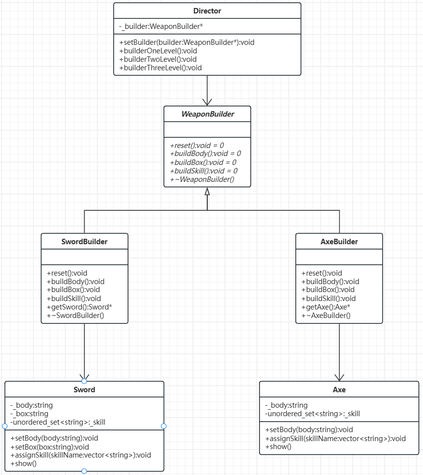

# 生成器/建造者模式

[概要](#概要)

[代码实现](#代码实现)

---

# 概要

生成器/建造者模式旨在分步骤构建复杂对象，允许通过相同的构建过程生成不同的对象表示。

核心要点：
- 将对象的构建过程与其表示分离，使同样的构建逻辑可复用，且能构造不同形式的产品。
- 解决“构造函数参数过多”或“对象构造过程复杂”的问题（如可选参数、多步骤初始化）。

建造者模式结构通常如下：
- 产品：最终要构建的复杂对象。
- 抽象建造者：定义构建产品各个组件的接口。
- 具体建造者：实现抽象建造者的接口，提供具体的构建逻辑。
- 主管：控制构建过程，定义构造步骤的顺序。
- 客户端：通过生成器或指挥者完成对象构建。

## 代码实现

假如我们要建造一个武器厂生产剑与斧头等武器，武器又分为三个等级的类别，如下表：

||一级武器|二级武器|三级武器|
|:---:|:---:|:---:|:---:|
|武器体本身|√|√|√|
|武器盒子||√|√|
|武器技能|||√|

我们先定义俩个武器剑、斧头，即我们的**产品**：
```C++
// 剑
class Sword {
public:
	void setBody(string body) {
		_body = body;
	}

	void setBox(string box) {
		_box = box;
	}

	void assignSkill(vector<string> skillName) {
		for (auto s : skillName) _skill.insert(s);
	}

	void show() {
		cout << "Sword_body:" << _body << endl;
		cout << "Sword_box:" << _box << endl;
		cout << "Sword_skill:";
		for (auto& s : _skill) cout << s << " ";
	}

private:
	string _body;
	string _box;
	unordered_set<string> _skill;
};

// 斧头
class Axe {
public:
	void setBody(string body) {
		_body = body;
	}

	void assignSkill(vector<string> skillName) {
		for (auto s : skillName) _skill.insert(s);
	}

	void show() {
		cout << "Sword_body:" << _body << endl;
		cout << "Sword_skill:";
		for (auto& s : _skill) cout << s << " ";
	}

private:
	string _body;
	unordered_set<string> _skill;
};
```

虽然有了俩个武器类，但我们并不直接通过这俩个类进行生产武器，这里，我们再定义一个**抽象生成器**：

```C++
// 抽象生成器
class WeaponBuilder {
public:
	virtual void reset() = 0;
	virtual void buildBody() = 0;
	virtual void buildBox() = 0;
	virtual void buildSkill() = 0;
	virtual ~WeaponBuilder() = default;
};
```

根据抽象生成器在实现**具体生成器**：

```C++
// 剑生成器
class SwordBuilder : public WeaponBuilder {
public:
	SwordBuilder() {
		reset();
	}

	void reset() override {
		sword = new Sword();
	}

	void buildBody() override {
		sword->setBody("剑身");
	}

	void buildBox() override {
		sword->setBox("剑鞘");
	}

	void buildSkill() override {
		sword->assignSkill({ "十字斩", "一剑切" });
	}

	Sword* getSword() {
		Sword* ret_sword = sword;
		sword = nullptr;
		return ret_sword;
	}

	~SwordBuilder() {
		delete sword;
	}

private:
	Sword* sword = nullptr;

};

// 斧头生成器
class AxeBuilder : public WeaponBuilder {
public:
	AxeBuilder() {
		reset();
	}

	void reset() {
		axe = new Axe();
	}

	void buildBody() {
		axe->setBody("斧身");
	}

	void buildBox() { 
		// 斧头并没有容纳其的盒子，这里不做处理，但依然需要重写函数防止报错
	}

	void buildSkill() {
		axe->assignSkill({ "钝击", "挥砍", "格挡" });
	}

	Axe* getAxe() {
		Axe* ret_axe = axe;
		axe = nullptr;
		return ret_axe;
	}

	~AxeBuilder() {
		delete axe;
	}

private:
	Axe* axe = nullptr;
};
```

要隐藏造船细节，就可以添加一个**主管**，不管具体生产过程，我们看到的就是一个结果：

```C++
// 主管类
class Director {
public:
	void setBuilder(WeaponBuilder* builder) {
		_builder = builder;
	}
	
	// 一级武器
	void builderOneLevel() {
		_builder->buildBody();
	}

	// 二级武器
	void builderTwoLevel() {
		_builder->buildBody();
		_builder->buildBox();
	}

	// 三级武器
	void builderThreeLevel() {
		_builder->buildBody();
		_builder->buildBox();
		_builder->buildSkill();
	}

private:
	WeaponBuilder* _builder = nullptr;
};
```

整合上述代码，得到完整代码及使用演示如下：

```C++
// 剑
class Sword {
public:
	void setBody(string body) {
		_body = body;
	}

	void setBox(string box) {
		_box = box;
	}

	void assignSkill(vector<string> skillName) {
		for (auto s : skillName) _skill.insert(s);
	}

	void show() {
		cout << "Sword_body:" << _body << endl;
		cout << "Sword_box:" << _box << endl;
		cout << "Sword_skill:";
		for (auto& s : _skill) cout << s << " ";
	}

private:
	string _body;
	string _box;
	unordered_set<string> _skill;
};

// 斧头
class Axe {
public:
	void setBody(string body) {
		_body = body;
	}

	void assignSkill(vector<string> skillName) {
		for (auto s : skillName) _skill.insert(s);
	}

	void show() {
		cout << "Sword_body:" << _body << endl;
		cout << "Sword_skill:";
		for (auto& s : _skill) cout << s << " ";
	}

private:
	string _body;
	unordered_set<string> _skill;
};

// 抽象生成器
class WeaponBuilder {
public:
	virtual void reset() = 0;
	virtual void buildBody() = 0;
	virtual void buildBox() = 0;
	virtual void buildSkill() = 0;
	virtual ~WeaponBuilder() = default;
};

// 剑生成器
class SwordBuilder : public WeaponBuilder {
public:
	SwordBuilder() {
		reset();
	}

	void reset() override {
		sword = new Sword();
	}

	void buildBody() override {
		sword->setBody("剑身");
	}

	void buildBox() override {
		sword->setBox("剑鞘");
	}

	void buildSkill() override {
		sword->assignSkill({ "十字斩", "一剑切" });
	}

	Sword* getSword() {
		Sword* ret_sword = sword;
		sword = nullptr;
		return ret_sword;
	}

	~SwordBuilder() {
		delete sword;
	}

private:
	Sword* sword = nullptr;

};

// 斧头生成器
class AxeBuilder : public WeaponBuilder {
public:
	AxeBuilder() {
		reset();
	}

	void reset() {
		axe = new Axe();
	}

	void buildBody() {
		axe->setBody("斧身");
	}

	void buildBox() {
		buildBody();
	}

	void buildSkill() {
		axe->assignSkill({ "钝击", "挥砍", "格挡" });
	}

	Axe* getAxe() {
		Axe* ret_axe = axe;
		axe = nullptr;
		return ret_axe;
	}

	~AxeBuilder() {
		delete axe;
	}

private:
	Axe* axe = nullptr;
};

// 主管类
class Director {
public:
	void setBuilder(WeaponBuilder* builder) {
		_builder = builder;
	}
	
	// 一级武器
	void builderOneLevel() {
		_builder->buildBody();
	}

	// 二级武器
	void builderTwoLevel() {
		_builder->buildBody();
		_builder->buildBox();
	}

	// 三级武器
	void builderThreeLevel() {
		_builder->buildBody();
		_builder->buildBox();
		_builder->buildSkill();
	}

private:
	WeaponBuilder* _builder = nullptr;
};

int main() {
	Director* director = new Director();
	SwordBuilder* swordBuilder = new SwordBuilder();

	// 一级剑
	director->setBuilder(swordBuilder);
	director->builderOneLevel();
	Sword* sword = swordBuilder->getSword();
	sword->show();
	delete sword;
	cout << endl << "---------------------" << endl;

	// 三级剑
	swordBuilder->reset();
	director->setBuilder(swordBuilder);
	director->builderThreeLevel();
	sword = swordBuilder->getSword();
	sword->show();
	delete sword;
	cout << endl << "---------------------" << endl;


	AxeBuilder* axeBuilder = new AxeBuilder();
	// 二级斧头
	director->setBuilder(axeBuilder);
	director->builderTwoLevel();
	Axe* axe = axeBuilder->getAxe();
	axe->show();
	delete axe;
	cout << endl << "---------------------" << endl;

	// 三级斧头
	axeBuilder->reset();
	director->setBuilder(axeBuilder);
	director->builderThreeLevel();
	axe = axeBuilder->getAxe();
	axe->show();
	delete axe;
	cout << endl << "---------------------" << endl;

	delete director;
	delete swordBuilder;
	delete axeBuilder;
}
```

对应UML类图如下：

