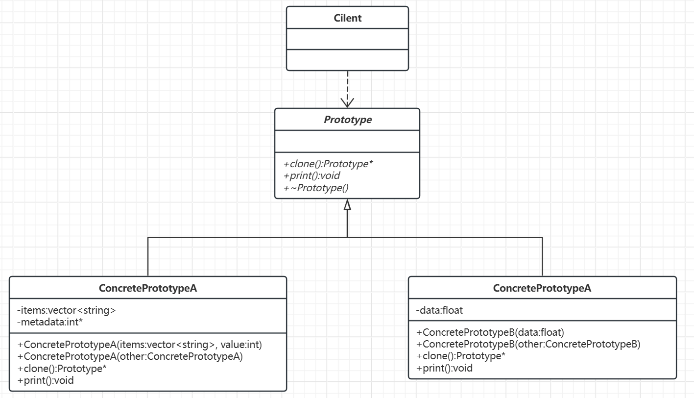

# 原型模式

[概要](#概要)

[代码实现](#代码实现)

[原型模式的作用](#原型模式的作用)

---

## 概要

核心思想:通过复制现有对象（原型）来创建新对象，而非通过传统的类实例化方式（如 new 操作符）。适用于对象创建成本较高或需要动态配置的场景，能够提升性能并简化对象创建过程。

## 代码实现

示例代码：

```C++
// 原型基类（抽象接口）
class Prototype {
public:
    virtual ~Prototype() = default;
    virtual std::unique_ptr<Prototype> clone() const = 0; // 多态克隆方法
    virtual void addItem(const std::string& item) = 0;
    virtual void printItems() const = 0;
};

// 具体原型类
class ConcretePrototype : public Prototype {
private:
    std::vector<std::string> items;
    int* metadata; // 用于演示深拷贝的指针成员

public:
    // 构造函数
    ConcretePrototype(const std::vector<std::string>& items, int metadataValue)
        : items(items), metadata(new int(metadataValue)) {}

    // 深拷贝构造函数
    ConcretePrototype(const ConcretePrototype& other)
        : items(other.items), metadata(new int(*other.metadata)) {}

    // 克隆方法（返回智能指针）
    std::unique_ptr<Prototype> clone() const override {
        return std::make_unique<ConcretePrototype>(*this);
    }

    void addItem(const std::string& item) override {
        items.push_back(item);
    }

    void printItems() const override {
        std::cout << "Items: [";
        for (const auto& item : items) {
            std::cout << item << " ";
        }
        std::cout << "], Metadata: " << *metadata << std::endl;
    }

    // 修改元数据以验证深拷贝
    void setMetadata(int value) {
        *metadata = value;
    }

    ~ConcretePrototype() {
        delete metadata;
    }
};

// 客户端代码
int main() {
    // 1. 创建原型对象
    auto original = std::make_unique<ConcretePrototype>(
        std::vector<std::string>{"Apple", "Banana"}, 100
    );

    // 2. 克隆对象（深拷贝）
    auto cloned = original->clone();

    // 3. 修改原型的成员
    original->addItem("Cherry");
    dynamic_cast<ConcretePrototype*>(original.get())->setMetadata(200);

    // 4. 验证克隆结果
    std::cout << "Original: ";
    original->printItems(); // Items: [Apple Banana Cherry ], Metadata: 200

    std::cout << "Cloned:   ";
    cloned->printItems();   // Items: [Apple Banana ], Metadata: 100
                            // （深拷贝后不受原对象修改影响）

    return 0;
}
```

这样，就可以十分方便的通过`clone()`函数复制对象了。为了更好的展示原型模式的解耦创建逻辑，改进代码如下：

```C++
// 1. 原型基类（抽象接口）
class Prototype {
public:
    virtual ~Prototype() = default;
    virtual std::unique_ptr<Prototype> clone() const = 0; // 多态克隆
    virtual void print() const = 0;                       // 统一操作接口
};

// 2. 具体原型类A
class ConcretePrototypeA : public Prototype {
private:
    std::vector<std::string> items;
    int* metadata;

public:
    ConcretePrototypeA(const std::vector<std::string>& items, int value) 
        : items(items), metadata(new int(value)) {}

    // 深拷贝构造函数
    ConcretePrototypeA(const ConcretePrototypeA& other) 
        : items(other.items), metadata(new int(*other.metadata)) {}

    std::unique_ptr<Prototype> clone() const override {
        return std::make_unique<ConcretePrototypeA>(*this);
    }

    void print() const override {
        std::cout << "TypeA Items: [";
        for (const auto& item : items) std::cout << item << " ";
        std::cout << "], Metadata: " << *metadata << std::endl;
    }
};

// 3. 具体原型类B（新增类型无需修改客户端）
class ConcretePrototypeB : public Prototype {
private:
    float data;

public:
    explicit ConcretePrototypeB(float data) : data(data) {}

    // 拷贝构造函数
    ConcretePrototypeB(const ConcretePrototypeB& other) : data(other.data) {}

    std::unique_ptr<Prototype> clone() const override {
        return std::make_unique<ConcretePrototypeB>(*this);
    }

    void print() const override {
        std::cout << "TypeB Data: " << data << std::endl;
    }
};

// 4. 原型注册表（核心解耦组件）
class PrototypeRegistry {
private:
    std::unordered_map<std::string, std::unique_ptr<Prototype>> prototypes;

public:
    // 注册原型
    void registerPrototype(const std::string& key, std::unique_ptr<Prototype> proto) {
        prototypes[key] = std::move(proto);
    }

    // 创建对象（客户端仅通过接口操作）
    std::unique_ptr<Prototype> create(const std::string& key) const {
        auto it = prototypes.find(key);
        if (it != prototypes.end()) {
            return it->second->clone(); // 多态克隆
        }
        return nullptr;
    }
};

// 5. 客户端代码（完全解耦）
int main() {
    // 初始化注册表
    PrototypeRegistry registry;
    
    // 注册预定义原型（可配置化）
    registry.registerPrototype("TypeA", 
        std::make_unique<ConcretePrototypeA>(std::vector<std::string>{"Apple", "Banana"}, 100));
    registry.registerPrototype("TypeB", 
        std::make_unique<ConcretePrototypeB>(3.14f));

    // 动态创建对象（无需知道具体类）
    auto obj1 = registry.create("TypeA");
    auto obj2 = registry.create("TypeB");
    auto obj3 = registry.create("TypeA"); // 同一原型的多个副本

    // 统一操作接口
    std::cout << "Object 1: ";
    obj1->print(); // TypeA Items: [Apple Banana ], Metadata: 100
    
    std::cout << "Object 2: ";
    obj2->print(); // TypeB Data: 3.14
    
    std::cout << "Object 3: ";
    obj3->print(); // TypeA Items: [Apple Banana ], Metadata: 100

    return 0;
}
```

对应类图如下：



## 原型模式的作用

为什么不直接使用普通拷贝构造？原型模式对比普通拷贝构造的优势：
- 多态克隆：客户端代码`original->clone()`通过基类指针操作，完全不知道`ConcretePrototype`的存在。
- 解耦创建逻辑：新增具体原型类时，客户端代码无需修改即可通过`clone()`创建新类型的对象。
- 避免高成本初始化，拷贝构造每次都会执行完整初始化逻辑，而原型模式直接复制已初始化的状态，能节省大量时间。
