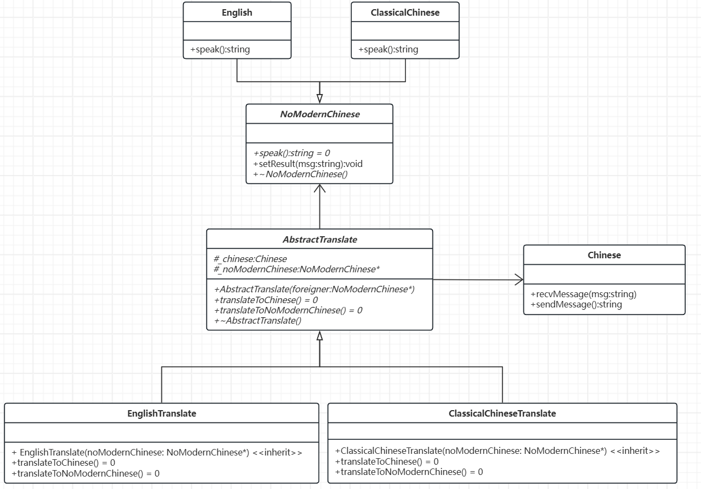

# 适配器模式

[概要](#概要)

[代码实现](#代码实现)

---

## 概要

概念：适配器模式用于将不兼容的接口转换为客户端期望的接口，使原本无法协同工作的类能够一起工作。

核心结构：
- 目标接口：客户端期望的接口，定义客户端需要调用的方法。
- 被适配者：已存在的类或接口，但其方法与目标接口不兼容。
- 适配器：实现目标接口，并持有被适配者的实例，通过调用被适配者的方法实现目标接口的功能。

## 代码实现

假设现在有一个外国人和一个古人都打算与一个现代中国人打招呼，他们打招呼的用语是固定的（类似插头接口不会改变）

现在我们要实现一个固定的非现代中文（英语、文言文）与现代中文的转换

我们可以先定义需要被转换的语言类：

```C++
class NoModernChinese
{
public:
    virtual string speak() = 0;
    void setResult(string msg)
    {
        cout << "中国人说: " << msg << endl;
    }
    virtual ~NoModernChinese() {}
};

// 英语
class English : public NoModernChinese
{
public:
    string speak() override
    {
        return string("hello!");
    }
};

// 文言文
class ClassicalChinese : public NoModernChinese
{
public:
    string speak()
    {
        return string("幸会！");
    }
};

// 中文
class Chinese
{
public:
    void recvMessage(string msg)
    {
        cout << msg << endl;
    }
    string sendMessage()
    {
        return string("你也好！");
    }
};
```

这里`speak()`中是他们打招呼固定会说的话，`setResult`用来接收现代中国人的回复。

已经有了他们的固定用语，要让他们互相听懂，就需要一个翻译器，也就是适配器：

```C++
// 抽象翻译适配器类
class AbstractTranslate
{
public:
    AbstractTranslate(NoModernChinese* noModernChinese) : _noModernChinese(noModernChinese) {}
    virtual void translateToChinese() = 0;
    virtual void translateToNoModernChinese() = 0;
    virtual ~AbstractTranslate() {}
protected:
    Chinese _chinese;
    NoModernChinese* _noModernChinese = nullptr;
};

// 英语翻译适配器
class EnglishTranslate : public AbstractTranslate
{
public:
    // 继承构造函数
    using AbstractTranslate::AbstractTranslate;
    void translateToChinese() override
    {
        string msg = _noModernChinese->speak();
        // 翻译并将信息传递给中文对象
        _chinese.recvMessage("外国人说: " + msg);
    }
    void translateToNoModernChinese() override
    {
        // 接收中文的信息
        string msg = _chinese.sendMessage();
        // 翻译并将中文的话转发给外国人
        _noModernChinese->setResult("外国佬, " + msg);
    }
};

// 文言文翻译适配器
class ClassicalChineseTranslate : public AbstractTranslate
{
public:
    using AbstractTranslate::AbstractTranslate;
    void translateToChinese() override
    {
        string msg = _noModernChinese->speak();
        // 翻译并将信息传递给中文对象
        _chinese.recvMessage("古人说: " + msg);
    }
    void translateToNoModernChinese() override
    {
        // 接收中文的信息
        string msg = _chinese.sendMessage();
        // 翻译并将中文的话转发给古人
        _noModernChinese->setResult("古人, " + msg);
    }
};
```
每一个适配器都有`translateToChinese`可以将信息传递给现代中国人，同时有一个`translateToNoModernChinese`将现代中国人的回复翻译并发送。

完整代码如下：

```C++
class NoModernChinese
{
public:
    virtual string speak() = 0;
    void setResult(string msg)
    {
        cout << "中国人说: " << msg << endl;
    }
    virtual ~NoModernChinese() {}
};

// 英语
class English : public NoModernChinese
{
public:
    string speak() override
    {
        return string("hello!");
    }
};

// 文言文
class ClassicalChinese : public NoModernChinese
{
public:
    string speak()
    {
        return string("幸会！");
    }
};

// 中文
class Chinese
{
public:
    void recvMessage(string msg)
    {
        cout << msg << endl;
    }
    string sendMessage()
    {
        return string("你也好！");
    }
};

// 抽象翻译适配器类
class AbstractTranslate
{
public:
    AbstractTranslate(NoModernChinese* noModernChinese) : _noModernChinese(noModernChinese) {}
    virtual void translateToChinese() = 0;
    virtual void translateToNoModernChinese() = 0;
    virtual ~AbstractTranslate() {}
protected:
    Chinese _chinese;
    NoModernChinese* _noModernChinese = nullptr;
};

// 英语翻译适配器
class EnglishTranslate : public AbstractTranslate
{
public:
    // 继承构造函数
    using AbstractTranslate::AbstractTranslate;
    void translateToChinese() override
    {
        string msg = _noModernChinese->speak();
        // 翻译并将信息传递给中文对象
        _chinese.recvMessage("外国人说: " + msg);
    }
    void translateToNoModernChinese() override
    {
        // 接收中文的信息
        string msg = _chinese.sendMessage();
        // 翻译并将中文的话转发给外国人
        _noModernChinese->setResult("外国佬, " + msg);
    }
};

// 文言文翻译适配器
class ClassicalChineseTranslate : public AbstractTranslate
{
public:
    using AbstractTranslate::AbstractTranslate;
    void translateToChinese() override
    {
        string msg = _noModernChinese->speak();
        // 翻译并将信息传递给中文对象
        _chinese.recvMessage("古人说: " + msg);
    }
    void translateToNoModernChinese() override
    {
        // 接收中文的信息
        string msg = _chinese.sendMessage();
        // 翻译并将中文的话转发给古人
        _noModernChinese->setResult("古人, " + msg);
    }
};

int main()
{
    NoModernChinese* noModernChinese = new English;
    EnglishTranslate* foreigner = new EnglishTranslate(noModernChinese);
    foreigner->translateToChinese();
    foreigner->translateToNoModernChinese();
    delete noModernChinese;
    delete foreigner;

    noModernChinese = new ClassicalChinese;
    ClassicalChineseTranslate* ancients = new ClassicalChineseTranslate(noModernChinese);
    ancients->translateToChinese();
    ancients->translateToNoModernChinese();
    delete noModernChinese;
    delete ancients;

    return 0;
}
```

对应UML类图如下：



`AbstractTranslate`与`Chinese`不仅可以是关联关系，也可以是泛化关系，见下图示例：


俩种模式作用并无区别，可根据实际场景选择更适用的方法。
