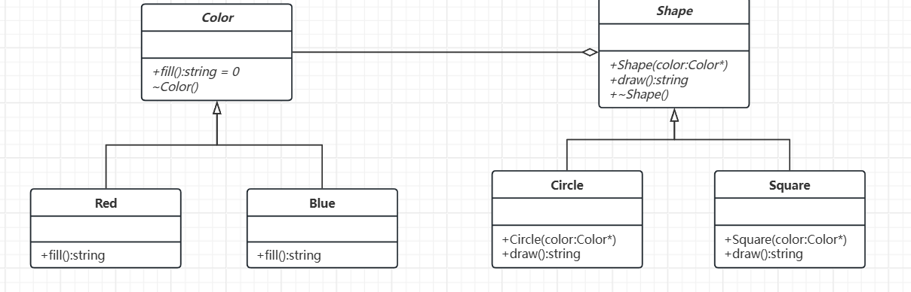

# 桥接模式

--- 

## 概要

核心思想：将抽象与实现解耦，使二者可以独立变化。

假设要设计一个图形界面库，需要支持多种形状（圆形、方形）和多种颜色（红色、蓝色）。如果为每种组合（红圆、蓝圆、红方、蓝方）都创建子类，会产生 2x2=4 个类。若新增一种颜色或形状，类数量将指数级增长。

桥接模式通过拆分维度解决这一问题：将形状（抽象）和颜色（实现）分离，通过组合方式动态绑定。

模型结构：
- 抽象化：定义高层的抽象接口（例如“形状”）。
- 扩展抽象化：对抽象的扩展（例如“圆形”或“方形”）。
- 实现化：定义底层实现的接口（例如“颜色”）。
- 具体实现化：实现底层接口的具体类（例如“红色”或“蓝色”）。

## 类图及代码

类图如下：



代码实现如下：

```C++
// 实现化接口：颜色
class Color {
public:
    virtual ~Color() = default; // 虚析构确保正确释放资源
    virtual string fill() = 0;
};

// 具体实现化：红色
class Red : public Color {
public:
    string fill() override {
        return "红色";
    }
};

// 具体实现化：蓝色
class Blue : public Color {
public:
    string fill() override {
        return "蓝色";
    }
};

// 抽象化：形状
class Shape {
protected:
    Color* color_; // 组合颜色对象（实际项目建议用智能指针）
public:
    explicit Shape(Color* color) : color_(color) {}
    virtual ~Shape() = default; // 虚析构确保正确释放资源
    virtual string draw() = 0;
};

// 扩展抽象化：圆形
class Circle : public Shape {
public:
    explicit Circle(Color* color) : Shape(color) {}

    string draw() override {
        return "圆形（" + color_->fill() + "）";
    }
};

// 扩展抽象化：方形
class Square : public Shape {
public:
    explicit Square(Color* color) : Shape(color) {}

    string draw() override {
        return "方形（" + color_->fill() + "）";
    }
};

// 客户端使用
int main() {
    // 创建颜色实现
    Color* red = new Red();
    Color* blue = new Blue();

    // 组合形状与颜色
    Shape* redCircle = new Circle(red);
    Shape* blueSquare = new Square(blue);

    // 输出结果
    cout << redCircle->draw() << endl;  // 输出：圆形（红色）
    cout << blueSquare->draw() << endl; // 输出：方形（蓝色）

    // 释放资源（实际项目建议使用智能指针）
    delete redCircle;
    delete blueSquare;
    delete red;
    delete blue;

    return 0;
}
```

