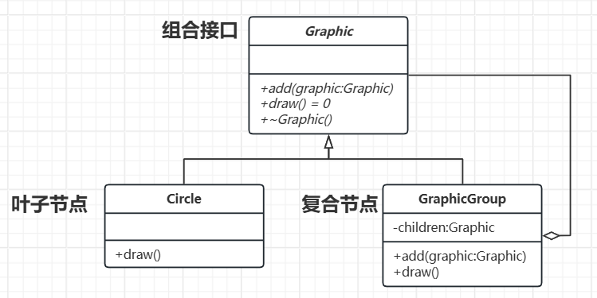

# 组合模式

[概要](#概要)

[类图及代码](#类图及代码)

---

## 概要

概念：组合模式是一种用于将对象组合成树形结构以表示“部分-整体”的层次结构，使客户端能够以统一的方式处理单个对象和组合对象。

基本结构：
- 组件接口：定义所有对象的通用接口（如添加、删除子节点、操作等），可以是抽象类或接口。
- 叶子节点：基本对象，没有子节点，实现组件接口的具体操作。
- 复合节点：包含子节点的对象，实现组件接口，并管理子组件。

## 类图及代码

类图如下：



代码如下：

```C++
// 组件接口
class Graphic {
public:
    virtual void add(shared_ptr<Graphic> graphic) {} // 空实现（简化）
    virtual void draw() const = 0;
    virtual ~Graphic() = default;
};

// 叶子节点：圆
class Circle : public Graphic {
public:
    void draw() const override {
        cout << "Drawing a Circle" << endl;
    }
};

// 复合节点：图形组
class GraphicGroup : public Graphic {
private:
    vector<shared_ptr<Graphic>> children;
public:
    void add(shared_ptr<Graphic> graphic) override {
        children.push_back(graphic);
    }

    void draw() const override {
        cout << "--- Drawing Group ---" << endl;
        for (const auto& child : children) {
            child->draw(); // 递归绘制子对象
        }
    }
};

// 客户端代码
int main() {
    auto circle1 = make_shared<Circle>();
    auto circle2 = make_shared<Circle>();

    // 创建组合对象
    auto group = make_shared<GraphicGroup>();
    group->add(circle1);
    group->add(circle2);

    // 统一调用接口
    circle1->draw();  // 单独调用叶子
    group->draw();    // 调用组合对象

    return 0;
}
```