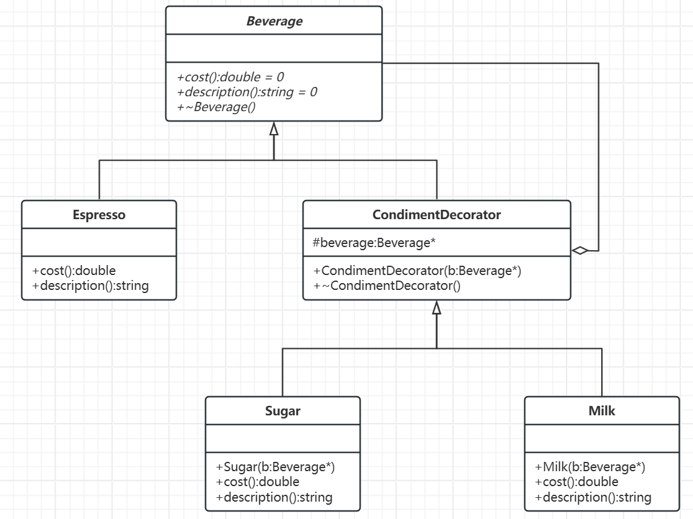
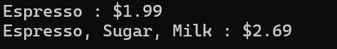

# 装饰模式

---

## 概要

装饰模式就像是对一个简单的房子进行装修和加建，让它逐步变得更加舒适和功能齐全。最初，房子（对象）是基础的，能提供最基本的居住功能。而通过不断添加新的装饰和功能，比如增设门窗、家电、花园等，房子的居住体验变得更好。同理，装饰模式是在不改变对象原有结构的情况下，动态地给对象添加新功能，从而让对象更加强大和灵活。

概念：装饰模式也可以称之为封装模式，所谓的封装就是在原有行为之上进行拓展，并不会改变该行为，该模式允许通过将对象放入包含行为的特殊封装对象中来动态地扩展对象的功能。这种模式通过组合替代继承，提供了比继承更有弹性的扩展方式。

基本结构：
- 组件接口：定义被装饰对象的统一接口。
- 具体组件：实现基础功能的组件。
- 装饰器基类：持有一个组件引用并实现组件接口。
- 具体装饰器：添加额外功能的装饰器实现。

## 类图及代码

类图如下：



对应代码如下：

```C++
// 组件接口
class Beverage {
public:
    virtual ~Beverage() = default;
    virtual double cost() = 0;
    virtual std::string description() = 0;
};

// 具体组件
class Espresso : public Beverage {
public:
    double cost() override {
        return 1.99;  // 基础价格
    }

    std::string description() override {
        return "Espresso";
    }
};

// 装饰器基类
class CondimentDecorator : public Beverage {
protected:
    Beverage* beverage;

public:
    explicit CondimentDecorator(Beverage* b) : beverage(b) {}
    virtual ~CondimentDecorator() {
        delete beverage;  // 清理内存
    }
};

// 具体装饰器：糖
class Sugar : public CondimentDecorator {
public:
    explicit Sugar(Beverage* b) : CondimentDecorator(b) {}

    double cost() override {
        return beverage->cost() + 0.2;  // 增加糖的价格
    }

    std::string description() override {
        return beverage->description() + ", Sugar";
    }
};

// 具体装饰器：牛奶
class Milk : public CondimentDecorator {
public:
    explicit Milk(Beverage* b) : CondimentDecorator(b) {}

    double cost() override {
        return beverage->cost() + 0.5;  // 增加牛奶的价格
    }

    std::string description() override {
        return beverage->description() + ", Milk";
    }
};

// 使用示例
int main() {
    // 创建基础饮料
    Beverage* drink = new Espresso();
    std::cout << drink->description()
        << " : $" << drink->cost() << std::endl;

    // 添加装饰器
    Beverage* drinkWithSugar = new Sugar(drink);
    Beverage* drinkWithSugarAndMilk = new Milk(drinkWithSugar);

    std::cout << drinkWithSugarAndMilk->description()
        << " : $" << drinkWithSugarAndMilk->cost()
        << std::endl;

    // 注意：装饰器会自动清理内存
    delete drinkWithSugarAndMilk;
    return 0;
}
```
输出如下：



不难发现，浓缩咖啡单独卖只有1.99$，但加入（装饰）糖和牛奶价格便会得到相应上涨。