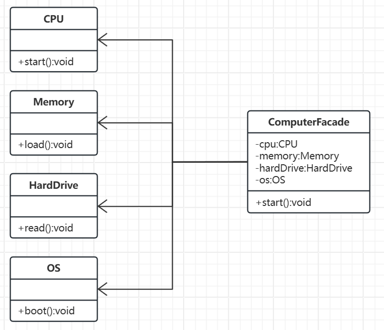

# 外观模式

[概述](#概述)

&emsp;&emsp;[概念](#概念)

&emsp;&emsp;[核心思想](#核心思想)

&emsp;&emsp;[基本结构](#基本结构)

[类图及代码实现](#类图及代码实现)

&emsp;&emsp;[类图](#类图)

&emsp;&emsp;[代码实现](#代码实现)

[与其他模式的区别](#与其他模式的区别)

---

## 概述

当系统包含多个复杂的模块或类时，客户端可能需要直接与这些模块交互，导致以下问题：
- 代码臃肿：客户端需要了解每个模块的细节。
- 高耦合：模块的修改可能影响客户端代码。
- 使用复杂：调用顺序或依赖关系容易出错。

外观模式通过一个中间层（外观类）封装子系统的复杂性，让客户端只需与外观类交互，无需关心子系统内部细节。 

### 概念

外观模式旨在为复杂的子系统提供一个简化的统一接口，从而降低客户端与子系统之间的耦合度。

### 核心思想

隐藏系统的复杂性，让用户通过一个高层接口轻松使用系统的核心功能。

### 基本结构：

- 外观类：
	- 提供统一的入口接口，将客户端请求转发给子系统的相关模块。
	- 了解子系统的功能，并负责协调其工作流程。
- 子系统类：
	- 实现子系统的具体功能，可以独立工作或被外观类调用。
	- 不感知外观类的存在（解耦）。

## 类图及代码实现

场景：电脑启动过程
假设用户启动电脑时，需要依次执行以下操作：
- CPU初始化；
- 内存加载；
- 硬盘读取数据；
- 操作系统启动。

### 类图



### 代码实现

```C++
// 子系统1: CPU
class CPU {
public:
    void start() {
        std::cout << "CPU initialized" << std::endl;
    }
};

// 子系统2: 内存
class Memory {
public:
    void load() {
        std::cout << "Memory loaded" << std::endl;
    }
};

// 子系统3: 硬盘
class HardDrive {
public:
    void read() {
        std::cout << "HardDrive data read" << std::endl;
    }
};

// 子系统4: 操作系统
class OS {
public:
    void boot() {
        std::cout << "OS booted" << std::endl;
    }
};

class ComputerFacade {
private:
    CPU cpu;
    Memory memory;
    HardDrive hardDrive;
    OS os;

public:
    void start() {
        cpu.start();      // 初始化CPU
        memory.load();    // 加载内存
        hardDrive.read(); // 读取硬盘
        os.boot();        // 启动操作系统
        std::cout << "Computer started successfully!" << std::endl;
    }
};

int main() {
    ComputerFacade computer;
    computer.start(); // 一键启动电脑
    return 0;
}
```

如果不使用外观模式时，用户需要手动调用每个模块的接口，调用顺序或依赖关系容易出错。

使用外观模式后，用户只需调用一个接口，简化客户端的使用，降低系统耦合度，提高子系统的独立性和复用性。

## 与其他模式的区别

- 中介者模式：协调对象间的交互，而外观模式仅提供简化接口。
- 单例模式：外观类通常可以设计为单例，但单例模式是 “实例的唯一性”，解决资源共享的问题，而外观模式是“接口的简化”，解决复杂调用的问题。
- 适配器模式：适配器解决接口不兼容问题，外观模式解决接口复杂性问题。
