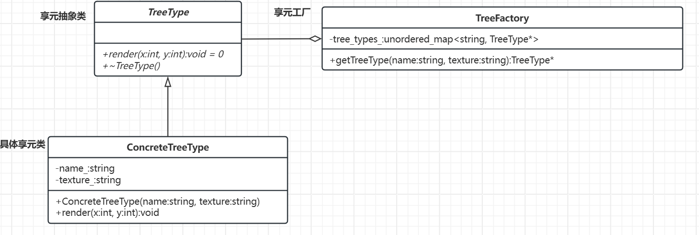
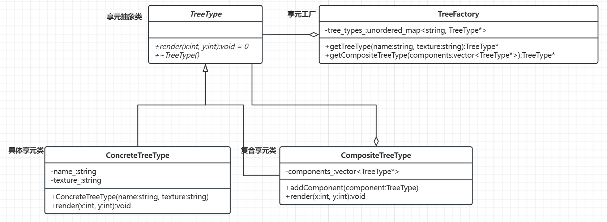

# 享元模式

[概述](#概述)

&emsp;&emsp;[概念](#概念)

&emsp;&emsp;[核心思想](#核心思想)

&emsp;&emsp;[基本结构](#基本结构)

[类图及代码实现](#类图及代码实现)

&emsp;&emsp;[实现方式](#实现方式)

&emsp;&emsp;[类图](#类图)

&emsp;&emsp;[代码](#代码)

---

## 概述

假设需要渲染一片森林（包含成千上万棵树）。如果每棵树都独立存储所有属性（如树种、纹理、颜色），将导致大量的内存消耗，可能超出系统的处理能力。。这时候，就可以用到享元模式。

### 概念

享元模式旨在通过共享对象来减少内存占用并提高性能。它将对象的状态分为内部状态（可共享）和外部状态（不可共享），通过复用内部状态来减少对象数量。

### 核心思想

- 分离不变与变化：将对象的不变部分（内部状态，如配置、类型）与变化部分（外部状态，如位置、上下文）分离。
- 共享重复部分：所有相似对象共享同一份内部状态，避免重复创建。

### 基本结构

- 享元接口：定义对象内部状态的接口。
- 具体享元类：实现享元接口，存储内部状态，且状态不可变。
- 享元工厂：创建并管理享元对象，确保相同内部状态的对象只创建一次。
- 客户端：维护外部状态，并通过享元工厂获取享元对象。

## 类图及代码实现

### 实现方式

单纯享元模式
- 所有的具体享元类都可以共享，没有非共享的享元对象。
- 这种模式下，享元对象的内部状态是共享的，而外部状态由客户端管理。

复合享元模式
- 部分享元对象是由一些单纯享元对象组合而成，这些组合的享元对象称为复合享元。
- 复合享元对象本身不能共享，但它们可以分解成单纯享元对象进行共享。
- 这种模式适用于需要将多个享元对象组合在一起，共享其内部状态的场景。

### 类图

单纯享元模式类图示例：



复合享元模式类图示例：



### 代码

单纯享元模式：

```C++
// 享元抽象类
class TreeType {
public:
    virtual void render(int x, int y) const = 0;
    virtual ~TreeType() = default;
};

// 具体享元类
class ConcreteTreeType : public TreeType {
private:
    std::string name_;    // 内部状态（不可变）
    std::string texture_;

public:
    ConcreteTreeType(const std::string& name, const std::string& texture)
        : name_(name), texture_(texture) {}

    void render(int x, int y) const override {
        std::cout << "渲染 " << name_ << " 树在 (" << x << ", " << y 
                  << ")，使用纹理 " << texture_ << std::endl;
    }
};

// 享元工厂
class TreeFactory {
private:
    using Key = std::string;
    std::unordered_map<Key, std::shared_ptr<TreeType>> tree_types_;

public:
    std::shared_ptr<TreeType> getTreeType(const std::string& name, const std::string& texture) {
        const Key key = name + "_" + texture;
        auto it = tree_types_.find(key);
        
        if (it == tree_types_.end()) {
            auto tree_type = std::make_shared<ConcreteTreeType>(name, texture);
            tree_types_[key] = tree_type;
            return tree_type;
        }
        return it->second;
    }
};

// 客户端
int main() {
    TreeFactory factory;

    // 获取共享对象
    auto oak = factory.getTreeType("Oak", "oak_texture.png");
    oak->render(10, 20);  // 外部状态由客户端传递

    auto pine = factory.getTreeType("Pine", "pine_texture.png");
    pine->render(30, 40);

    // 再次获取 Oak 类型，应该复用已有对象
    auto oak2 = factory.getTreeType("Oak", "oak_texture.png");
    oak2->render(50, 60);

    // 验证对象是否共享
    std::cout << "oak 和 oak2 是否相同对象? " << std::boolalpha 
              << (oak.get() == oak2.get()) << std::endl;  // 输出 true

    return 0;
}
```

复合享元模式：

```C++
// 享元抽象类
class TreeType {
public:
    virtual void render(int x, int y) const = 0;
    virtual ~TreeType() = default;
};

// 具体享元类
class ConcreteTreeType : public TreeType {
private:
    std::string name_;    // 内部状态（不可变）
    std::string texture_;

public:
    ConcreteTreeType(const std::string& name, const std::string& texture)
        : name_(name), texture_(texture) {
    }

    void render(int x, int y) const override {
        std::cout << "渲染 " << name_ << " 树在 (" << x << ", " << y
            << ")，使用纹理 " << texture_ << std::endl;
    }
};

// 复合享元类(单纯享元模式该类可以去掉）
class CompositeTreeType : public TreeType {
private:
    std::vector<std::shared_ptr<TreeType>> components_;

public:
    void addComponent(const std::shared_ptr<TreeType>& component) {
        components_.push_back(component);
    }

    void render(int x, int y) const override {
        for (const auto& component : components_) {
            component->render(x, y);
        }
    }
};

// 享元工厂
class TreeFactory {
private:
    using Key = std::string; // Key 就是 std::string 的别名，意味着 Key 和 std::string 是等价的
    std::unordered_map<Key, std::shared_ptr<TreeType>> tree_types_;

public:
    std::shared_ptr<TreeType> getTreeType(const std::string& name, const std::string& texture) {
        const Key key = name + "_" + texture;   
        auto it = tree_types_.find(key);

        if (it == tree_types_.end()) {
            auto tree_type = std::make_shared<ConcreteTreeType>(name, texture);
            tree_types_[key] = tree_type;
            return tree_type;
        }
        return it->second;
    }

    // 单纯享元模式中不需要下面代码
    std::shared_ptr<TreeType> getCompositeTreeType(const std::vector<std::shared_ptr<TreeType>>& components) {
        auto composite = std::make_shared<CompositeTreeType>();
        for (const auto& component : components) {
            composite->addComponent(component);     
        }
        return composite;
    }
};

// 客户端
int main() {
    TreeFactory factory;

    // 获取共享对象
    auto oak = factory.getTreeType("Oak", "oak_texture.png");
    auto pine = factory.getTreeType("Pine", "pine_texture.png");

    // 创建复合享元对象
    std::vector<std::shared_ptr<TreeType>> components = { oak, pine };
    auto composite_tree = factory.getCompositeTreeType(components);

    // 渲染复合树
    composite_tree->render(10, 20);

    return 0;
}
```

当树的数量足够多时，采用享元模式可以有效地共享相同属性的树对象，显著减少内存占用，提高系统性能。