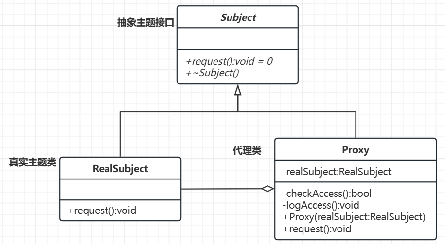

# 代理模式

[概要](#概要)

[类图及代码](#类图及代码)

---

## 概要

概念：代理模式通过代理对象控制对原始对象的访问。代理对象通常与真实对象具有相同的接口，使客户端可以透明地使用代理对象而无需关心其背后的实现细节。

基本结构：
- 抽象主题接口
- 真实业务类
- 代理类

## 类图及代码

场景：VPN架梯子访问外网。

类图如下：



该类图中代理类和真实业务类是聚合关系，但场景不同关系也不同，在别的样例场景中还可能是关联。

代码如下：

```C++
// 抽象主题接口
class Subject {
public:
    virtual void request() const = 0;
    virtual ~Subject() = default;
};

// 真实主题类
class RealSubject : public Subject {
public:
    void request() const override {
        std::cout << "真实主题：处理请求。" << std::endl;
    }
};

// 代理类
class Proxy : public Subject {
private:
    RealSubject* realSubject;

    bool checkAccess() const {
        // 在此进行访问控制，例如权限检查
        std::cout << "代理：在转发请求之前检查访问权限。" << std::endl;
        return true; // 假设访问被允许
    }

    void logAccess() const {
        // 记录访问日志
        std::cout << "代理：记录请求的时间。" << std::endl;
    }

public:
    Proxy(RealSubject* subject) : realSubject(subject) {}

    void request() const override {
        if (checkAccess()) {
            realSubject->request();
            logAccess();
        }
    }

    ~Proxy() {
        delete realSubject;
    }
};

// 客户端代码
int main() {
    RealSubject* realSubject = new RealSubject();
    Proxy proxy(realSubject);
    proxy.request();

    return 0;
}
```

代理模式的核心思想是通过引入代理对象来控制对真实对象的访问，代理对象和真实对象之间的关系可以根据具体需求采用不同的关联方式。选择哪种关系取决于场景对对象生命周期管理、灵活性和复杂度的权衡。​

任何一种设计模式都是如此，类的关系可能各有不同，但核心思想不变。