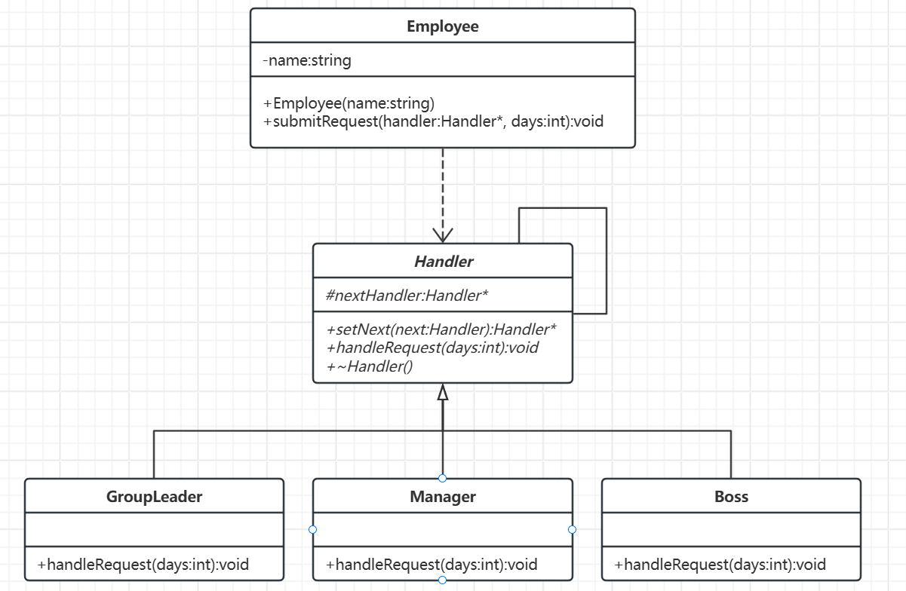

# 责任链模式

[概述](#概述)

&emsp;&emsp;[概念](#概念)

&emsp;&emsp;[核心思想](#核心思想)

&emsp;&emsp;[基本结构](#基本结构)

[类图及代码](#类图及代码)

&emsp;&emsp;[类图](#类图)

&emsp;&emsp;[代码](#代码)

---

## 概述

### 概念

责任链模式是一种允许多个对象按顺序处理请求，直到其中一个对象能够处理该请求为止。这种模式通过将请求的发送者和接收者解耦，增强了系统的灵活性。

### 核心思想

- 将多个处理请求的对象连成一条链。
- 请求沿着链传递，直到某个对象处理它。
- 每个处理者决定是否处理请求，以及是否将请求传递给链中的下一个处理者。

### 基本结构

- 抽象处理者
	- 定义处理请求的接口（或抽象类）。
	- 包含对下一个处理者的引用。
- 具体处理者
	- 实现抽象处理者的接口，处理自己能处理的请求。
	- 无法处理时，将请求转发给下一个处理者。


## 类图及代码

场景：公司请假审批

### 类图



### 代码

```C++
// 1. 抽象处理者
class Handler {
protected:
    shared_ptr<Handler> nextHandler;  // 使用智能指针管理

public:
    virtual ~Handler() = default;

    // 设置下一个处理者（支持链式调用）
    virtual shared_ptr<Handler> setNext(shared_ptr<Handler> next) {
        nextHandler = next;
        return next;
    }

    // 处理请求的虚函数
    virtual void handleRequest(int days) {
        if (nextHandler) {
            nextHandler->handleRequest(days);  // 默认传递请求
        }
        else {
            cout << "这种小事不要越级请求！" << endl;
        }
    }
};

// 2. 具体处理者：组长
class GroupLeader : public Handler {
public:
    void handleRequest(int days) override {
        if (days <= 2) {
            cout << "组长批准请假 " << days << " 天" << endl;
        }
        else {
            Handler::handleRequest(days);  // 传递给下一级
        }
    }
};

// 3. 具体处理者：经理
class Manager : public Handler {
public:
    void handleRequest(int days) override {
        if (days > 2 && days <= 5) {
            cout << "经理批准请假 " << days << " 天" << endl;
        }
        else {
            Handler::handleRequest(days);  // 传递给下一级
        }
    }
};

// 4. 具体处理者：老板
class Boss : public Handler {
public:
    void handleRequest(int days) override {
        if (days > 5) {
            cout << "老板批准请假 " << days << " 天" << endl;
        }
        else {
            Handler::handleRequest(days);  // 传递或终止
        }
    }
};

// 5. 员工类（发起请求的对象）
class Employee {
private:
    string name;

public:
    Employee(const string& name) : name(name) {}

    // 员工选择向某个处理者提交请求
    void submitRequest(shared_ptr<Handler> handler, int days) {
        cout << "\n员工 [" << name << "] 申请请假 " << days << " 天" << endl;
        handler->handleRequest(days);  // 直接向指定处理者提交
    }
};

// 客户端
int main() {
    // 创建处理者对象
    auto groupLeader = make_shared<GroupLeader>();
    auto manager = make_shared<Manager>();
    auto boss = make_shared<Boss>();

    // 构建责任链：组长 → 经理 → 老板
    groupLeader->setNext(manager)->setNext(boss);

    // 创建员工对象
    Employee alice("Alice");
    Employee bob("Bob");
    Employee uha("uha");

    // 场景1：Alice 按流程提交给组长
    alice.submitRequest(groupLeader, 3);  // 组长 → 经理 → 老板

    // 场景2：Bob 直接跳过组长，提交给经理
    bob.submitRequest(manager, 4);        // 经理处理

    // 场景3：Alice 直接找老板（可能越级）
    alice.submitRequest(boss, 6);         // 老板处理

    // 场景4：Bob 错误地提交给老板处理小请求
    bob.submitRequest(boss, 1);           // 老板不处理，触发终止

    // 场景5：uha 错误地提交给经理处理小请求
    uha.submitRequest(manager, 1);        // 经理不处理，触发终止

    return 0;
}
```

该代码复合封闭-开放原则，新增处理者无需修改现有代码，也可灵活调整处理者的顺序或增减处理者，请求者无需知道具体由谁处理，可直接获取结果。

责任链模式通过将多个处理者串联成链，实现了请求处理的灵活性和可扩展性。适合需要动态决定请求处理对象的场景，但如果责任链过长可能导致处理速度不符合预期，需注意链的完整性和处理效率。
