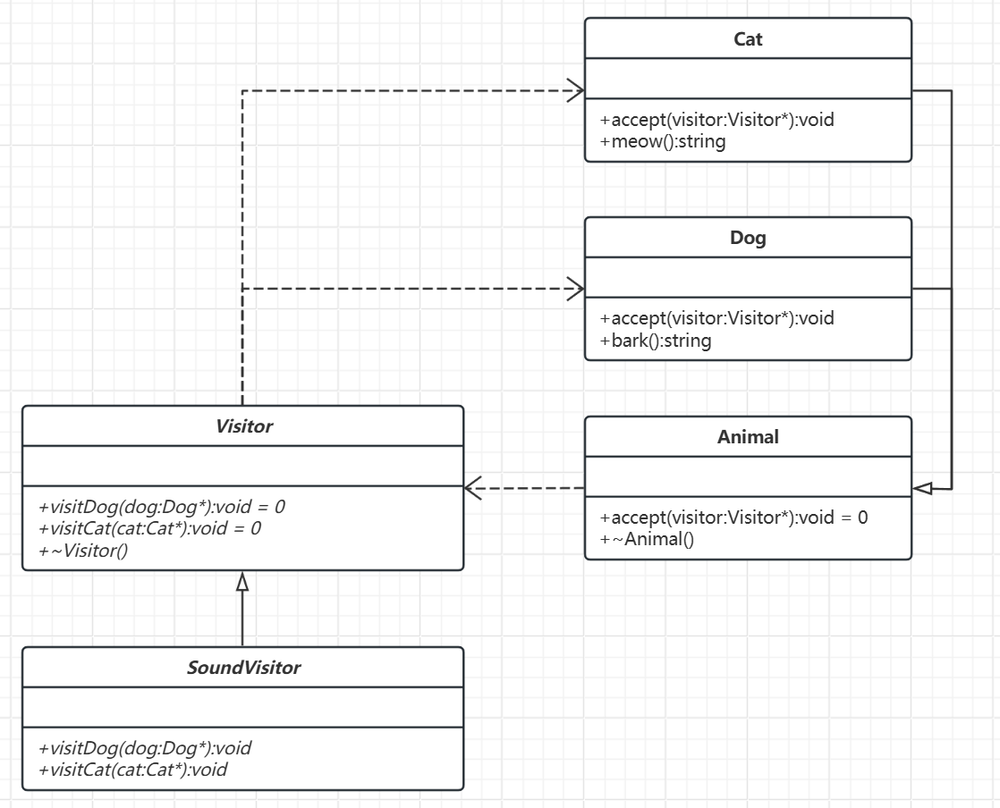

# 访问者模式

[概述](#概述)

&emsp;&emsp;[概念](#概念)

&emsp;&emsp;[核心思想](#核心思想)

&emsp;&emsp;[基本结构](#基本结构)

[类图及代码](#类图及代码)

&emsp;&emsp;[类图](#类图)

&emsp;&emsp;[代码](#代码)

---

## 概述

想象一个 野生动物保护区，这里有多种动物（比如狮子、长颈鹿、企鹅），它们生活在自己的栖息地中。保护区的目标是让动物们健康生活，同时为游客提供教育和观赏体验。但不同的需求需要不同的“操作”：
- 兽医需要定期检查动物的健康状态。
- 饲养员需要根据动物习性投喂食物。
- 摄影师需要捕捉动物的自然行为。
- ……

### 概念

访问者模式是一种行为型设计模式，用于将数据结构和数据操作解耦。它允许在不修改现有数据结构的前提下，定义新的操作。这种模式的核心思想是：将操作逻辑从对象结构中分离，通过访问者对象来统一实现这些操作。

### 核心思想

- 双分派：通过两次动态绑定（元素接受访问者，访问者访问元素）实现多态。
- 分离关注点：数据结构（元素类）与操作逻辑（访问者类）独立变化。

### 基本结构

- 元素角色：定义一个接收方法，接收一个访问者对象。所有具体元素都需要实现这个方法。
- 具体元素：实现了接口，并提供数据或操作，同时在接收方法中调用访问者相应的处理函数。
- 访问者角色：声明了对每个具体元素的访问方法，这些方法会在不同的具体元素上执行操作。
- 具体访问者：实现了访问者接口，定义了对每个具体元素的具体操作。

## 类图及代码

场景：动物行为扩展 
需求：需要为多种动物（如`Dog`和`Cat`）定义不同的操作（如发出声音、喂食等），但不希望直接修改动物的类代码。

### 类图



### 代码

```C++
// 前向声明
class Dog;
class Cat;

// 访问者接口
class Visitor {
public:
    virtual void visitDog(Dog* dog) = 0;
    virtual void visitCat(Cat* cat) = 0;
    virtual ~Visitor() = default;
};

// 元素接口
class Animal {
public:
    virtual void accept(Visitor* visitor) = 0;
    virtual ~Animal() = default;
};

// 具体元素：Dog
class Dog : public Animal {
public:
    void accept(Visitor* visitor) override {
        visitor->visitDog(this);
    }

    std::string bark() {
        return "Woof!";
    }
};

// 具体元素：Cat
class Cat : public Animal {
public:
    void accept(Visitor* visitor) override {
        visitor->visitCat(this);
    }

    std::string meow() {
        return "Meow!";
    }
};

// 具体访问者：声音访问者
class SoundVisitor : public Visitor {
public:
    void visitDog(Dog* dog) override {
        std::cout << "Dog says: " << dog->bark() << std::endl;
    }

    void visitCat(Cat* cat) override {
        std::cout << "Cat says: " << cat->meow() << std::endl;
    }
};

// 使用示例
int main() {
    std::vector<Animal*> animals = { new Dog(), new Cat() };
    Visitor* visitor = new SoundVisitor();

    for (Animal* animal : animals) {
        animal->accept(visitor);
    }

    // 释放内存（实际开发中建议使用智能指针）
    for (Animal* animal : animals) {
        delete animal;
    }
    delete visitor;

    return 0;
}
```