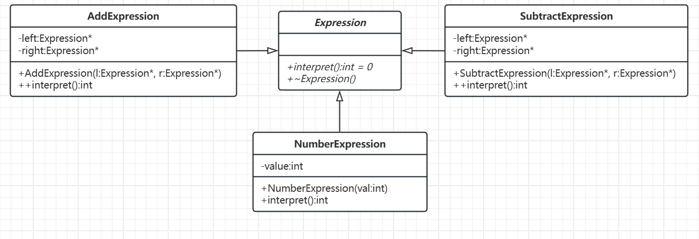

# 解释器模式

[概述](#概述)

&emsp;&emsp;[概念](#概念)

&emsp;&emsp;[核心思想](#核心思想)

&emsp;&emsp;[基本结构](#基本结构)

[类图及代码](#类图及代码)

&emsp;&emsp;[类图](#类图)

&emsp;&emsp;[代码](#代码)

---

## 概述

解释器模式就像解数学题的过程。假设你有一道数学题，比如 1 + 2 - 3，你需要逐步拆解题目中的符号和数字，应用运算规则（如先乘除后加减），最终得出答案。这个过程中，每个数字和运算符都有明确的含义，而解释器模式就是将这些含义翻译成具体的计算动作。

### 概念

解释器模式通过定义语言的文法规则，并构建解释器来解释执行这些语言中的句子。这种模式常用于处理特定领域的问题，例如数学表达式解析、规则引擎、SQL语法处理等。

### 核心思想

将语言中的每个语法规则表示为一个类，通过组合这些类构建抽象语法树，递归调用解释器来执行语法规则

### 基本结构

- ​抽象表达式：这是一个接口或抽象类，定义了一个抽象的解释方法，用来解释上下文中的信息。
- 终结符表达式：
    - 这是抽象表达式的一个实现，通常代表文法中的终结符。例如，在数学表达式中，数字就是终结符表达式。
    - 它的解释方法实现了具体的解释逻辑。
- 非终结符表达式：
    - 这也是抽象表达式的实现，但它通常表示文法中的非终结符，如加法、乘法等操作符。
    - 非终结符表达式的解释方法通常会调用其子表达式的解释方法来解析其内容。​
- 上下文：上下文是解释器需要的额外信息，包含了需要解释的数据。在C++中，通常它是一个对象，用于传递信息给表达式的解释方法。​
- 客户端：客户端代码通常会创建和构建解释器树，然后通过调用根表达式的解释方法来解释和计算数据。

## 类图及代码

场景：四则运算解释器。

### 类图



### 代码

```C++
// 1. 抽象表达式接口
class Expression {
public:
    virtual int interpret() = 0;
    virtual ~Expression() = default;  // 确保派生类正确析构
};

// 2. 终结符表达式：数字
class NumberExpression : public Expression {
private:
    int value;
public:
    NumberExpression(int val) : value(val) {}
    int interpret() override {
        return value;
    }
};

// 3. 非终结符表达式：加法
class AddExpression : public Expression {
private:
    std::unique_ptr<Expression> left;
    std::unique_ptr<Expression> right;
public:
    AddExpression(std::unique_ptr<Expression> l, std::unique_ptr<Expression> r)
        : left(std::move(l)), right(std::move(r)) {
    }

    int interpret() override {
        return left->interpret() + right->interpret();
    }
};

// 4. 非终结符表达式：减法
class SubtractExpression : public Expression {
private:
    std::unique_ptr<Expression> left;
    std::unique_ptr<Expression> right;
public:
    SubtractExpression(std::unique_ptr<Expression> l, std::unique_ptr<Expression> r)
        : left(std::move(l)), right(std::move(r)) {
    }

    int interpret() override {
        return left->interpret() - right->interpret();
    }
};

// 客户端：构建语法树并解释
int main() {
    // 表达式：1 + 2 - 3
    auto expr = std::make_unique<SubtractExpression>(
        std::make_unique<AddExpression>(
            std::make_unique<NumberExpression>(1),
            std::make_unique<NumberExpression>(2)
        ),
        std::make_unique<NumberExpression>(3)
    );

    int result = expr->interpret();
    std::cout << "Result: " << result << std::endl;  // 输出：0
    return 0;
}
```
