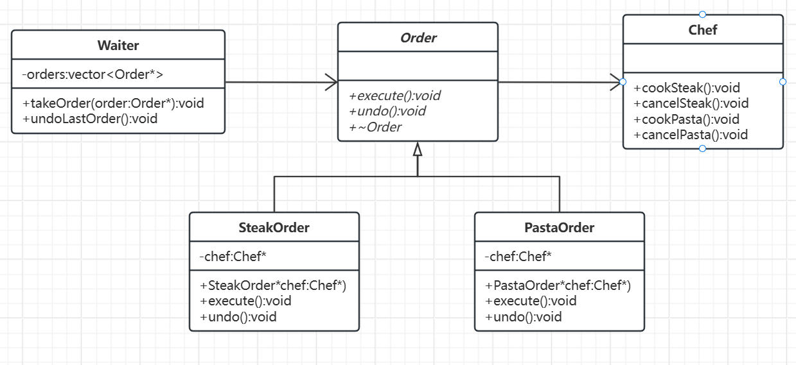

# 命令模式

[概述](#概述)

&emsp;&emsp;[概念](#概念)

&emsp;&emsp;[基本结构](#基本结构)

[类图及代码](#类图及代码)

&emsp;&emsp;[类图](#类图)

&emsp;&emsp;[代码](#代码)

---

## 概述

### 概念

命令模式是一种行为型设计模式，它将请求封装成独立的对象，允许你将请求的发送者和接收者解耦，并支持请求的队列、撤销/重做、日志记录等扩展功能。

### 基本结构

- 命令接口：声明执行操作的接口。
- 具体命令：实现命令接口，关联接收者并调用其方法。
- 调用者：触发命令执行，持有命令对象的引用。
- 接收者：实际执行业务逻辑的对象。
- 客户端：创建命令对象并关联接收者与调用者。

## 类图及代码

场景：餐厅点餐

### 类图



### 代码

```C++
// 命令接口：订单
class Order {
public:
    virtual void execute() = 0;  // 执行点餐
    virtual void undo() = 0;     // 撤销订单
    virtual ~Order() = default;
};

// 接收者：厨师
class Chef {
public:
    void cookSteak() { std::cout << "厨师烹饪牛排..." << std::endl; }
    void cancelSteak() { std::cout << "撤销牛排订单！" << std::endl; }

    void cookPasta() { std::cout << "厨师烹饪意大利面..." << std::endl; }
    void cancelPasta() { std::cout << "撤销意大利面订单！" << std::endl; }
};

// 具体命令：点牛排订单
class SteakOrder : public Order {
private:
    Chef* chef;  // 关联接收者（厨师）
public:
    explicit SteakOrder(Chef* chef) : chef(chef) {}
    void execute() override { chef->cookSteak(); }
    void undo() override { chef->cancelSteak(); }
};

// 具体命令：点意大利面订单
class PastaOrder : public Order {
private:
    Chef* chef;
public:
    explicit PastaOrder(Chef* chef) : chef(chef) {}
    void execute() override { chef->cookPasta(); }
    void undo() override { chef->cancelPasta(); }
};

// 调用者：服务员（持有订单队列）
class Waiter {
private:
    std::vector<Order*> orders;  // 订单队列
public:
    void takeOrder(Order* order) {
        orders.push_back(order);
        order->execute();  // 立即执行订单
    }

    // 撤销最后一个订单
    void undoLastOrder() {
        if (!orders.empty()) {
            orders.back()->undo();
            orders.pop_back();
        }
    }

    ~Waiter() {
        for (auto order : orders) delete order;
    }
};

// 客户端：顾客点餐
int main() {
    Chef chef;          // 接收者：厨师
    Waiter waiter;      // 调用者：服务员

    // 顾客点牛排
    Order* steakOrder = new SteakOrder(&chef);
    waiter.takeOrder(steakOrder);

    // 顾客点意大利面
    Order* pastaOrder = new PastaOrder(&chef);
    waiter.takeOrder(pastaOrder);

    // 撤销最后一个订单（意大利面）
    std::cout << "\n撤销操作：" << std::endl;
    waiter.undoLastOrder();

    return 0;
}
```

通过这个示例，可以看出命令模式如何将点餐请求封装为对象，实现调用者（服务员）与接收者（厨师）的解耦，并支持灵活的撤销操作。
