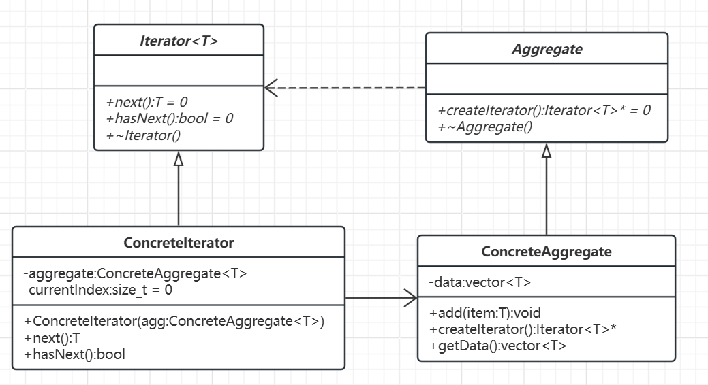

# 迭代器模式

---

## 概述

### 概念

迭代器模式提供了一种顺序访问聚合对象元素的方法，而无需暴露其底层表示。

### 核心思想

将遍历逻辑从集合类中分离，封装到一个独立的迭代器对象中，使得客户端代码能够以统一的方式处理不同类型的集合，同时保持集合内部结构的隐蔽性。

### 基本结构

- 迭代器接口
- 具体迭代器
- 聚合接口
- 具体聚合类

## 类图及代码

### 类图



### 代码

```C++
// 迭代器接口
template <typename T>
class Iterator {
public:
    virtual ~Iterator() = default;
    virtual T next() = 0;          // 获取下一个元素
    virtual bool hasNext() = 0;     // 是否还有元素
};

// 聚合接口
template <typename T>
class Aggregate {
public:
    virtual ~Aggregate() = default;
    virtual std::unique_ptr<Iterator<T>> createIterator() = 0;  // 使用智能指针
};

// 具体聚合类
template <typename T>
class ConcreteAggregate : public Aggregate<T> {
    std::vector<T> data;

public:
    void add(const T& item) {
        data.push_back(item);
    }

    std::unique_ptr<Iterator<T>> createIterator() override;

    // 暴露内部数据的访问（仅供迭代器使用）
    const std::vector<T>& getData() const { return data; }
};

// 具体迭代器类
template <typename T>
class ConcreteIterator : public Iterator<T> {
    const ConcreteAggregate<T>& aggregate;
    size_t currentIndex = 0;

public:
    explicit ConcreteIterator(const ConcreteAggregate<T>& agg)
        : aggregate(agg) {
    }

    T next() override {
        return aggregate.getData()[currentIndex++];
    }

    bool hasNext() override {
        return currentIndex < aggregate.getData().size();
    }
};

// 实现聚合类的 createIterator
template <typename T>
std::unique_ptr<Iterator<T>> ConcreteAggregate<T>::createIterator() {
    return std::make_unique<ConcreteIterator<T>>(*this);
}

int main() {
    ConcreteAggregate<int> numbers;
    numbers.add(1);
    numbers.add(2);
    numbers.add(3);
    numbers.add(5);
    numbers.add(8);

    // 使用智能指针自动管理内存
    auto it = numbers.createIterator();

    std::cout << "遍历结果: ";
    while (it->hasNext()) {
        std::cout << it->next() << " ";
    }
    // 输出: 遍历结果: 1 2 3 5 8 

    return 0;
}
```

迭代器模式作为经过验证的设计模式，在主流编程语言的集合框架中已内置了高效实现（如C++的STL标准模板库）。实际开发中，开发者通常无需重复实现该模式，可直接使用语言内置的迭代器功能。

