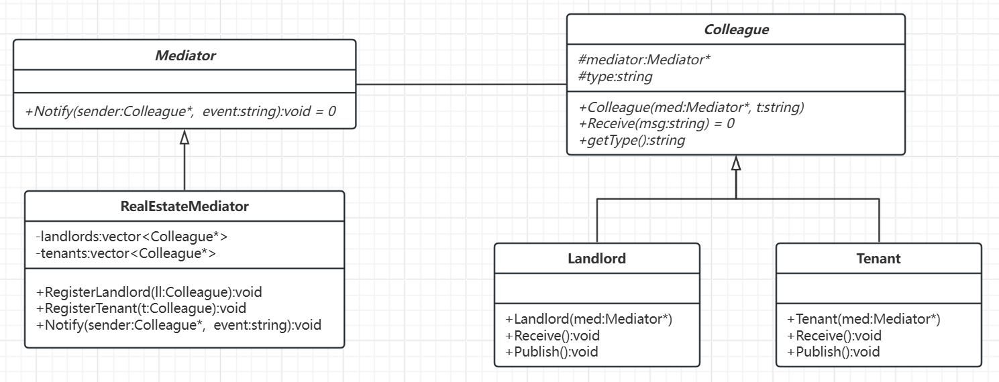

# 中介者模式

[概述](#概述)

&emsp;&emsp;[概念](#概念)

&emsp;&emsp;[核心思想](#核心思想)

&emsp;&emsp;[基本结构](#基本结构)

[类图及代码](#类图及代码)

&emsp;&emsp;[类图](#类图)

&emsp;&emsp;[代码](#代码)

---

## 概述

### 概念

中介者模式通过引入一个中介对象来封装一系列对象之间的交互，从而减少对象间的直接依赖，降低耦合度。

### 核心思想

将多对多的对象交互转化为一对多的中介者交互，避免对象间直接引用，从而解耦系统。

### 基本结构

- 抽象中介者
- 具体中介者
- 抽象同事类
- 具体同事类

## 类图及代码

场景：房产中介

## 类图



## 代码

```C++
// 前置声明
class Colleague;

// 抽象中介者
class Mediator {
public:
    virtual void Notify(Colleague* sender, const std::string& event) = 0;
};

// 抽象同事类
class Colleague {
protected:
    Mediator* mediator;
    std::string type;

public:
    Colleague(Mediator* med, const std::string& t) : mediator(med), type(t) {}
    virtual void Receive(const std::string& msg) = 0;
    std::string getType() const { return type; }
};

// 具体中介者：房产中介
class RealEstateMediator : public Mediator {
private:
    std::vector<Colleague*> landlords;
    std::vector<Colleague*> tenants;

public:
    void RegisterLandlord(Colleague* ll) {
        landlords.push_back(ll);
    }

    void RegisterTenant(Colleague* t) {
        tenants.push_back(t);
    }

    void Notify(Colleague* sender, const std::string& event) override {
        if (sender->getType() == "Landlord") {
            if (event == "publish") {
                for (auto t : tenants) {
                    t->Receive("房东发布了新房源");
                }
            }
        }
        else if (sender->getType() == "Tenant") {
            if (event == "request_view") {
                for (auto ll : landlords) {
                    ll->Receive("租客请求看房");
                }
            }
        }
    }
};

// 具体同事类：房东
class Landlord : public Colleague {
public:
    Landlord(Mediator* med) : Colleague(med, "Landlord") {}

    void Publish() {
        std::cout << "[房东] 发布房源信息\n";
        mediator->Notify(this, "publish");
    }

    void Receive(const std::string& msg) override {
        std::cout << "[房东] 收到消息: " << msg << "\n";
    }
};

// 具体同事类：租客
class Tenant : public Colleague {
public:
    Tenant(Mediator* med) : Colleague(med, "Tenant") {}

    void RequestView() {
        std::cout << "[租客] 发起看房请求\n";
        mediator->Notify(this, "request_view");
    }

    void Receive(const std::string& msg) override {
        std::cout << "[租客] 收到消息: " << msg << "\n";
    }
};

int main() {
    RealEstateMediator mediator;

    Landlord landlord(&mediator);
    Tenant tenant1(&mediator);
    Tenant tenant2(&mediator);

    mediator.RegisterLandlord(&landlord);
    mediator.RegisterTenant(&tenant1);
    mediator.RegisterTenant(&tenant2);

    landlord.Publish();     // 房东发布房源
    tenant1.RequestView();  // 租客请求看房

    return 0;
}
```

如果没有中介，每一个租客都得和房东进行交流，如果有多个租客和多个房东，关系错综复杂，代码看起来会更加混乱，而使用中介者模式，就可以解决该问题。

有了中介者对象，每个具体的对象不再通过直接的联系与另一对象发生相互作用，而是通过中介者对象与另一个对象发生相互作用。

