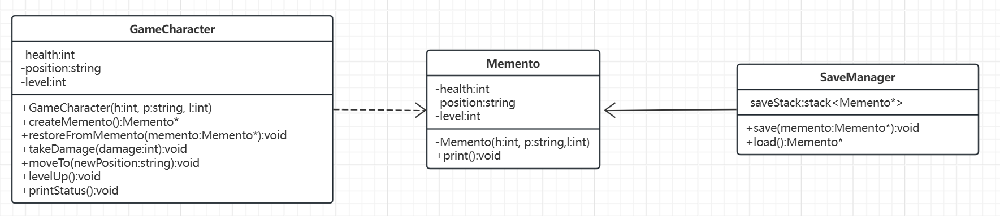
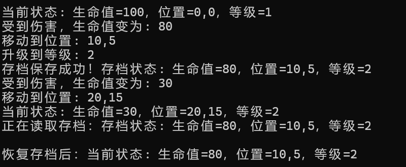

# 备忘录模式

[概述](#概述)

&emsp;&emsp;[概念](#概念)

&emsp;&emsp;[基本结构](#基本结构)

[类图及代码](#类图及代码)

&emsp;&emsp;[类图](#类图)

&emsp;&emsp;[代码](#代码)

---

## 概述

### 概念

顾名思义，备忘录模式可以在不破坏对象封装性的前提下，捕获并保存对象的内部状态，以便后续可以恢复到这个状态。

### 基本结构

- 发起人：需要保存状态的对象
- 备忘录：存储发起人内部状态的对象
- 管理者：负责保存和管理备忘录对象

## 类图及代码

### 类图



### 代码

```C++
class Memento {
private:
    int health;
    std::string position;
    int level;

    friend class GameCharacter;  // 关键友元声明

    Memento(int h, std::string p, int l)
        : health(h), position(p), level(l) {
    }

public:
    void print() const {
        std::cout << "存档状态: 生命值=" << health
            << "，位置=" << position
            << "，等级=" << level << "\n";
    }
};

class GameCharacter {
private:
    int health;
    std::string position;
    int level;

public:
    GameCharacter(int h, std::string p, int l)
        : health(h), position(p), level(l) {
    }

    // 修改后的创建方法
    std::shared_ptr<Memento> createMemento() {
        return std::shared_ptr<Memento>(new Memento(health, position, level));
    }

    void restoreFromMemento(const std::shared_ptr<Memento>& memento) {
        health = memento->health;
        position = memento->position;
        level = memento->level;
    }

    void takeDamage(int damage) {
        health -= damage;
        std::cout << "受到伤害，生命值变为: " << health << "\n";
    }

    void moveTo(const std::string& newPosition) {
        position = newPosition;
        std::cout << "移动到位置: " << position << "\n";
    }

    void levelUp() {
        level++;
        std::cout << "升级到等级: " << level << "\n";
    }

    void printStatus() const {
        std::cout << "当前状态: 生命值=" << health
            << "，位置=" << position
            << "，等级=" << level << "\n";
    }
};

class SaveManager {
private:
    std::stack<std::shared_ptr<Memento>> saveStack;

public:
    void save(const std::shared_ptr<Memento>& memento) {
        saveStack.push(memento);
        std::cout << "存档保存成功！";
        memento->print();
    }

    std::shared_ptr<Memento> load() {
        if (saveStack.empty()) {
            throw std::runtime_error("没有可用存档");
        }
        auto save = saveStack.top();
        std::cout << "正在读取存档：";
        save->print();
        return save;
    }
};

int main() {
    GameCharacter character(100, "0,0", 1);
    SaveManager saveManager;

    character.printStatus();  // 初始状态

    // 第一次游戏操作
    character.takeDamage(20);
    character.moveTo("10,5");
    character.levelUp();

    // 创建存档
    saveManager.save(character.createMemento());

    // 继续操作
    character.takeDamage(50);
    character.moveTo("20,15");
    character.printStatus();

    // 读取存档
    try {
        auto save = saveManager.load();
        character.restoreFromMemento(save);
        std::cout << "\n恢复存档后：";
        character.printStatus();
    }
    catch (const std::exception& e) {
        std::cerr << e.what() << "\n";
    }

    return 0;
}
```

输出如下：

