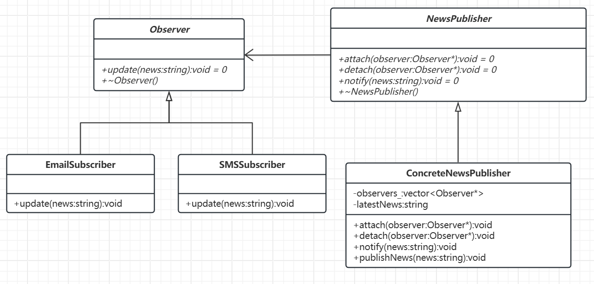
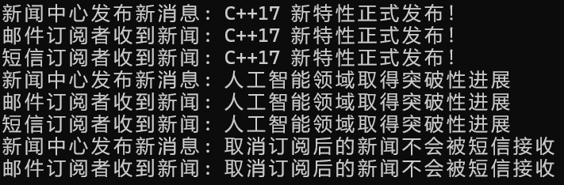

# 观察者模式

[概述](#概述)

&emsp;&emsp;[概念](#概念)

&emsp;&emsp;[核心思想](#核心思想)

&emsp;&emsp;[基本结构](#基本结构)

[类图及代码](#类图及代码)

&emsp;&emsp;[类图](#类图)

&emsp;&emsp;[代码](#代码)

---

## 概述

### 概念

观察者模式允许我们定义一种订阅机制，可在对象事件发生时通知所有的观察者对象，使它们能够自动更新。观察者模式还有另外一个名字叫做**发布-订阅模式**。

### 核心思想

解耦被观察者和观察者，让它们通过抽象接口交互，而不是直接依赖具体实现。

### 基本结构

- 主题接口：定义注册、删除、通知观察者的方法。
- 具体主题：
	- 维护观察者列表，存储具体状态（如温度数据）。
	- 状态变化时通知所有观察者。
- 观察者接口：定义更新方法。
- 具体观察者：实现更新方法，根据主题状态调整自身行为。

## 类图及代码

### 类图



### 代码

```C++
// 前向声明
class Observer;

// 主题接口（新闻发布中心）
class NewsPublisher {
public:
    virtual void attach(Observer* observer) = 0;
    virtual void detach(Observer* observer) = 0;
    virtual void notify(const std::string& news) = 0;
    virtual ~NewsPublisher() = default;
};

// 观察者接口（订阅者）
class Observer {
public:
    virtual void update(const std::string& news) = 0;
    virtual ~Observer() = default;
};

// 具体主题：新闻发布中心实现
class ConcreteNewsPublisher : public NewsPublisher {
private:
    std::vector<Observer*> observers_;
    std::string latestNews_;

public:
    void attach(Observer* observer) override {
        observers_.push_back(observer);
    }

    void detach(Observer* observer) override {
        // 简化实现：实际生产环境需处理迭代器
        auto it = std::find(observers_.begin(), observers_.end(), observer);
        if (it != observers_.end()) {
            observers_.erase(it);
        }
    }

    void notify(const std::string& news) override {
        for (Observer* observer : observers_) {
            observer->update(news);
        }
    }

    void publishNews(const std::string& news) {
        latestNews_ = news;
        std::cout << "新闻中心发布新消息: " << news << std::endl;
        notify(news); // 通知所有订阅者
    }
};

// 具体观察者：邮件订阅者
class EmailSubscriber : public Observer {
public:
    void update(const std::string& news) override {
        std::cout << "邮件订阅者收到新闻: " << news << std::endl;
    }
};

// 具体观察者：短信订阅者
class SMSSubscriber : public Observer {
public:
    void update(const std::string& news) override {
        std::cout << "短信订阅者收到新闻: " << news << std::endl;
    }
};

// 使用示例
int main() {
    ConcreteNewsPublisher publisher;
    EmailSubscriber emailSubscriber;
    SMSSubscriber smsSubscriber;

    // 订阅新闻
    publisher.attach(&emailSubscriber);
    publisher.attach(&smsSubscriber);

    // 发布新闻，自动通知订阅者
    publisher.publishNews("C++17 新特性正式发布！");
    publisher.publishNews("人工智能领域取得突破性进展");

    // 取消短信订阅
    publisher.detach(&smsSubscriber);
    publisher.publishNews("取消订阅后的新闻不会被短信接收");

    return 0;
}
```

样例输出：

