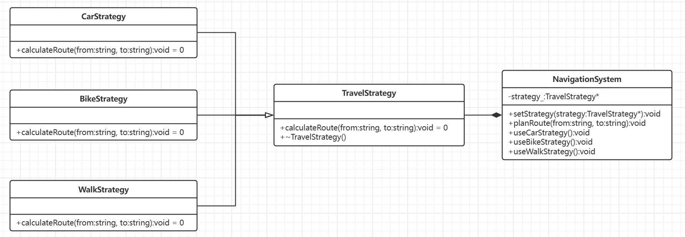
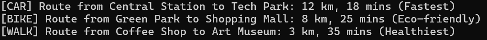

# 策略模式

[概述](#概述)

&emsp;&emsp;[概念](#概念)

&emsp;&emsp;[核心思想](#核心思想)

&emsp;&emsp;[基本结构](#基本结构)

[类图及代码](#类图及代码)

&emsp;&emsp;[类图](#类图)

&emsp;&emsp;[代码](#代码)

---

## 概述

策略模式就像是在面对同一问题时，可以根据不同情况选择不同的出行方式。假设你需要从家里到一个目的地，你可以选择步行、骑自行车、坐出租车或者开车，每种方式都有各自的优缺点和适用场景。策略模式的核心就是将这些出行方式——也就是不同的算法——分别封装到各自的策略类中，然后在运行时根据实际情况选择最适合的一种，而不需要改变调用这些策略的客户端代码。

### 概念

策略模式允许我们定义一系列算法，把它们封装成独立的类，并让它们可以互相替换。这样，客户端只需选择合适的策略，而不必关心具体的实现细节，从而达到解耦和灵活切换算法的目的。

### 核心思想

- 封装变化：将频繁变化的算法或行为抽象为独立的策略类。
- 面向接口编程：通过接口或抽象类定义策略的通用行为。
- 组合优于继承：通过组合策略对象实现功能，避免通过继承导致类爆炸。

### 基本结构

- 策略接口：定义所有支持的算法或行为的公共接口。
- 具体策略类：实现策略接口，提供具体的算法实现。
- 上下文类：持有一个策略对象的引用，并调用其算法。

## 类图及代码

场景：出行方式

### 类图



### 代码

```C++
// ==================== 策略接口 ====================
class TravelStrategy {
public:
    virtual ~TravelStrategy() = default;  // 虚析构确保正确释放派生类资源
    virtual void calculateRoute(const std::string& from, const std::string& to) const = 0;
};

// ==================== 具体策略实现 ====================
class CarStrategy : public TravelStrategy {
public:
    void calculateRoute(const std::string& from,
        const std::string& to) const override {
        std::cout << "[CAR] Route from " << from << " to " << to
            << ": 12 km, 18 mins (Fastest)\n";
    }
};

class BikeStrategy : public TravelStrategy {
public:
    void calculateRoute(const std::string& from,
        const std::string& to) const override {
        std::cout << "[BIKE] Route from " << from << " to " << to
            << ": 8 km, 25 mins (Eco-friendly)\n";
    }
};

class WalkStrategy : public TravelStrategy {
public:
    void calculateRoute(const std::string& from,
        const std::string& to) const override {
        std::cout << "[WALK] Route from " << from << " to " << to
            << ": 3 km, 35 mins (Healthiest)\n";
    }
};

// ==================== 上下文类 ====================
class NavigationSystem {
private:
    std::unique_ptr<TravelStrategy> strategy_;  // 使用智能指针管理策略对象

public:
    // 设置策略（支持移动语义）
    void setStrategy(std::unique_ptr<TravelStrategy>&& strategy) {
        strategy_ = std::move(strategy);
    }

    // 执行路径计算
    void planRoute(const std::string& from, const std::string& to) const {
        if (strategy_) {
            strategy_->calculateRoute(from, to);
        }
        else {
            throw std::runtime_error("Navigation strategy not configured!");
        }
    }

    // 快速切换预设策略
    void useCarStrategy() {
        setStrategy(std::make_unique<CarStrategy>());
    }

    void useBikeStrategy() {
        setStrategy(std::make_unique<BikeStrategy>());
    }

    void useWalkStrategy() {
        setStrategy(std::make_unique<WalkStrategy>());
    }
};

// ==================== 客户端使用示例 ====================
int main() {
    NavigationSystem nav;

    // 方式1：直接设置具体策略
    nav.setStrategy(std::make_unique<CarStrategy>());
    nav.planRoute("Central Station", "Tech Park");

    // 方式2：使用快捷方法切换
    nav.useBikeStrategy();
    nav.planRoute("Green Park", "Shopping Mall");

    // 方式3：动态创建策略
    bool isRaining = false;
    if (isRaining) {
        nav.setStrategy(std::make_unique<CarStrategy>());
    }
    else {
        nav.setStrategy(std::make_unique<WalkStrategy>());
    }
    nav.planRoute("Coffee Shop", "Art Museum");

    return 0;
}
```

输出如下：



策略模式中的若干个策略对象相互之间是完全独立的， 它们不知道其他对象的存在。当我们想使用对象中各种不同的算法变体，并希望能够在运行的时候切换这些算法时，可以选择使用策略模式来处理这个问题。 
