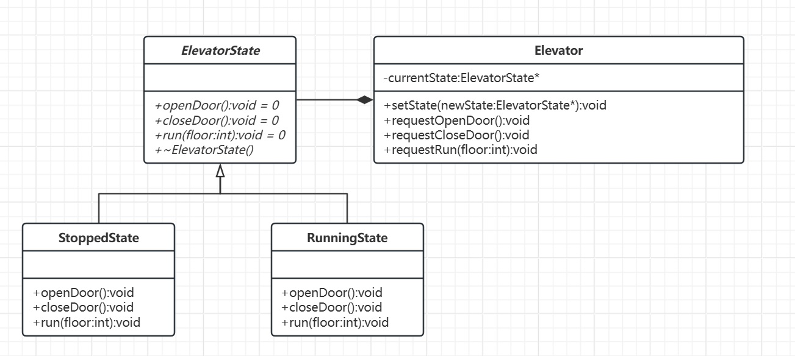

# 状态模式

[概述](#概述)

&emsp;&emsp;[概念](#概念)

&emsp;&emsp;[基本结构](#基本结构)

[类图及代码](#类图及代码)

&emsp;&emsp;[类图](#类图)

&emsp;&emsp;[代码](#代码)

---

## 概述

状态模式就像是一个智能电梯在不同楼层间切换行为逻辑，电梯（对象）的核心功能始终是运输乘客，但会根据当前所处状态（静止、上升、下降、紧急停止）动态调整响应策略。当乘客按下开门按钮时，静止状态的电梯会开门，而运行中的电梯则会拒绝请求。这种模式通过封装状态对应的行为，使对象能够根据内部状态变化而改变自身行为表现。

### 概念

状态模式也可以称之为状态机模式，通过将对象的行为委托给表示当前状态的状态对象，实现在不同状态下切换行为逻辑。该模式消除了复杂的条件判断语句，通过对象内部状态转换来驱动行为变化，使状态转换显式化、代码结构更清晰。

### 基本结构

- 抽象状态：定义状态相关的方法，规范状态行为协议。
- 具体状态：实现不同状态下的具体行为逻辑。
- 上下文：持有当前状态引用，委托状态对象处理请求。

## 类图及代码

场景：智能电梯

### 类图



### 代码

```C++
// 1. 状态接口
class ElevatorState {
public:
    virtual void openDoor() = 0;
    virtual void closeDoor() = 0;
    virtual void run(int floor) = 0;
    virtual ~ElevatorState() = default;
};

// 2. 具体状态实现
class StoppedState : public ElevatorState {
public:
    void openDoor() override {
        std::cout << "开门成功" << std::endl;
    }
    void closeDoor() override {
        std::cout << "关门完成" << std::endl;
    }
    void run(int floor) override {
        std::cout << "启动前往 " << floor << " 层" << std::endl;
    }
};

class RunningState : public ElevatorState {
public:
    void openDoor() override {
        std::cout << "【警告】运行中禁止开门" << std::endl;
    }
    void closeDoor() override {
        std::cout << "（已处于关门状态）" << std::endl;
    }
    void run(int floor) override {
        std::cout << "已在运行，目标层不变" << std::endl;
    }
};

// 3. 上下文类
class Elevator {
private:
    std::unique_ptr<ElevatorState> currentState;

public:
    Elevator() : currentState(std::make_unique<StoppedState>()) {}

    void setState(std::unique_ptr<ElevatorState> newState) {
        currentState = std::move(newState);
    }

    void requestOpenDoor() { currentState->openDoor(); }
    void requestCloseDoor() { currentState->closeDoor(); }
    void requestRun(int floor) { currentState->run(floor); }
};

// 4. 使用示例
int main() {
    Elevator elevator;

    // 初始静止状态
    elevator.requestOpenDoor();   // 输出: 开门成功
    elevator.requestCloseDoor();  // 输出: 关门完成
    elevator.requestRun(3);       // 输出: 启动前往 3 层

    // 切换为运行状态
    elevator.setState(std::make_unique<RunningState>());
    elevator.requestOpenDoor();   // 输出: 【警告】运行中禁止开门
    elevator.requestRun(5);       // 输出: 已在运行，目标层不变

    return 0;
}
```

通过类图和代码不难发现，状态模式与策略模式都十分相似，但它们在设计意图和应用场景上存在显著差异：
- 状态模式：状态切换由内部逻辑驱动，状态之间知道彼此的转换规则。
- 策略模式：策略由客户端指定，策略之间相互独立。
