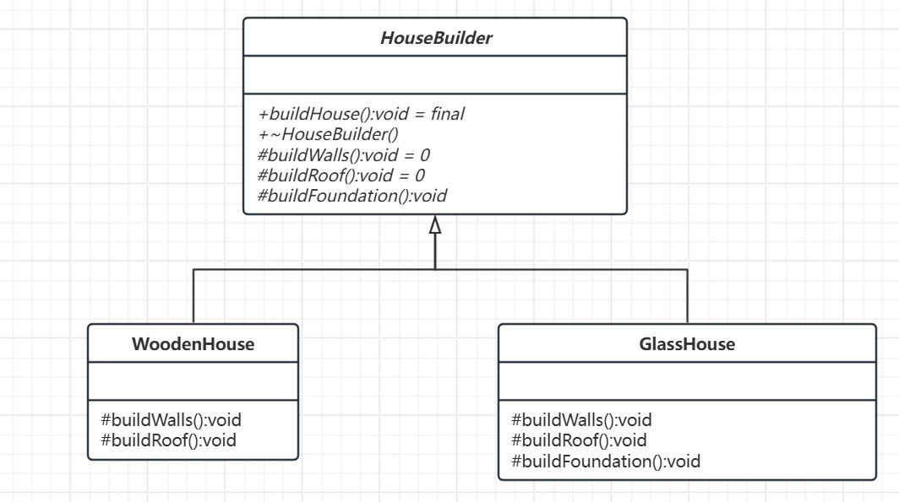

# 模板方法模式

[概述](#概述)

&emsp;&emsp;[概念](#概念)

&emsp;&emsp;[相关基本概念](#相关基本概念)

&emsp;&emsp;[基本结构](#基本结构)

[类图及代码](#类图及代码)

&emsp;&emsp;[类图](#类图)

&emsp;&emsp;[代码](#代码)

---

## 概述

模板方法模式就像是一套标准化的房屋建造蓝图。无论是建造木屋、砖房还是玻璃房，建造流程（如打地基、砌墙、封顶）都是固定的，但每个步骤的具体实现可以根据材料或设计进行调整。该模式定义了算法的骨架，允许子类在不改变算法结构的情况下重写某些步骤的具体实现。

### 概念

模板方法模式是指在父类（抽象类）中定义了一个算法的框架，将某些步骤的实现延迟到子类中。通过这种方式，父类可以控制算法的主流程，而子类可以根据需要灵活调整某些步骤的具体行为，从而实现代码复用和扩展性。

### 相关基本概念

- 模板方法：在抽象类中定义一个固定的算法流程（模板方法），该方法调用一系列步骤方法。部分步骤方法可以在抽象类中提供默认实现，也可以声明为抽象方法，强制子类实现。
- 抽象步骤方法：用于描述算法中需要子类具体实现的部分。子类通过重写这些方法来实现自己的业务逻辑。
- 钩子方法：钩子方法在抽象类中通常提供默认（空或简单）的实现，子类可以根据需要选择性地覆盖，从而在不改变算法框架的情况下增加额外行为。

### 基本结构

- 抽象类（模板类）：
	- 定义算法的骨架，包含一个模板方法。
	- 声明算法中的某些步骤为抽象方法或钩子方法（可选的默认实现），由子类具体实现。
- 具体子类：
	- 继承抽象类，实现父类中定义的抽象步骤。
	- 可覆盖钩子方法以提供额外灵活性，但不改变算法的主流程。

## 类图及代码

场景：房屋建造

### 类图



### 代码

```C++
// 抽象类：定义建造流程的模板
class HouseBuilder {
public:
    // 模板方法（final 防止子类修改流程）
    virtual void buildHouse() final { 
        buildFoundation();
        buildWalls();
        buildRoof();
        std::cout << "房屋建造完成！" << std::endl;
    }

    virtual ~HouseBuilder() = default;

protected:
    virtual void buildWalls() = 0;
    virtual void buildRoof() = 0;

    virtual void buildFoundation() {
        std::cout << "打地基：标准混凝土基础" << std::endl;
    }
};

// 具体子类：木屋（实现与之前相同）
class WoodenHouse : public HouseBuilder {
protected:
    void buildWalls() override {
        std::cout << "砌墙：用木材搭建墙壁" << std::endl;
    }

    void buildRoof() override {
        std::cout << "封顶：木质斜屋顶" << std::endl;
    }
};

// 具体子类：玻璃房（实现与之前相同）
class GlassHouse : public HouseBuilder {
protected:
    void buildWalls() override {
        std::cout << "砌墙：用玻璃幕墙" << std::endl;
    }

    void buildRoof() override {
        std::cout << "封顶：玻璃平顶" << std::endl;
    }

    void buildFoundation() override {
        std::cout << "打地基：加强钢结构地基" << std::endl;
    }
};

int main() {
    WoodenHouse woodenHouse;
    woodenHouse.buildHouse();

    GlassHouse glassHouse;
    glassHouse.buildHouse();
}
```

不管是建造木屋还是玻璃房，都是套固有模板，所变化的，只要材料而已，这解释模板方法模式。