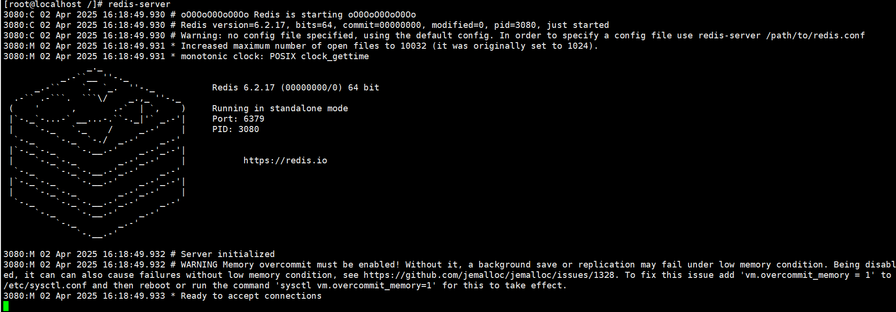

# Redis基础

[Redis](#Redis)

&emsp;&emsp;[主要特征](#主要特征)

&emsp;&emsp;[应用场景](#应用场景)

&emsp;&emsp;[Redis安装](#Redis安装)

[基本命令](#基本命令)

[数据结构](#数据结构)

&emsp;&emsp;[String类型](#String类型)

&emsp;&emsp;[List集合类型](#List集合类型)

&emsp;&emsp;[set集合类型](#set集合类型)

&emsp;&emsp;[Hash集合类型](#Hash集合类型)

&emsp;&emsp;[Zset有序集合类型](#Zset有序集合类型)

---

# Redis

Redis是一种使用ANSI C语言编写、遵守BSD协议、支持网络、基于内存且可选持久化的键值对存储数据库。​它不仅支持简单的键值对存储，还提供了丰富的数据结构，如字符串、列表、集合、有序集合和哈希表等。

## 主要特征

- 高性能：​由于将数据存储在内存中，Redis提供了极高的读写性能。官方数据表明，Redis能够达到每秒超过10万次的查询速度。​
- 丰富的数据类型：​除了基本的字符串类型，Redis还支持列表、集合、有序集合、哈希表等多种数据类型，满足不同场景的需求。
- 持久化：​虽然Redis主要将数据存储在内存中，但它也提供了持久化机制，如RDB快照和AOF日志，确保数据在系统重启后不会丢失。
- 主从复制与高可用：​​​Redis支持主从复制，可以将数据从主服务器同步到多个从服务器，提高数据的可靠性和读取性能。
- 集群模式：​Redis Cluster允许将数据分布在多个节点上，实现数据的分片存储，支持高可用和自动故障转移。

## 应用场景

- 缓存：Redis 常被用作缓存层，存储频繁访问的数据，减少数据库的负载，提高系统响应速度。
- 会话存储：​由于其高性能和持久化特性，Redis适合用于存储用户会话信息。​
- 实时分析：​Redis 的有序集合和快速操作使其适合用于实时数据分析，如排行榜和计数器。
- pub/sub消息订阅。
- ……

## Redis安装

执行 ```yum install redis``` 即可。

- 需要特点版本操作如下（以6.2.7为例）：
	```
		wget https://download.redis.io/releases/redis-6.2.7.tar.gz
		tar -zxvf redis-6.2.7.tar.gz
		cd redis-6.2.7
		make
		make install
	```

- 配置文件通常在 /etc/redis.conf

# 基本命令

- 启动 Redis ：

	在一个终端输入

	```redis
		redis-server
	```
 
	启动 Redis 服务器，显示如下：

	

	然后可以通过以下命令连接到 Redis 服务端，检查是否成功启动：

	```redis
		redis-cli
	```

	

- 如在docker中启动请参考[https://github.com/qinlw/myBlog/blob/main/3-Docker/3.6-Docker%E4%BD%BF%E7%94%A8%E5%8F%82%E8%80%83.md](https://github.com/qinlw/myBlog/blob/main/3-Docker/3.6-Docker%E4%BD%BF%E7%94%A8%E5%8F%82%E8%80%83.md)

- 设置一个key为a，值为10的数据

	```redis
		set a 10
	```

- 获取key为a的值
 
	```redis
		get a
	```

- 查看key为a是什么类型

	```redis
		type a
	```

- 获取所有的key

	```redis
		keys *
	```

- 删除key为a的数据

	```redis
		del a
	```

- 清除当前数据库

	```redis
		flushdb
	```

- 清除所有数据库

	```redis
		flushall
	```

- 查询key为a是否存在

	```redis
		exists a
	```

- 指定key为a移动到1号数据库 

	```redis
		move a 1
	```

- 指定key为a 10s后过期

	```redis
		expire a 10
	```

- 查看key为a还有多久过期

	```redis
		ttl a
	```

# 数据结构

## String类型

- 设置key为name的值为joker

	```redis
		set name joker
	```

- 拼接key为name的值：joker01

	```redis
		append name 01
	```

- 获取key为name的值的长度

	```redis
		strlen name
	```

- 设置key为val的值加1 

	```redis
		incr val
	```

- 设置key为val的值加5

	```redis
		incrby val 5
	```

- 设置key为val的值减1

	```redis
		decr val
	```

- 设置key为val的值减5

	```redis
		decrby val 5
	```

- 截取下标为0-4之间的字符串，例如：joker01，截取后joker

	```redis
		getrange name 0 4
	```

- 从下标1开始替换字符串，例如：joker01，替换成junk001

	```redis
		setrange name 1 unk001
	```

- 设置key为name的值为nonono，10s后过期

	```redis
		setex name 10 nonono
	```

- 如果不存在key为age的，值设置为18，如果存在，则set失败

	```redis
		setnx age 10
	```

- 一次性设置多个值

	```redis
		mset key01 val01 key2 vval02 key03 val03
	```

- 一次性获取多个值

	```redis
		mget name age key01 key02 key03
	```

- 如果k1已经存在，则k1，k2全部设置失败

	```redis
		msetnx k1 v1 k2 v2
	```

- 如果不存在key为username的值，则返回nil，然后set；如果存在值，则获取原来的值并设置新的值

	```redis
		getset name jocker02
	```

## List集合类型

- 将一个值或者多个值插入到列表的头部

	```redis
		lpush mylist 1 2 3
	```

- 将一个值或者多个值插入到列表的尾部

	```redis
		rpush mylist 4 5 6
	```

- 通过区间获取具体的值

	```redis
		lrange mylist 0 -1
	```

- 移除mylist的第一个元素

	```redis
		lpop mylist
	```

- 移除mylist的最后一个元素

	```redis
		rpop mylist
	```

- 通过下标获得mylist当中的某一个值

	```redis
		lindex mylist 1
	```

- 获取mylist的长度

	```redis
		llen mylist
	```

- 从列表中删除指定数量的元素，比如要删除2个3

	```redis
		lrem mylist 2 3
	```

- 截取mylist集合中下标为0到下标为3之间的元素集合，并覆盖原来的mylist集合

	```redis
		ltrim mylist 0 3
	```

- 更新list集合当中下标为0的值为joker，如果下标0的值不存在，则报错

	```redis
		lset mylist 0 joker
	```

- 将一个某一个具体的值插入到某一个具体元素（默认第一个）的前面或者后面

	语法

	```redis
		linsert key before|after pivot value
	``` 
	- key: 列表的键。
	- BEFORE 或 AFTER: 指定插入位置，是插入在 pivot 元素的前面 (BEFORE) 或后面 (AFTER)。
	- pivot: 参考元素，即你想要在其前后插入元素的值。
	- value: 要插入的值。

## set集合类型

- 往set集合中添加一个元素

	```redis
		sadd set 1
	```

- 查看set集合中所有元素

	```redis
		smembers set
	```

- 查看set集合中是否存在某元素

	```redis
		sismember set 1
	```

- 随机抽取出2个元素，默认为1

	```redis
		srandmember set 2
	```

- 随机删除set集合中某2个元素,默认为1个

	```redis
		spop set 2
	```

- 移动set集合中的元素2到set2集合中

	```redis
		smove set set2 2
	```

- 作set2集合减去set集合的差集

	```redis
		sdiff set2 set
	```

- 求set和set2的交集

	```redis
		sinter set set2
	```

- 求set和set2的并集并去重

	```redis
		sunion set set2
	```

## Hash集合类型

- 往hash集合中存放键值对数据

	```redis
		hset hash name joker01
	```

- 从hash集合中获取数据

	```redis
		hget hash name
	```

- 同时往hash集合中添加多个值

	```redis
		hmset hash name joker02 age 18
	```

- 同时从hash集合中获取多个值

	```redis
		hmget hash name age
	```

- 获取hash集合中所有的键值对

	```redis
		hgetall hash
	```

- 删除hash集合中指定的key字段

	```redis
		hdel hash age
	```

- 获取hash集合的长度

	```redis
		hlen hash
	```

- 判断hash集合中指定字段是否存在

	```redis
		hexists hash name
	```

- 获取hash集合中所有的值

	```redis
		hvals hash
	```

- 指定hash集合中指定增量

	```redis
		hincrby hash val 1
	```

- 如果不存在则直接设置值，存在则设置失败

	```redis
		hsetnx hash age 18
	```

## Zset有序集合类型

ZSET 是有序集合（Sorted Set）的数据类型，允许你按分数对元素进行排序。每个元素都关联一个分数，Redis 会根据这个分数来维护元素的顺序。

- 添加一个或多个值
	
	语法：

	```redis
		zadd key score member [score member ...]
	```
	
	示例：

	```redis
		zadd zset 1 first
	```

- 获取zset集合中所有元素

	```redis
		zrange zset 0 -1
	```

- 从一个有序集合（zset）中返回指定分数范围内的元素。inf是无穷大

	```redis
		zrangebyscore zset -inf +inf
	```

	```redis
		zrangebyscore zset 0 2
	```

- 指定范围排序并输出键值

	```redis
		zrangebyscore zset -inf 2 withscores
	```

- 移除zset集合中指定的元素

	```redis
		zrem zset first
	```

- 查看zset集合中元素个数

	```redis
		zcard zset
	```

- 反转指定范围

	```redis
		zrevrange zset 1 2
	```