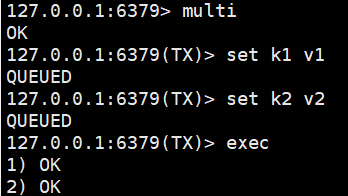
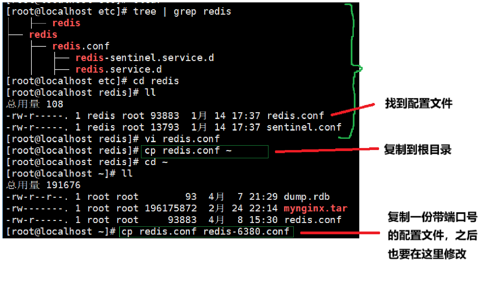
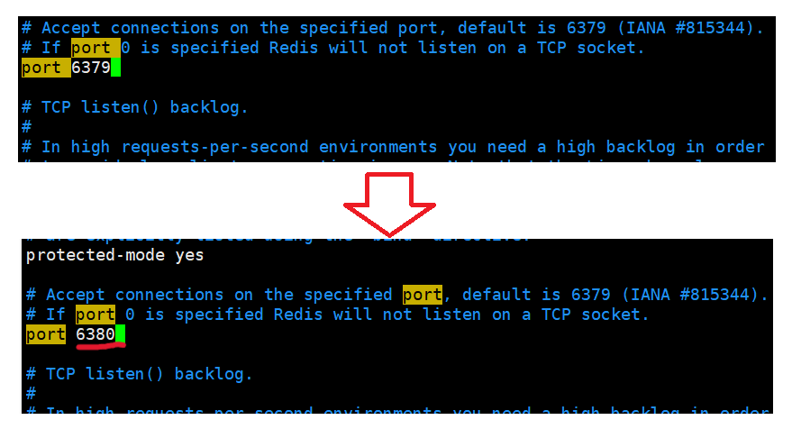
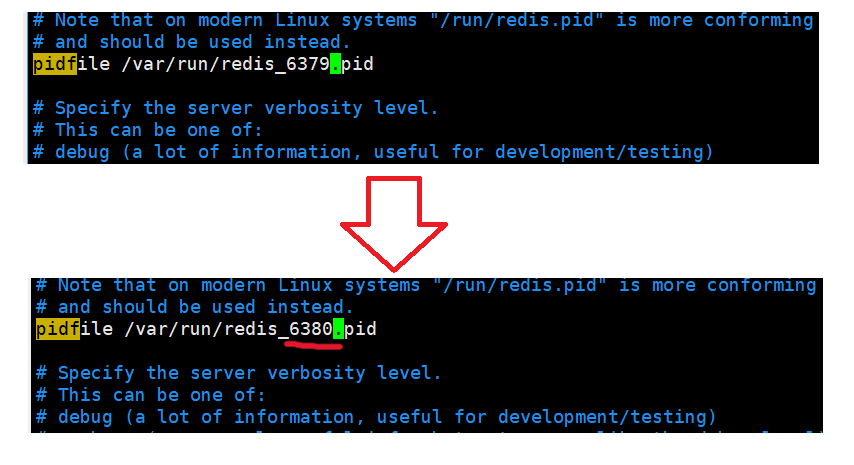
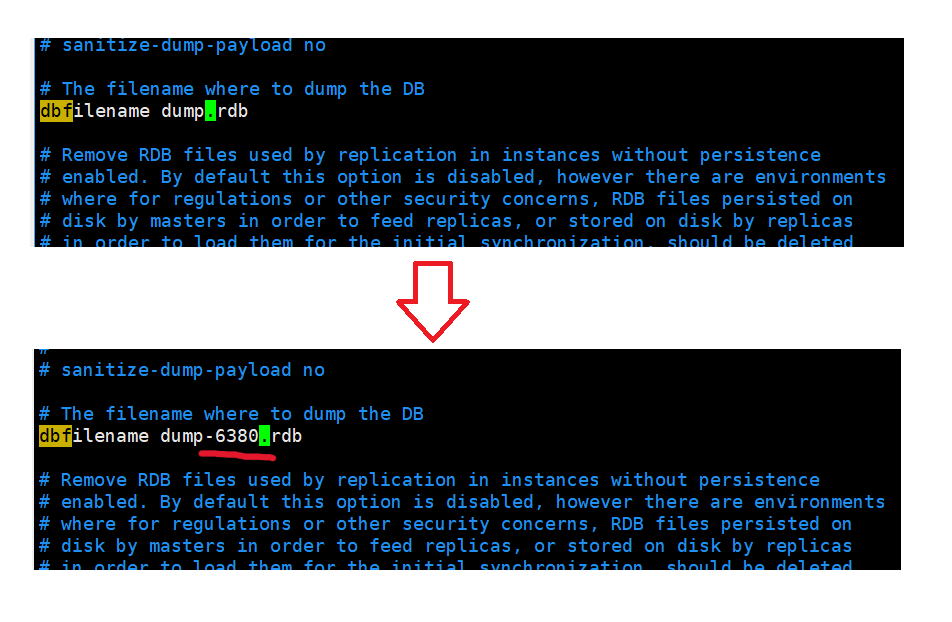
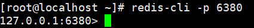
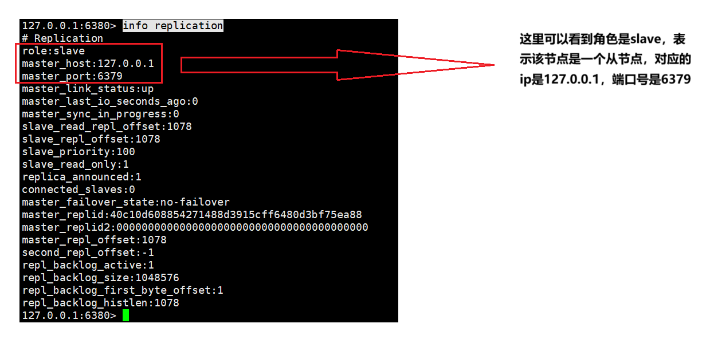
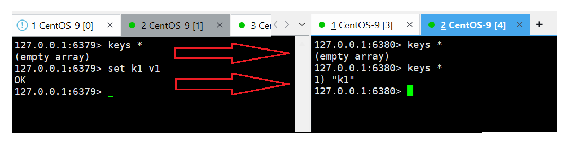

# Redis核心

[事务](#事务)

&emsp;&emsp;[事务的基本流程](#事务的基本流程)

&emsp;&emsp;[事务的特点](#事务的特点)

&emsp;&emsp;[乐观锁](#乐观锁)

&emsp;&emsp;[局限性](#局限性)

[持久化](#持久化)

&emsp;&emsp;[RDB(Redis Database)](#RDB)

&emsp;&emsp;&emsp;&emsp;[RDB工作原理](#RDB工作原理)

&emsp;&emsp;&emsp;&emsp;[RDB优点](#RDB优点)

&emsp;&emsp;&emsp;&emsp;[RDB缺点](#RDB缺点)

&emsp;&emsp;[AOF(Append Only File)](#AOF)

&emsp;&emsp;&emsp;&emsp;[AOF工作原理](#AOF工作原理)

&emsp;&emsp;&emsp;&emsp;[AOF优点](#AOF优点)

&emsp;&emsp;&emsp;&emsp;[AOF缺点](#AOF缺点)

&emsp;&emsp;[混合持久化](#混合持久化)

&emsp;&emsp;&emsp;&emsp;[工作原理](#工作原理)

&emsp;&emsp;&emsp;&emsp;[优点](#优点)

&emsp;&emsp;&emsp;&emsp;[缺点](#缺点)

[主从复制](#主从复制)

&emsp;&emsp;[核心要点](#核心要点)

&emsp;&emsp;[配置主从复制](#配置主从复制)

&emsp;&emsp;&emsp;&emsp;[命令配置](#命令配置)

&emsp;&emsp;&emsp;&emsp;[通过配置文件修改](#通过配置文件修改)

[哨兵模式](#哨兵模式)

&emsp;&emsp;[核心功能](#核心功能)

&emsp;&emsp;[配置哨兵模式](#配置哨兵模式)

---

# 事务

Redis 的事务机制与传统的数据库事务（如 MySQL）有所不同，它更偏向于一种批量执行命令的能力，即可以在一次请求中执行多个命令。

## 事务的基本流程

- MULTI：标记事务的开始。此后输入的命令会被加入队列，而不是立即执行。
- EXEC：执行队列中的所有命令。
- DISCARD：取消事务，清空队列中的命令。

示例：

## 事务的特点

- 原子性：部分保证
	- 执行原子性：所有命令在 EXEC 时按顺序执行，期间不会被其他客户端命令打断。
	- 无回滚机制：如果某个命令执行失败（如对字符串执行 INCR），后续命令仍会继续执行，且不会回滚已执行的操作。
- 错误处理
	- 入队阶段错误（如语法错误）：整个事务无法执行。
	- 执行阶段错误（如类型错误）：错误命令会失败，但其他命令正常执行。

## 乐观锁

WATCH 命令
- 用途：监控一个或多个键，如果在事务执行前这些键被其他客户端修改，则事务会被取消（通过 EXEC 返回 nil）。
- 机制：基于乐观锁，适用于并发场景。

## 局限性

- 不支持回滚：需在应用层处理错误。
- 无隔离性：事务中的命令在 EXEC 前不会被实际执行，但其他客户端可以看到中间状态。
- 性能风险：长事务可能阻塞其他客户端。

# 持久化

持久化机制是为了确保内存中的数据在服务器重启或故障后不会丢失。

## RDB

### RDB工作原理

- 全量快照：RDB 将某一时刻的内存数据以二进制格式保存到磁盘（默认文件 dump.rdb）
- 触发条件：
	- 自动触发：通过 redis.conf 配置时间间隔和修改次数（例如 save 900 1 表示 900 秒内至少 1 次修改则触发）。
	- 手动触发：执行 SAVE（阻塞主线程）或 BGSAVE（后台子进程执行，非阻塞）。
- 恢复方式：Redis 启动时自动加载 dump.rdb 文件恢复数据。

### RDB优点

- 紧凑高效：RDB 文件体积小，适合备份和灾难恢复。
- 快速恢复：直接加载二进制数据，速度远快于 AOF。
- 性能影响小：BGSAVE 由子进程处理，主进程无阻塞。

### RDB缺点

- 数据丢失风险：两次快照之间的数据可能丢失（依赖配置的触发频率）。
- 大数据量时延迟：数据量较大时，BGSAVE 的 fork 操作可能短暂阻塞主线程。

## AOF

### AOF工作原理

- 日志追加：记录所有写操作命令（如 SET、DEL），以文本形式追加到 appendonly.aof 文件。
- 同步策略：
	- always：每次写操作都同步到磁盘（数据最安全，性能最差）。
	- everysec（默认）：每秒同步一次（平衡安全与性能，最多丢失 1 秒数据）。
	- no：由操作系统决定（性能最好，但可能丢失较多数据）。
- AOF 重写:
	- 目的：解决 AOF 文件膨胀问题（例如多次修改同一 key 的冗余命令）。
	- 实现：通过 BGREWRITEAOF 命令或配置自动触发，生成新 AOF 文件替换旧文件（子进程处理，非阻塞）。

### AOF优点

- 数据安全性高：默认 everysec 策略最多丢失 1 秒数据，always 策略理论上零丢失。
- 可读性强：AOF 文件为文本格式，便于人工分析或修复。

### AOF缺点

- 文件体积大：AOF 文件通常比 RDB 大，恢复速度较慢。
- 写性能略低：高并发场景下，AOF 可能比 RDB 略慢（尤其 always 模式）。

## 混合持久化

### 工作原理

- 结合 RDB 和 AOF：生成的 AOF 文件前半部分是 RDB 格式的全量数据，后半部分是增量操作的 AOF 日志。
- 触发条件：需开启 AOF 并设置 aof-use-rdb-preamble yes。
- 恢复方式：先加载 RDB 快照，再执行后续 AOF 命令，兼顾速度和数据完整性。

### 优点

- 快速恢复：RDB 部分提供快速加载。
- 低数据丢失：AOF 部分减少丢失风险。

# 主从复制

主从复制是指将一台Redis服务器的数据复制到其他Redis服务器，也叫主节点和从节点。

## 核心要点

- 一个主节点可以有多个从节点，而每个从节点只能有一个主节点。
- 数据的复制是单向的，只能由主节点到从节点。
- 一般情况，主节点负责写操作，从节点负责读操作。主节点会将自己的数据变化通过异步的方式发送给从节点，从节点接收到主节点的数据之后，更新自己的数据，使得数据一致。

## 配置主从复制

主节点不需要修改任何配置，因为默认的配置就是主节点，只需要修改从节点的配置就可以了。

### 命令配置

在从节点执行 SLAVEOF

语法：`SLAVEOF <master-ip> <master-port>`

### 通过配置文件修改

- 找到Redis的配置文件redis.conf(通常在 /etc/redis 下)。
- 复制一份到选定目录（这里假定为根目录）。
- 回到根目录，再复制一份带端口的文件，如下：

	

- 打开之前复制的文件（redis-6380.conf)，进行如下修改。
	
	- 将端口号改成 6380(改端口和文件名，是为了一台机器启动多个Redis实例)：
	
		
	
	- 因为要启动多个Redis服务，这里的pid应该区分开：
	
		

	- 修改下持久化的文件：
		
		
	
	- 指定主节点（配置中默认是注释状态）
	
		

- 再打开一个新的终端启动这个节点：

	

- 再启动一个客户端连接该子节点：

	

- 连接成功后可以使用 info replication 查看信息

	

- 验证如下：

	

	不难发现，当主节点发生数据变化时，子节点也会同步更新。

# 哨兵模式

## 核心功能

- 监控：通过不断地发送命令，来检查Redis节点是否正常。
- 通知：如果发现某个节点出现问题，那么哨兵就会通过发布订阅模式来通知其他节点。
- 自动故障转移：当主节点不能正常工作时，哨兵会开始一个自动故障转移的操作，它会将一个从节点升级为新的主节点，再将其他从节点指向新的主节点。

## 配置启用哨兵模式

- 创建一个 sentinel.conf 文件。
- 执行命令 redis-sentinel sentinel.conf 启动哨兵。
	- 启动多个哨兵实例（通常建议至少 3 个，防止脑裂）。

