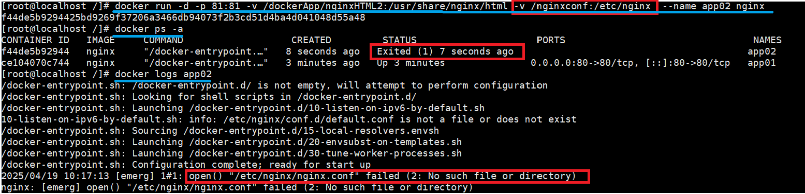

# Docker核心

[目录挂载](#目录挂载)

&emsp;&emsp;[目录挂载概念](#目录挂载概念)

&emsp;&emsp;[目录挂载需求场景](#目录挂载需求场景)

&emsp;&emsp;[目录挂载操作](#目录挂载操作)

[卷映射](#卷映射)

&emsp;&emsp;[卷映射概念](#卷映射概念)

&emsp;&emsp;[命令演示](#命令演示)

&emsp;&emsp;[注意](#注意)

---

# 目录挂载

## 目录挂载概念

目录挂载是操作系统中将存储设备或文件系统关联到目录树中的一个目录的过程。

## 目录挂载需求场景

在 Linux 中执行命令 `docker run -d -p 80:80 --name app01 nginx`，得到一个容器实例。

然后可以在浏览器中访问 `<本机ip>:80` ，得到画面如下：
	

- 如果我们想修改这个页面，通常做法如下：

	- 执行命令 `docker exec -it cab bash` 以交互模式进入容器。
		- -it
			- -i: 交互模式，允许用户与容器交互。
			- -t: 伪终端，使命令输出格式化且支持终端操作。
		- cab: 目标容器的 ​名称或 ID 的缩写，此处是 ID 的缩写。
	- 再执行命令 `cd /usr/share/nginx/html` 进入容器内部的 nginx/html路径。
	- 对其中的 index.html 文件进行修改即可更改页面信息。

	
	
不难发现，我们每一次修改都比较麻烦，另外在容器中只提供了基础的命令，如果要修改配置文件之类的也较为麻烦。

由此，我们可以用到目录挂载

## 目录挂载操作

执行命令 `docker run -d -p 80:80 -v /dockerApp/nginxHTML:/usr/share/nginx/html --name app01 nginx`

这样，目录 /dockerApp/nginxHTML 就对应着 目录 /usr/share/nginx/html。（注意：目录 /dockerApp/nginxHTML 刚开始为空目录，直接在浏览器中访问会失败。）

这时候在外部目录 /dockerApp/nginxHTML 中执行 `echo "hello word" > index.html`，再去浏览器中访问也可以看到 `hello word` 的字样了。

这时如果删除了之前的容器，再重新用命令 `docker run -d -p 80:80 -v /dockerApp/nginxHTML:/usr/share/nginx/html --name app01 nginx` 创建容器，其内容也会与之前的内容一致。

# 卷映射



对于配置文件，我们不能直接进行目录挂载，因为目录挂载的外部目录初始为空，即配置文件不存在，导致无法运行。这时候就需要卷映射了。

## 卷映射概念

卷映射是 Docker 中实现数据持久化和共享的关键机制。它将宿主机上的目录或文件与容器内的路径关联，确保容器数据独立于容器生命周期存在，并支持跨容器共享。

## 命令演示

```docker run -d -p 99:80 -v /dockerApp/nginxHTML02:/usr/share/nginx/html -v nginxconf:/etc/nginx  --name app02 nginx```

与目录挂载不同，卷映射直接使用一个卷 nginxconf，容器能正常运行，页面能正常显示。

## 注意

所有卷都在目录 /var/lib/docker/volumes/ 中。