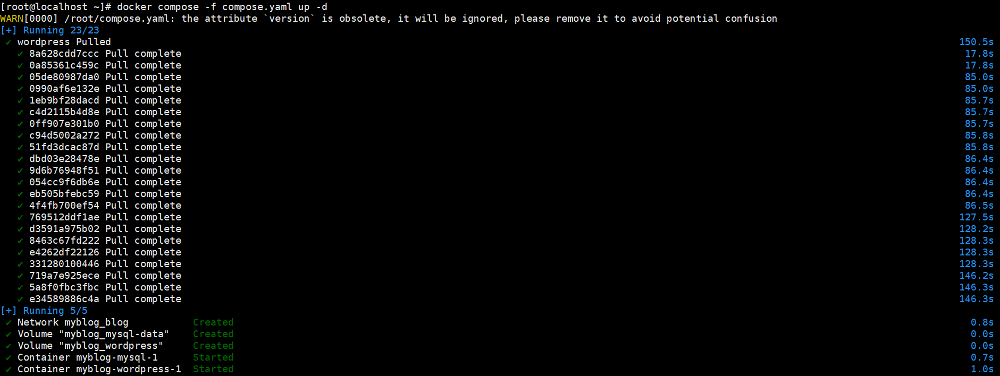

# DockerCompose

[概念](#概念)

&emsp;&emsp;[配置文件示例](#配置文件示例)

---

## 概念

Docker Compose 是一个用于定义和运行多容器 Docker 应用的工具，通过 .yaml 文件统一管理容器配置，实现一键部署、多服务协同和资源编排

### 配置文件示例

compose.yaml
```
name: myblog  # 项目名称（无缩进，需声明版本支持）
version: "3.8"  # 必须声明版本 ≥3.4

services:
  mysql:
    image: mysql:8.0
    ports:
      - "3306:3306"
    environment:
      MYSQL_ROOT_PASSWORD: "123456"
      MYSQL_DATABASE: wordpress
    volumes:
      - mysql-data:/var/lib/mysql
      - /app/myconf:/etc/mysql/conf.d
    restart: always
    networks:
      - blog

  wordpress:
    image: wordpress
    ports:
      - "8080:80"
    environment:
      WORDPRESS_DB_HOST: mysql
      WORDPRESS_DB_USER: root
      WORDPRESS_DB_PASSWORD: "123456"
      WORDPRESS_DB_NAME: wordpress
    volumes:
      - wordpress:/var/www/html
    restart: always
    networks:
      - blog
    depends_on:
      - mysql

volumes:
  mysql-data:
  wordpress:

networks:
  blog:
```

执行：

	```
	docker compose -f compose.yaml up -d
	```



这样，就可以看到 wordpress 和 mysql:8.0 俩个一起启动了。


