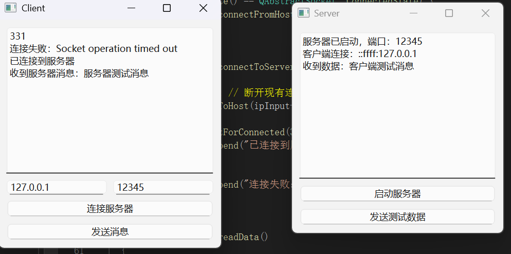

# Qt网络编程

[QTcpServer类的常用API](#QTcpServer类的常用API)

&emsp;&emsp;[公共成员函数](#QTcpServer-公共成员函数)

&emsp;&emsp;[信号](#QTcpServer-信号)

[QTcpSocket类的常用API](#QTcpServer类的常用API)

&emsp;&emsp;[公共成员函数](#QTcpSocket-信号公共成员函数)

&emsp;&emsp;[信号](#QTcpSocket-信号信号)

[代码Demo](代码Demo)

---

## QTcpServer类的常用API

### QTcpServer-公共成员函数

- 启动 TCP 服务器并监听传入连接

	```bool QTcpServer::listen(const QHostAddress &address = QHostAddress::Any, quint16 port = 0);```

	- address
		- 作用​​: 指定服务器监听的 IP 地址。
		- 默认值: QHostAddress::Any，监听所有网络接口的 IPv4 地址。
		- 可选值
			- QHostAddress::Any: 接受所有接口的连接（如服务器有多个网卡）。
			- QHostAddress::LocalHost: 仅监听本地回环地址（127.0.0.1）。
			- 特定 IP（如 QHostAddress("192.168.1.100")）。
	- port默认值​​: 0，系统自动分配空闲端口
		- 作用​​: 指定监听的端口号。
		- 默认值​​: 0（系统自动分配空闲端口）。

- 检测 TCP 服务器当前是否处于监听状态

	```bool QTcpServer::isListening() const;```

- 如果当前对象正在监听返回监听的服务器地址信息, 否则返回 QHostAddress::Null

	```QHostAddress QTcpServer::serverAddress() const;```

- 如果服务器正在侦听连接，则返回服务器的端口; 否则返回0

	```quint16 QTcpServer::serverPort() const```

- 从挂起的连接队列中获取下一个已建立的 TCP 客户端连接

	```QTcpSocket *QTcpServer::nextPendingConnection();```

	- 得到和客户端建立连接之后用于通信的QTcpSocket套接字对象，它是QTcpServer的一个子对象，当QTcpServer对象析构的时候会自动析构这个子对象

- 在阻塞模式下等待客户端连接请求

	```bool waitForNewConnection(int msec = 0, bool *timedOut = nullptr);```

	- msec：等待连接的最大时间（单位：毫秒），默认值为 0（立即返回）。
	- timedOut：输出参数，若操作超时则设为 true，否则为 false。

###	QTcpServer-信号

- 接受新连接时发生系统级错误

	```[signal] void QTcpServer::acceptError(QAbstractSocket::SocketError socketError);```

- 客户端成功建立 TCP 连接时触发异步通知

	```[signal] void QTcpServer::newConnection();```

## QTcpSocket类的常用API

### QTcpSocket-公共成员函数

- 连接服务器

	```
	[virtual] void QAbstractSocket::connectToHost(const QString &hostName, quint16 port, OpenMode openMode = ReadWrite, NetworkLayerProtocol protocol = AnyIPProtocol);

	[virtual] void QAbstractSocket::connectToHost(const QHostAddress &address, quint16 port, OpenMode openMode = ReadWrite);
	```

- 接收数据

	```
	// 指定可接收的最大字节数 maxSize 的数据到指针 data 指向的内存中
	qint64 QIODevice::read(char *data, qint64 maxSize);
	// 指定可接收的最大字节数 maxSize，返回接收的字符串
	QByteArray QIODevice::read(qint64 maxSize);
	// 将当前可用操作数据全部读出，通过返回值返回读出的字符串
	QByteArray QIODevice::readAll();
	```

- 发送数据

	```
	// 发送指针 data 指向的内存中的 maxSize 个字节的数据
	qint64 QIODevice::write(const char *data, qint64 maxSize);
	// 发送指针 data 指向的内存中的数据，字符串以 \0 作为结束标记
	qint64 QIODevice::write(const char *data);
	// 发送参数指定的字符串
	qint64 QIODevice::write(const QByteArray &byteArray);
	```

### QTcpSocket-信号

- 设备有新数据可读时触发异步通知

	```[signal] void QIODevice::readyRead();```

	在使用QTcpSocket进行套接字通信的过程中，如果该类对象发射出readyRead()信号，说明对端发送的数据达到了，之后就可以调用 read 函数接收数据了。

- 套接字连接成功的核心信号

	```[signal] void QAbstractSocket::connected();```

	调用connectToHost()函数并成功建立连接之后发出connected()信号。

- 套接字断开连接的核心信号

	```[signal] void QAbstractSocket::disconnected();```

	在套接字断开连接时发出disconnected()信号。


## 代码Demo

- Server

	- MainWindow.h
	```
	#ifndef MAINWINDOW_H
	#define MAINWINDOW_H

	#include <QMainWindow>
	#include <QTcpServer>
	#include <QTcpSocket>
	#include <QTextEdit>
	#include <QPushButton>
	#include <QVBoxLayout>

	QT_BEGIN_NAMESPACE
	namespace Ui { class MainWindow; }
	QT_END_NAMESPACE

	class MainWindow : public QMainWindow
	{
		Q_OBJECT

	public:
		MainWindow(QWidget* parent = nullptr);
		~MainWindow();

	private slots:
		void onNewConnection();
		void readData();
		void sendData();

	private:
		QTcpServer* server;
		QList<QTcpSocket*> clients;
		QTextEdit* logArea;
		QPushButton* startBtn;
		QPushButton* sendBtn;
		QVBoxLayout* mainLayout;
		QWidget* centralWidget;
	};

	#endif // MAINWINDOW_H
	```

	- MainWindow.cpp
	```
	#include "MainWindow.h"


	MainWindow::MainWindow(QWidget* parent)
		: QMainWindow(parent)
	{
		// 初始化组件
		centralWidget = new QWidget(this);
		mainLayout = new QVBoxLayout(centralWidget);

		logArea = new QTextEdit(centralWidget);
		logArea->setReadOnly(true);

		startBtn = new QPushButton("启动服务器", centralWidget);
		sendBtn = new QPushButton("发送测试数据", centralWidget);

		mainLayout->addWidget(logArea);
		mainLayout->addWidget(startBtn);
		mainLayout->addWidget(sendBtn);

		setCentralWidget(centralWidget);

		// 初始化服务器
		server = new QTcpServer(this);
		connect(startBtn, &QPushButton::clicked, [=]() {
			if (server->listen(QHostAddress::Any, 12345)) {
				logArea->append("服务器已启动，端口：12345");
			}
			else {
				logArea->append("启动失败：" + server->errorString());
			}
			});

		connect(server, &QTcpServer::newConnection, this, &MainWindow::onNewConnection);
		connect(sendBtn, &QPushButton::clicked, this, &MainWindow::sendData);
	}

	MainWindow::~MainWindow()
	{
		if (server->isListening()) server->close();
	}

	void MainWindow::onNewConnection()
	{
		QTcpSocket* client = server->nextPendingConnection();
		clients.append(client);
		logArea->append("客户端连接：" + client->peerAddress().toString());

		connect(client, &QTcpSocket::readyRead, this, &MainWindow::readData);
		connect(client, &QTcpSocket::disconnected, [=]() {
			clients.removeAll(client);
			client->deleteLater();
			logArea->append("客户端断开");
			});
	}

	void MainWindow::readData()
	{
		QTcpSocket* client = qobject_cast<QTcpSocket*>(sender());
		if (!client) return;

		QByteArray data = client->readAll();
		logArea->append("收到数据：" + QString::fromUtf8(data));
	}

	void MainWindow::sendData()
	{
		QByteArray msg = "服务器测试消息";
		for (auto client : clients) {
			client->write(msg);
			client->flush();
		}
	}
	```

- Client

	- MainWindow.h
	```
	#ifndef CLIENTWINDOW_H
	#define CLIENTWINDOW_H

	#include <QMainWindow>
	#include <QTcpSocket>
	#include <QTextEdit>
	#include <QPushButton>
	#include <QLineEdit>
	#include <QVBoxLayout>
	#include <QHBoxLayout>

	QT_BEGIN_NAMESPACE
	namespace Ui { class ClientWindow; }
	QT_END_NAMESPACE

	class ClientWindow : public QMainWindow
	{
		Q_OBJECT

	public:
		ClientWindow(QWidget* parent = nullptr);
		~ClientWindow();

	private slots:
		void connectToServer();
		void readData();
		void sendData();

	private:
		QTcpSocket* socket;
		QTextEdit* logArea;
		QLineEdit* ipInput;
		QLineEdit* portInput;
		QPushButton* connectBtn;
		QPushButton* sendBtn;
		QVBoxLayout* mainLayout;
		QWidget* centralWidget;
	};

	#endif // CLIENTWINDOW_H
	```

	- MainWindow.cpp
	```
	#include "clientwindow.h"

	ClientWindow::ClientWindow(QWidget* parent)
		: QMainWindow(parent)
	{
		centralWidget = new QWidget(this);
		mainLayout = new QVBoxLayout(centralWidget);

		// 输入区域
		QHBoxLayout* inputLayout = new QHBoxLayout();
		ipInput = new QLineEdit("127.0.0.1", centralWidget);
		portInput = new QLineEdit("12345", centralWidget);
		inputLayout->addWidget(ipInput);
		inputLayout->addWidget(portInput);

		connectBtn = new QPushButton("连接服务器", centralWidget);
		sendBtn = new QPushButton("发送消息", centralWidget);

		logArea = new QTextEdit(centralWidget);
		logArea->setReadOnly(true);

		mainLayout->addWidget(logArea);
		mainLayout->addLayout(inputLayout);
		mainLayout->addWidget(connectBtn);
		mainLayout->addWidget(sendBtn);

		setCentralWidget(centralWidget);

		// 初始化socket
		socket = new QTcpSocket(this);

		connect(connectBtn, &QPushButton::clicked, this, &ClientWindow::connectToServer);
		connect(sendBtn, &QPushButton::clicked, this, &ClientWindow::sendData);
		connect(socket, &QTcpSocket::readyRead, this, &ClientWindow::readData);
		connect(socket, &QTcpSocket::disconnected, [=]() {
			logArea->append("与服务器断开连接");
			});
	}

	ClientWindow::~ClientWindow()
	{
		if (socket->state() == QAbstractSocket::ConnectedState) {
			socket->disconnectFromHost();
		}
	}

	void ClientWindow::connectToServer()
	{
		socket->abort(); // 断开现有连接
		socket->connectToHost(ipInput->text(), portInput->text().toInt());

		if (socket->waitForConnected(3000)) {
			logArea->append("已连接到服务器");
		}
		else {
			logArea->append("连接失败：" + socket->errorString());
		}
	}

	void ClientWindow::readData()
	{
		QByteArray data = socket->readAll();
		logArea->append("收到服务器消息：" + QString::fromUtf8(data));
	}

	void ClientWindow::sendData()
	{
		QString msg = "客户端测试消息";
		socket->write(msg.toUtf8());
		socket->flush();
	}
	```

- 运行演示

