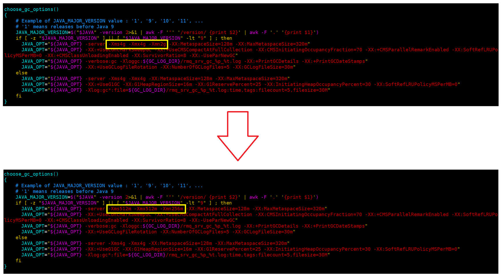

# RocketMQ单节点部署与消息基础操作

[安装](#安装)

&emsp;&emsp;[安装JDK](#安装JDK)

&emsp;&emsp;[安装RocketMQ](#安装RocketMQ)

[搭建NameServer与Broker](#搭建NameServer与Broker)

&emsp;&emsp;[搭建NameServer](#搭建NameServer)

&emsp;&emsp;&emsp;&emsp;[NameServer调整JVM内存配置](#NameServer调整JVM内存配置)

&emsp;&emsp;&emsp;&emsp;[启动NameServer](#启动NameServer)

&emsp;&emsp;[搭建Broker](#搭建Broker)

&emsp;&emsp;&emsp;&emsp;[Broker调整JVM内存配置](#Broker调整JVM内存配置)

&emsp;&emsp;&emsp;&emsp;[修改Broker配置文件](#修改Broker配置文件)

&emsp;&emsp;&emsp;&emsp;[启动Broker](#启动Broker)

[测试RocketMQ消息发送与消费](#测试RocketMQ消息发送与消费)

[关闭RocketMQ服务](#关闭RocketMQ服务)

---

# 安装

## 安装JDK

RocketMQ基于Java开发，​必须安装JDK 1.8或更高版本。

```
# 检查可安装的JDK版本（支持1.8/11/17）
sudo dnf list java-*-openjdk

sudo dnf install java-21-openjdk-devel # 如缺少 javac 执行该命令

# 演示安装 java-21-openjdk.x86_64
sudo dnf install -y java-21-openjdk.x86_64

# 验证安装
java -version 
```

## 安装RocketMQ

- 下载

```wget https://archive.apache.org/dist/rocketmq/5.3.2/rocketmq-all-5.3.2-bin-release.zip```

- 解压

```unzip rocketmq-all-5.3.2-bin-release.zip```

# 搭建NameServer与Broker

## 搭建NameServer

### NameServer调整JVM内存配置

RocketMQ 默认预设的 JVM 内存是4G，但虚拟机内存可能无法满足，所有需要调整 JVM 内存大小。

在 rocketmq-all-5.3.2-bin-release 的 bin 目录直接修改 runserver.sh 即可。



### 启动NameServer

- 后台启动 NameServer，输出到 nohup.out

	```nohup ./mqnamesrv &```

- 查看实时日志，直到显示"boot success"表示启动成功

	```tail -f nohup.out```

## 搭建Broker

### Broker调整JVM内存配置

启动 Broker 的脚本是 runbroker.sh。Broker 的默认预设内存是8G，启动前，如果内存不足也需要调整JVM内存配置。

在 rocketmq-all-5.3.2-bin-release 的 bin 目录直接修改 runbroker.sh 即可。


### 修改Broker配置文件

在 rocketmq-all-5.3.2-bin-release 的 conf 目录直接修改 broker.conf 文件。

在文件末尾添加：

```
# 允许自动创建 topic
autoCreateTopicEnable=true
# 添加 nameserver 地址
namesrvAddr=localhost:9876
```

### 启动Broker

- 后台启动 Broker，输出到 nohup.out

	```nohup ./mqbroker -c ../conf/broker.conf &```

- 查看实时日志，直到显示"boot success"表示启动成功

	```tail -f nohup.out```

# 测试RocketMQ消息发送与消费

在RocketMQ的安装包中，提供了一个tools.sh工具可以用来在命令行快速验证RocketMQ服务。

- 在bin录下执行以下命令测试消息发送，默认会发1000条消息，发送完成自动关闭

	```
	export NAMESRV_ADDR=localhost:9876
	./tools.sh org.apache.rocketmq.example.quickstart.Producer
	```

- 执行以下命令测试消息接收，Consumer执行不会自动关闭，会一直挂起等待新消息过来

	```
	export NAMESRV_ADDR=localhost:9876
	./tools.sh org.apache.rocketmq.example.quickstart.Consumer
	```

# 关闭RocketMQ服务

在bin目录下通过脚本关闭服务：

- 关闭 Broker

	```
	sh ./mqshutdown broker
	```

	可通过 jps 验证，如发现仍在运行可稍等几秒，关闭也需要一点时间。

- 关闭 NameServer

	```
	sh ./mqshutdown namesrv
	```

