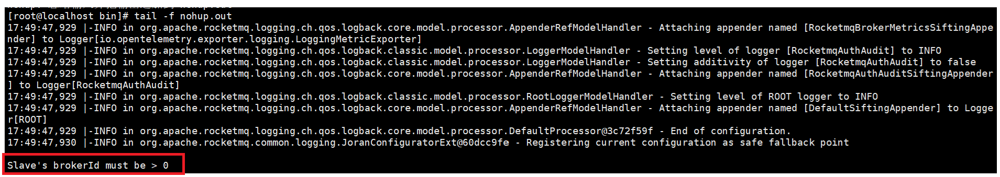
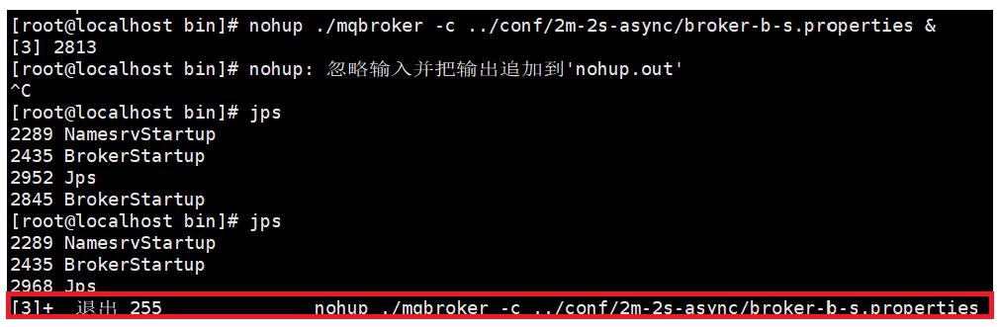

# RocketMQ集群部署与监控

[系统配置](#系统配置)

[配置RocketMQ主从集群](#配置RocketMQ主从集群)

&emsp;&emsp;[配置方式](#配置方式)

&emsp;&emsp;&emsp;&emsp;[搭建2主2从模式](#搭建2主2从模式)

[启动集群](#启动集群)

&emsp;&emsp;[从节点启动的报错](#从节点启动的报错)

&emsp;&emsp;[测试消息收发](#测试消息收发)

---

# 系统配置

- 将配置好 RocketMQ 的虚拟机克隆 2 台，加上原本的虚拟机此时一共 3 台虚拟机。

- 在三台机器上修改 /etc/hosts 文件，配置机器名，在文件末尾加上以下配置：

	```
	192.168.213.132 CentOS9_1
	192.168.213.133 CentOS9_2
	192.168.213.134 CentOS9_3
	```

- 通过 ping 验证是否配置成功：

	```
	ping CentOS9_1
	ping CnetOS9_2
	ping CnetOS9_3
	```

- 配置免密登录：服务之间设置免密登陆，三个机器都使用`ssh-keygen`生成秘钥。提示录入直接回车即可:

- 三个机器都使用以下命令分发给其他机器，输入yes，然后输入密码,这样可以直接某个机器便用ssh或者scp到另外的机器:

	```
	ssh-copy-id CentOS9_1
	ssh-copy-id CentOS9_2
	ssh-copy-id CentOS9_3
	```

- 停止并禁用防火墙防火墙:

	```
	# 查看防火墙状态
	firewall-cmd --state
	
	# 停止并禁用防火墙
	systemctl stop firewalld
	systemctl disable firewalld
	```

# 配置RocketMQ主从集群

使用conf/2m-2s-async下的配置文件搭建一个2主2从异步刷盘的集群。设计的集群情况如下：

|机器名|NameServer节点部署|Broker节点部署|
|:---:|:---:|:---:|
|CentOS9_1|nameserver||
|CentOS9_2|nameserver|broker-a,broker-b-s|
|CentOS9_3|nameserver|broker-b,broker-a-s|

## 配置方式

- 2m-2s-async：2主2从异步刷盘(否吐量较大，但是消息可能去失 
- 2m-2s-Sync：2主2从同步刷盘（吞吐量会下降，但是消息更安全）
- 2m-noslave：2主无从（单点故障），然后还可以直接配置broker.conf，进行单点环境配置

而dleger就是用来实现主从切换的。 集群中的节点会基于Raft办议随机选举出一个leader，其他的就都是follower。通常正式环境都会采用这种方式来搭建集群

### 搭建2主2从模式

配置 rocketmq-all-5.3.2-bin-release/conf/2m-2s-async 目录下 Broker 文件：

- 存储路径规划:

	```
	# CentOS9_2节点路径
	/RocketMQAPP/rocketmq-all-5.3.2-bin-release/store/broker-a      # 主节点
	/RocketMQAPP/rocketmq-all-5.3.2-bin-release/store/broker-b-slave # 从节点

	# CentOS9_3节点路径  
	/RocketMQAPP/rocketmq-all-5.3.2-bin-release/store/broker-b      # 主节点
	/RocketMQAPP/rocketmq-all-5.3.2-bin-release/store/broker-a-slave # 从节点
	```

- CentOS9_2配置：主节点 broker-a  从节点 broker-b-s

	- 配置 broker-a.properties：

		```
		# 集群元数据配置
		brokerClusterName=DefaultCluster
		brokerName=broker-a
		brokerId=0  # 主节点标识
		namesrvAddr=CentOS9_1:9876;CentOS9_2:9876;CentOS9_3:9876

		# 网络与存储配置
		listenPort=10911  # 默认主端口
		storePathRootDir=/RocketMQAPP/rocketmq-all-5.3.2-bin-release/store/broker-a
		storePathCommitLog=${storePathRootDir}/commitlog

		# 运行策略
		brokerRole=ASYNC_MASTER  # 异步复制主节点[7]
		flushDiskType=ASYNC_FLUSH
		autoCreateTopicEnable=true  # 按需开启
		enableControllerMode=false  # 5.x新增特性，默认关闭
		```

	- 配置 broker-b-s.properties：

		```
		brokerClusterName=DefaultCluster
		brokerName=broker-b
		brokerId=1  # 从节点标识
		namesrvAddr=CentOS9_1:9876;CentOS9_2:9876;CentOS9_3:9876
		listenPort=10912  # 同一机器需不同端口
		storePathRootDir=/RocketMQAPP/rocketmq-all-5.3.2-bin-release/store/broker-b-slave
		brokerRole=SLAVE
		```

- CentOS9_3配置：主节点 broker-b  从节点 broker-a-s

	- 配置 broker-b.properties：

		```
		# 集群元数据
		brokerClusterName=DefaultCluster
		brokerName=broker-b
		brokerId=0
		namesrvAddr=CentOS9_1:9876;CentOS9_2:9876;CentOS9_3:9876

		# 网络与存储
		listenPort=10001
		storePathRootDir=/RocketMQAPP/rocketmq-all-5.3.2-bin-release/store/broker-b
		storePathCommitLog=${storePathRootDir}/commitlog

		# 运行策略
		brokerRole=ASYNC_MASTER
		flushDiskType=ASYNC_FLUSH
		autoCreateTopicEnable=true
		deleteWhen=04
		fileReservedTime=48

		# 性能优化参数
		transientStorePoolEnable=false
		osPageCacheBusyTimeOutMills=3000
		waitTimeMillsInSendQueue=600
		sendMessageThreadPoolNums=16
		```

	- 配置 broker-a-s.properties：

		```
		# 集群元数据
		brokerClusterName=DefaultCluster
		brokerName=broker-a  # 对应主节点broker-a
		brokerId=1  # 从节点标识
		namesrvAddr=CentOS9_1:9876;CentOS9_2:9876;CentOS9_3:9876

		# 网络与存储
		listenPort=10912  # 同一机器需不同端口
		storePathRootDir=/RocketMQAPP/rocketmq-all-5.3.2-bin-release/store/broker-a-slave
		storePathCommitLog=${storePathRootDir}/commitlog

		# 运行策略
		brokerRole=SLAVE
		flushDiskType=ASYNC_FLUSH
		autoCreateTopicEnable=true
		deleteWhen=04
		fileReservedTime=48

		# 性能优化参数
		transientStorePoolEnable=true
		osPageCacheBusyTimeOutMills=3000
		waitTimeMillsInSendQueue=600
		sendMessageThreadPoolNums=16
		```

# 启动集群

- CentOS9_2上启动broker-a节点与broker-b-s节点

	```
	nohup ./mqbroker -c ../conf/2m-2s-async/broker-a.properties &

	nohup ./mqbroker -c ../conf/2m-2s-async/broker-b-s.properties &
	```

- CentOS9_3上启动broker-b节点与broker-a-s节点

	```
	nohup ./mqbroker -c ../conf/2m-2s-async/broker-b.properties &

	nohup ./mqbroker -c ../conf/2m-2s-async/broker-a-s.properties &  # 需要 broker-a 已启动
	```

## 从节点启动的报错



- 报错：Slave's brokerId must be > 0：

	使用 `cat -A broker-a-s.properties` 查看是否有异常字符。

	Windows 换行符（CRLF ^M）与 Linux 换行符（LF）不兼容, 可能导致的字符显示问题。这些隐藏字符会导致 RocketMQ 解析配置文件时出错，brokerId 未被正确识别，从而触发 Slave's brokerId must be > 0 错误。

	解决办法：删除从windows复制过去的注释内容，直到cat -A 没有异常符号（M-dM-;M-^NM-hM-^JM-^BM-gM-^BM-9M-fM- M-^GM-hM-/M-^F）为止



- 第二个节点异常退出:

	可能是端口冲突，可尝试调整 listenPort 的大小。

- 退出码 137： 节点运行成功，又异常退出:

	可能是系统内存不足，可通过 `free -h` 查看，同时更改配置文件。

## 测试消息收发

- 在 CentOS_2 上发送消息：

	```
	export NAMESRV_ADDR="CentOS9_1:9876;CentOS9_2:9876;CentOS9_3:9876"
	./tools.sh org.apache.rocketmq.example.quickstart.Producer
	```

- 在 CentOS_3 上接收消息：

	```
	export NAMESRV_ADDR="CentOS9_1:9876;CentOS9_2:9876;CentOS9_3:9876"
	./tools.sh org.apache.rocketmq.example.quickstart.Consumer
	```

