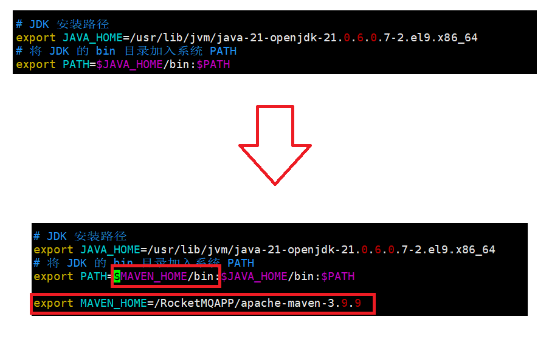
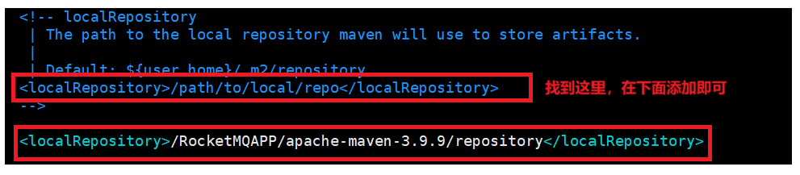
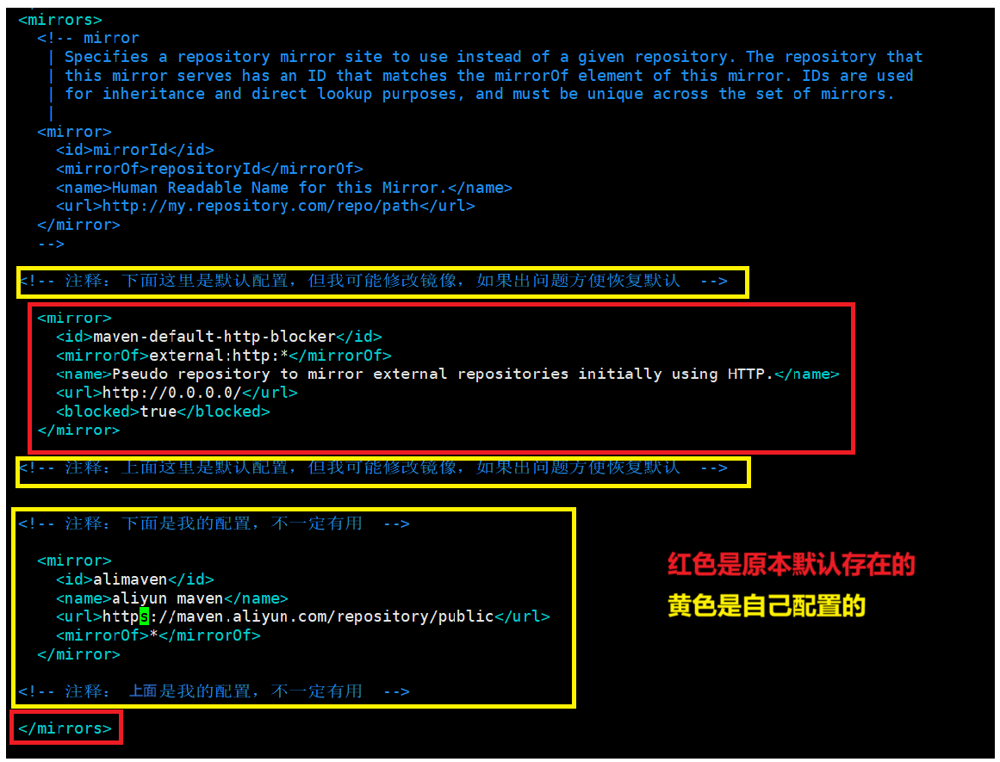
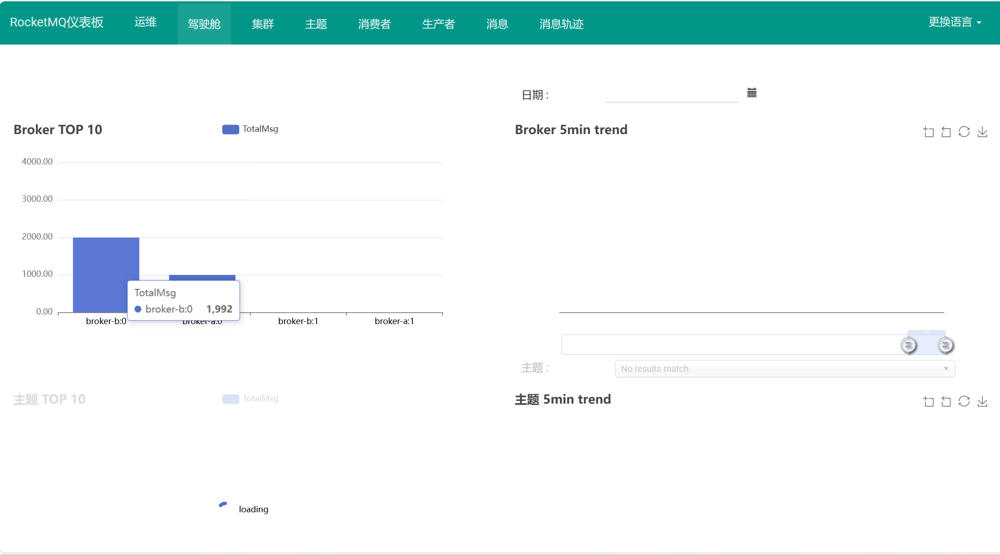
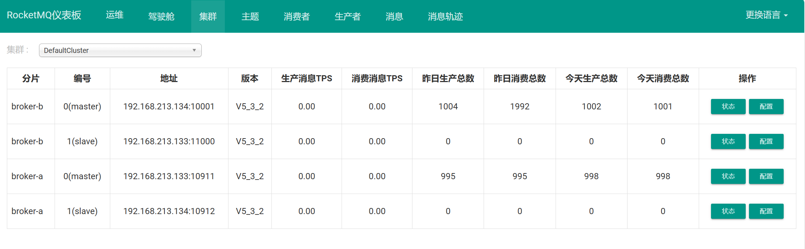

# RocketMQ集群监控

[rocketmq-dashboard](#rocketmq-dashboard)

&emsp;&emsp;[安装maven](#安装maven)

&emsp;&emsp;&emsp;&emsp;[配置maven](#配置maven)

&emsp;&emsp;[安装dashboard](#安装dashboard)

&emsp;&emsp;&emsp;&emsp;[编译打包dashboard](#编译打包dashboard)

&emsp;&emsp;[启动dashboard](#启动dashboard)

---

# rocketmq-dashboard

要通过 maven 安装 dashboard，所以先安装 maven 服务。

## 安装maven

执行```wget https://mirrors.tuna.tsinghua.edu.cn/apache/maven/maven-3/3.9.8/binaries/apache-maven-3.9.8-bin.tar.gz -P /opt```

或者在官网选择最新版：https://maven.apache.org/download.cgi

### 配置maven

- 配置 /etc/profile：

	```
	export MAVEN_HOME=/RocketMQAPP/apache-maven-3.9.9

	# 添加 $MAVEN_HOME/bin
	export $JAVA_HOME/bin:$PATH --> export PATH=$MAVEN_HOME/bin:$JAVA_HOME/bin:$PATH
	```

	

	- 立即生效：
 
	```
	source /etc/profile
	```

- 配置 目录 apache-maven-3.9.9/conf 中的 settings.xml：

	- 修改 maven 仓库配置：

		```<localRepository>/RocketMQAPP/apache-maven-3.9.9/repository</localRepository>```

		

	- 修改maven仓库节点配置：
		
		```
		  <!-- 注释：下面这里是默认配置，但我可能修改镜像，如果出问题方便恢复默认  -->

			<!--

			<mirror>
			  <id>maven-default-http-blocker</id>
			  <mirrorOf>external:http:*</mirrorOf>
			  <name>Pseudo repository to mirror external repositories initially using HTTP.</name>
			  <url>http://0.0.0.0/</url>
			  <blocked>true</blocked>
			</mirror>

			-->

		  <!-- 注释：上面这里是默认配置，但我可能修改镜像，如果出问题方便恢复默认  -->


		  <!-- 注释：下面是我的配置，不一定有用，如果不行就把上面的注释打开，把这段注释  -->

			<mirror>
			  <id>alimaven</id>
			  <name>aliyun maven</name>
			  <url>https://maven.aliyun.com/repository/public</url>
			  <mirrorOf>*</mirrorOf>
			</mirror>

		  <!-- 注释：上面是我的配置，不一定有用  -->

		  </mirrors>

		```

		


## 安装dashboard

- 方案一：

	执行```wget https://github.com/apache/rocketmq-dashboard/archive/refs/tags/rocketmq-dashboard-1.0.0.zip```

	再通过 ```unzip rocketmq-dashboard-rocketmq-dashboard-1.0.0.zip``` 解压。

- 方案二（docker)：

	通过 docker 安装：```docker pull apacherocketmq/rocketmq-dashboard:latest```

### 编译打包dashboard

- 方案一：

	执行 ```mvn clean package -Dmaven.test.skip=true```

	看到结尾几行有 `BUILD SUCCESS` 字样就代表成功了。

	打包失败可以通过 ```mvn clean install -U -Dmaven.test.skip=true```清除编译结果，重新打包。

	- 注意：因为 rocketMQ5.* 版木对应 dasnboard 的一些类还没有升级，最后编译时会异常。可以选择4.9版本打包 dashboard。

		- 选择4.9版本打包：

			```wget https://archive.apache.org/dist/rocketmq/4.9.0/rocketmq-all-4.9.0-bin-release.zip```

			再通过 ```unzip rocketmq-all-4.9.0-bin-release.zip``` 解压。

			之后操作见上。

- 方案二（docker)：
	
	方案二是通过docker pull拉取的镜像，镜像已经包含了编译好的应用，因此无需再次使用Maven命令编译。

## 启动dashboard

记得先启动集群。

- 方案一：

	进入 dashboard 的 target 目录，运行其中的 .jar 包。

	```
	nohup java -jar rocketmq-dashboard-1.0.0.jar &
	```

	验证：

	```
	tail -f nohup.out
	```
	
	如发现一个巨大的 spring 图形即代表成功。

	或者在浏览器中通过ip加端口访问 `<ip:port>`, 再去进行消息测试查看变化。

	

- 方案二（docker)：

	通过 docker 命令启动：

	```
	docker run -d --name rocketmq-dashboard   -e "JAVA_OPTS=-Drocketmq.namesrv.addr=192.168.213.132:9876;192.168.213.133:9876;192.168.213.134:9876"   -p 8080:8080   apacherocketmq/rocketmq-dashboard:latest
	```

	验证：

	```
	docker logs rocketmq-dashboard
	```

	如发现一个巨大的 spring 图形即代表成功。

	或者在浏览器中通过ip加端口访问 `<ip:port>`, 再去进行消息测试查看变化。

	
