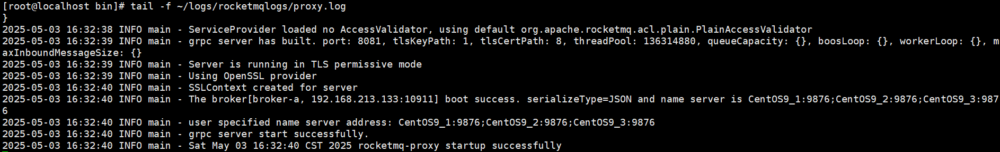

# RocketMQ部署模式 

[Local模式](#Local模式)

&emsp;&emsp;[启动broker节点](#启动broker节点)

&emsp;&emsp;[测试消息收发](#测试消息收发)

---

# Local模式

- 在 Local 模式下，Broker 和 Proxy 是同进程部署，只是在原有 Broker 的配置基础上新增 Proxy 的简易配置就可以运行。
- 在Cluster模式下，Broker和Proxy分别部署，即在原有的集群基础上，额外再部署Proxy即可。

## 启动broker节点

使用Local方式部署，每个机器只能部署一个broker，否则会出现端口占用的异常。

- 在俩台机器启动 NameServer。

	```
	nohup ./mqnamesrv &
	```

- 启动 CentOS9_2 的 broker-a

	```
	nohup ./mqbroker -c ../conf/2m-2s-async/broker-a.properties --enable-proxy -n "CentOS9_1:9876;CentOS9_2:9876;CentOS9_3:9876" &
	```

	- --enable-proxy: 启动 proxy 模块。

	可通过 `tail -f ~/logs/rocketmqlogs/proxy.log` 查看日志文件：

	

- 启动 CentOS9_3 的 broker-b

	```
	nohup ./mqbroker -c ../conf/2m-2s-async/broker-b.properties --enable-proxy -n "CentOS9_1:9876;CentOS9_2:9876;CentOS9_3:9876" &
	```

	也可通过 `tail -f ~/logs/rocketmqlogs/proxy.log` 查看日志文件。

## 测试消息收发

- 在 CentOS_2 上生成消息：

	```
	export NAMESRV_ADDR="CentOS9_1:9876;CentOS9_2:9876;CentOS9_3:9876"
	./tools.sh org.apache.rocketmq.example.quickstart.Producer
	```

- 在 CentOS_3 上消费消息：

	```
	export NAMESRV_ADDR="CentOS9_1:9876;CentOS9_2:9876;CentOS9_3:9876"
	./tools.sh org.apache.rocketmq.example.quickstart.Consumer
	```

# 其他

[https://rocketmq.apache.org/zh/docs/deploymentOperations/01deploy](https://rocketmq.apache.org/zh/docs/deploymentOperations/01deploy)

